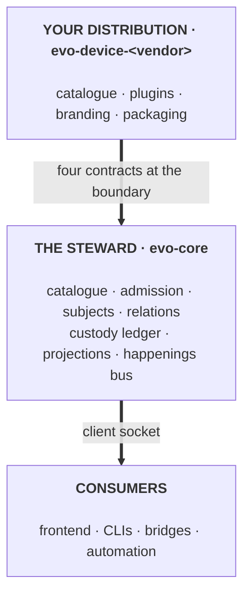
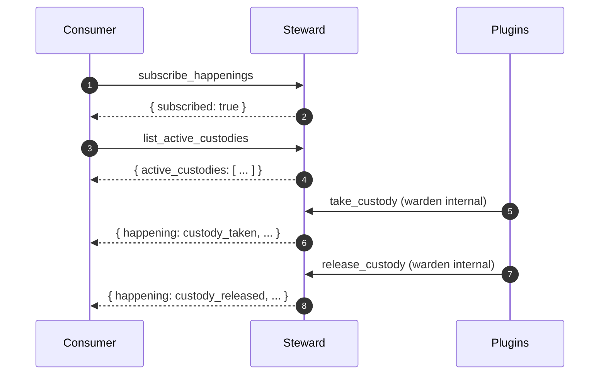

# evo-core

> A brand-neutral steward for appliance-class devices.

Write the catalogue. Stock the plugins. The steward does the rest.

Evo is a fabric for building devices where many concerns - sources, processing, outputs, metadata, networking, presentation - have to compose into something coherent without turning into a monolith. The framework is the steward: a single long-running process that administers a declared catalogue, admits plugins that stock its slots, reconciles subject identities across the plugins, and emits projections and happenings to any consumer that looks.

The framework knows nothing about audio, streaming services, DACs, protocols, or any specific device. Everything that names a real service or piece of hardware lives in a **distribution** - a separate `evo-device-<vendor>` repository that imports evo-core, declares its own catalogue, ships its own plugins, and packages them as a product. The first distribution is `evo-device-volumio`; the framework supports an open set of distributions without upper bound.

## Architecture



Three layers, four contracts at the top boundary (plugin SDK, plugin wire protocol, plugin packaging, catalogue shape), one contract at the bottom (client socket protocol). Everything above and below evo-core lives in a distribution; evo-core holds the middle.

## Why evo

- **Minimal and declared.** The fabric is described by a catalogue file, not by the code. Adding a capability is a new plugin, never a patch to the framework.
- **Plugins never coordinate.** The steward is the sole authority. Plugins stock slots and never address each other. Integration cost stays O(1) per plugin as the ecosystem grows.
- **Technology-wide.** Plugins in Rust or any language that speaks a Unix socket. Frontends in any framework. Bridges to any remote protocol. One client protocol, seven example languages in `CLIENT_API.md`.
- **Multi-distribution by design.** Each device ships its own `evo-device-<vendor>` repository; the framework imposes no upper bound on how many distributions exist or which vendors they target.
- **Pure Rust, Unix-native.** No C dependencies. Eight primary target architectures, three ARM profiles, glibc and musl. Cross-compiles cleanly.

## Sixty seconds

```bash
# Clone, build, and run a steward locally:
git clone https://github.com/foonerd/evo-core.git && cd evo-core
cargo build --workspace

mkdir -p /tmp/evo
cat > /tmp/evo/catalogue.toml <<'EOF'
[[racks]]
name = "example"
family = "domain"
kinds = ["registrar"]
charter = "Minimal example rack."

[[racks.shelves]]
name = "echo"
shape = 1
description = "Echoes inputs back."
EOF

cargo run -p evo -- \
    --catalogue /tmp/evo/catalogue.toml \
    --socket /tmp/evo/evo.sock \
    --log-level info
```

In another terminal, probe it:

```bash
python3 - <<'EOF'
import socket, struct, json, base64
s = socket.socket(socket.AF_UNIX); s.connect("/tmp/evo/evo.sock")
req = json.dumps({
    "op": "request", "shelf": "example.echo", "request_type": "echo",
    "payload_b64": base64.b64encode(b"hello").decode()
}).encode()
s.send(struct.pack(">I", len(req)) + req)
n = struct.unpack(">I", s.recv(4))[0]
resp = json.loads(s.recv(n).decode())
print(base64.b64decode(resp["payload_b64"]).decode())  # -> "hello"
EOF
```

## A consumer in action

The canonical pattern for a live-updating consumer is subscribe-then-query-then-reconcile. The steward's ordering guarantees make this reliable.



Any happening emitted after the ack reaches the consumer. The initial list gives a consistent snapshot; each subsequent happening is an incremental update.

Plugin identity on the wire is opaque: every projection and happening carries an opaque `claimant_token`, never the plugin's plain canonical name. A consumer that needs to display plain names follows the negotiate-then-resolve pattern: send `op = "negotiate"` with `capabilities: ["resolve_claimants"]` as the first frame on the connection, then call `op = "resolve_claimants"` with the tokens to exchange. The default operator policy grants `resolve_claimants` only to local-UID consumers running as the steward's own user; distributions with a frontend or bridge running under a different UID widen the policy through `/etc/evo/client_acl.toml`. See [CLIENT_API.md](docs/engineering/CLIENT_API.md) sections 4.7 and 4.8 for the negotiation and resolution ops, and examples in seven languages.

## Documentation

The doc set is grouped by what you are trying to do.

### Start here

| Document | If you are... |
|----------|---------------|
| [CONCEPT.md](docs/CONCEPT.md) | new to evo. Read this first. The fabric contract: essence, steward, racks, shelves, plugins, subjects, relations, projections, happenings. |
| [BOUNDARY.md](docs/engineering/BOUNDARY.md) | about to start an `evo-device-<vendor>` repository, or deciding whether a change belongs in the framework or a distribution. Defines the four contracts across the boundary and the distribution-integrator checklist. |
| [SCHEMAS.md](docs/engineering/SCHEMAS.md) | looking for any schema at all. Consolidated authoritative reference for every TOML file, JSON shape, wire frame, happening variant, and data structure across the fabric. |
| [DEVELOPING.md](DEVELOPING.md) | cloning this repository to hack on the framework itself. Prerequisites, build, test, run locally, repo conventions. |

### Build on evo (plugin authors)

| Document | Purpose |
|----------|---------|
| [PLUGIN_AUTHORING.md](docs/engineering/PLUGIN_AUTHORING.md) | Tutorial. Walkthroughs for respondents and wardens, in-process and wire. Manifest authoring, testing, before-you-ship checklist, common pitfalls. |
| [PLUGIN_CONTRACT.md](docs/engineering/PLUGIN_CONTRACT.md) | Spec. The universal plugin contract in Rust trait and Unix-socket wire form, kept strictly aligned. Schema details in SCHEMAS.md section 4.2. |
| [PLUGIN_PACKAGING.md](docs/engineering/PLUGIN_PACKAGING.md) | Manifest narrative, identity, signing, filesystem layout on target, installation lifecycle. Schema details in SCHEMAS.md section 3.1. |
| [PLUGIN_TOOL.md](docs/engineering/PLUGIN_TOOL.md) | GAPS [20]: `evo-plugin-tool` implementation contract (subcommands, trust parity, install/URL, exit codes, archives). Complements PLUGIN_PACKAGING §9. |
| [VENDOR_CONTRACT.md](docs/engineering/VENDOR_CONTRACT.md) | Who signs what. Actor taxonomy, namespace governance, vendor commitments, distribution relationships, revocation pathways. |

### Integrate with evo (consumers, frontends, bridges)

| Document | Purpose |
|----------|---------|
| [CLIENT_API.md](docs/engineering/CLIENT_API.md) | The consumer-facing protocol with JSON transcripts for every op and complete worked examples in Python, Node.js, TypeScript, Go, Rust, shell, and C. Schema details in SCHEMAS.md section 4.1. |
| [FRONTEND.md](docs/engineering/FRONTEND.md) | Where the frontend runs, what technology it uses, and how it reaches the steward. Eleven deployment shapes, the bridge-plugin pattern for remote interfaces (HTTP / WebSocket / MQTT / gRPC / proprietary), compositional patterns. |

### Reference (engineering internals)

| Document | Purpose |
|----------|---------|
| [STEWARD.md](docs/engineering/STEWARD.md) | The steward process. Module structure, admission, shared state, concurrency model, configuration, invariants, reserved capabilities. |
| [CATALOGUE.md](docs/engineering/CATALOGUE.md) | Narrative on authoring a `catalogue.toml`. Racks, shelves, predicates, shape versioning, anti-patterns, evolution. Schema in SCHEMAS.md section 3.2. |
| [CONFIG.md](docs/engineering/CONFIG.md) | Narrative on the steward's runtime configuration. File location, precedence (CLI > env > config > default), operational patterns. Schema in SCHEMAS.md section 3.3. |
| [SUBJECTS.md](docs/engineering/SUBJECTS.md) | Subject registry. Canonical identity, external addressings, reconciliation. |
| [RELATIONS.md](docs/engineering/RELATIONS.md) | Relation graph. Typed directed edges, scoped walks, multi-plugin claimants. |
| [PROJECTIONS.md](docs/engineering/PROJECTIONS.md) | Projection layer. Federated queries, composition rules, degraded states. |
| [CUSTODY.md](docs/engineering/CUSTODY.md) | Custody ledger. Warden-held work tracked by `(plugin, handle_id)`. |
| [HAPPENINGS.md](docs/engineering/HAPPENINGS.md) | Live notification bus. Non-exhaustive variant contract, broadcast semantics. |
| [FAST_PATH.md](docs/engineering/FAST_PATH.md) | Fast-path mutation channel (roadmap). |
| [LOGGING.md](docs/engineering/LOGGING.md) | Logging contract. Levels, format, structured fields, logs vs happenings. |

### Operations

| Document | Purpose |
|----------|---------|
| [BUILDING.md](docs/engineering/BUILDING.md) | Cross-architecture builds. Eight primary targets, the `cross` tool, release tuning, glibc vs musl, Android notes, testing cross-compiled binaries. |
| [MSRV.md](docs/engineering/MSRV.md) | Minimum Supported Rust Version policy, verification matrix across Primary targets, lockfile entries that exceed the declared MSRV (target-gated wasi crates), rules for raising MSRV. |

## Status

Implemented: the steward runs and admits singleton respondents and wardens (in-process or over a Unix socket), with bundle discovery walking the configured search roots and admitting out-of-process singletons automatically. Subject registry and relation graph maintained. Projections composed on demand with federated subject queries and relation walks. Custody ledger tracks active warden-held work. Happenings bus emits every custody, subject, and relation transition with strictly monotonic `seq` numbers, and supports replay through a `since` cursor backed by the durable `happenings_log` table. Subject identity, addressings, aliases, the claim log, the durable happenings log, and the pending-conflicts table are persisted to SQLite at `/var/lib/evo/state/evo.db`. Catalogue documents carry a required `schema_version`; `evo-plugin-tool catalogue lint` validates against the supported range. The wire protocol carries a unified `ErrorClass` taxonomy with `class.is_connection_fatal()` derivation. Trust verification walks chains via `signed_by` with a configured maximum depth, supports rotation overlap, and verifies the trust-root fingerprint at load. Client-socket ops include `request`, `project_subject`, `describe_alias`, `describe_subject_with_aliases`, `describe_capabilities`, `list_subjects`, `list_relations`, `enumerate_addressings`, `list_active_custodies`, `subscribe_happenings`, `negotiate`, and `resolve_claimants` (gated by `client_acl.toml`). Wire protocol end-to-end tested with in-process and out-of-process plugins.

Roadmap (see `STEWARD.md` section 12 for the full list): appointments and watches, durable persistence for the relation graph and custody and admin ledgers (the subject identity slice and durable happenings log are persisted today), factory admission, fast-path mutation channel, shape-version range support, rack-keyed projections, hot-reload supervision, restart supervision, structured catalogue grammar survival surface, auto-merge heuristics.

See [CHANGELOG.md](CHANGELOG.md) for version history.

Reference crates to look at: [`crates/evo`](crates/evo) (the steward), [`crates/evo-plugin-sdk`](crates/evo-plugin-sdk) (the SDK), [`crates/evo-example-echo`](crates/evo-example-echo) and [`crates/evo-example-warden`](crates/evo-example-warden) (reference plugins, in-process and wire).

## Distributions

Evo is domain-neutral. A device ships as a distribution of evo in its own `evo-device-<vendor>` repository: a catalogue declaration plus a plugin set plus branding plus frontend plus packaging. The framework imposes no upper bound on how many distributions exist or which vendors they target. The first distribution is `evo-device-volumio`, using Volumio's existing device functions (MPD, ALSA, NetworkManager, NAS mounts) as its reference feature set.

See [BOUNDARY.md](docs/engineering/BOUNDARY.md) for the boundary contract and the distribution-integrator checklist.

## Contributing

Developer workflow, prerequisites, local running, test commands, and repository conventions are in [DEVELOPING.md](DEVELOPING.md). For cross-architecture and release builds, see [BUILDING.md](docs/engineering/BUILDING.md).

Contributions must hold the framework/distribution boundary ([BOUNDARY.md](docs/engineering/BOUNDARY.md) section 5). Anything naming a specific service, protocol, or vendor belongs in a distribution, not here.

## License

Apache 2.0. See [LICENSE](LICENSE).
