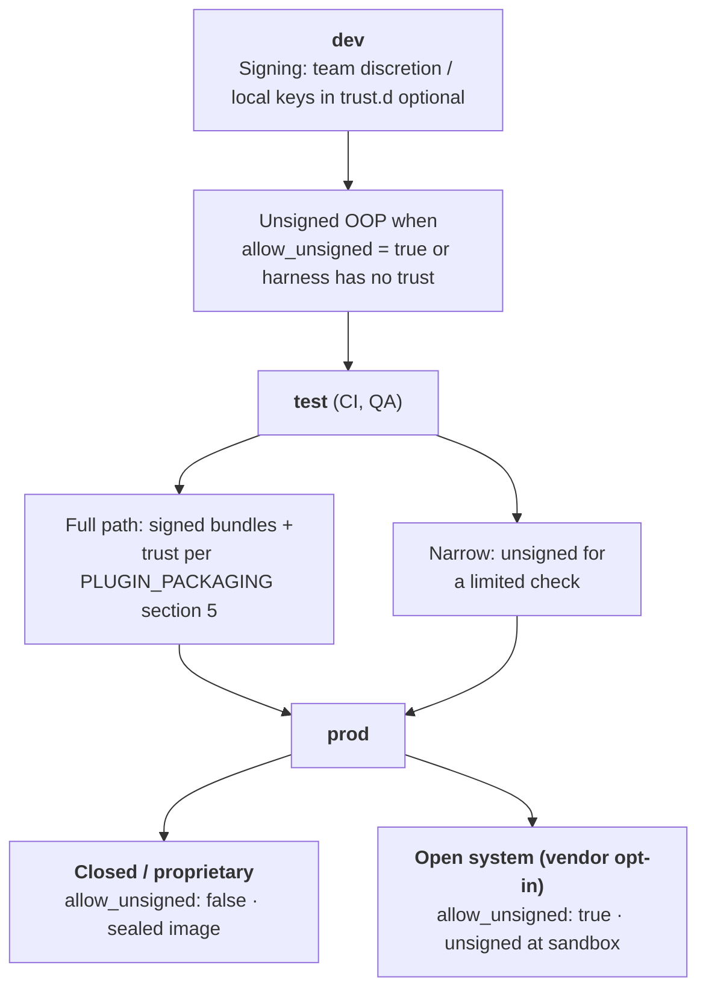
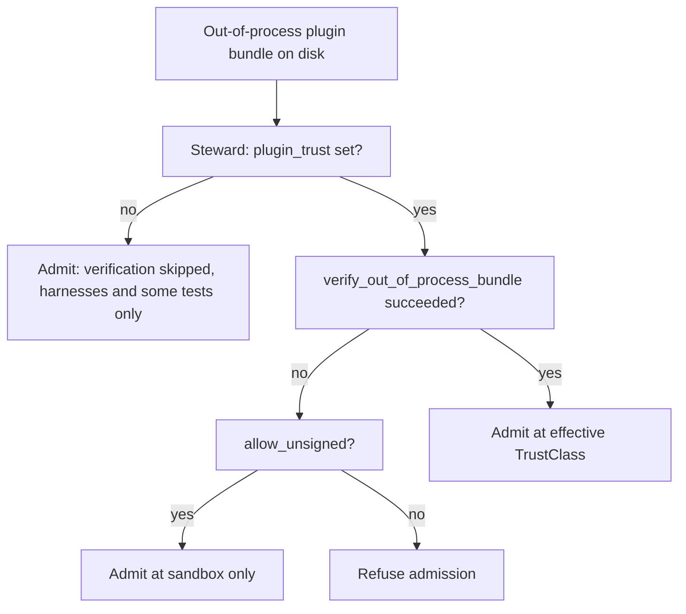

# Boundary

Status: engineering-layer statement of the boundary between the framework and a distribution.
Audience: evo-core maintainers, distribution authors, plugin authors working at the distribution level, operators integrating evo into a product.
Vocabulary: per `docs/CONCEPT.md`. Cross-references: `STEWARD.md`, `PLUGIN_CONTRACT.md`, `PLUGIN_PACKAGING.md`, `VENDOR_CONTRACT.md`. **Signing and deployment stages (dev / test / prod)** are specified in **section 6.2** (distributions) with a Mermaid diagram; `CONFIG.md` §3.4 is a short pointer to the same model.

Evo-core is a framework. A device is a product. This document states where the framework ends, where the device begins, and what contract connects them. Every engineering doc in this repository assumes the boundary is understood; this one makes it explicit.

If you are about to start a distribution repository, read this document first. If you are about to add something to evo-core, read section 5 ("What evo-core MUST NOT Contain") before you write code.

Incomplete framework behaviour and misplaced product work are both failures; the boundary tells them apart.

## 1. Purpose

The fabric concept ("a device that plays audio from any reachable source, through a configurable audio path, to any present output, while presenting coherent information about what it is doing to any consumer that looks") describes what a product does. The steward enforces the concept regardless of what specifically is being played, over what, to whom. That separation is not stylistic. It is the reason the framework can serve many products without being rewritten for each.

The framework must not know which codecs exist, which services stream music, which DACs are connected, which network protocols are in use, or what the device is branded as. The distribution holds all of that. The interface between them is narrow and versioned.

This document defines that interface and, just as importantly, says what crosses it and what does not.

## 2. The Three Repository Tiers

Evo is a family of repositories arranged in three tiers. Each tier has one role; vendor products are composed by stacking tiers.

| Tier | Repository | Role | Namespace |
|------|------------|------|-----------|
| Framework | `evo-core` | One repository. The steward, the plugin SDK, the plugin tooling, the engineering-layer contracts, reference example plugins. Domain-neutral. | `org.evoframework.core.*` |
| Reference generic device | `evo-device-<domain>` (e.g. `evo-device-audio`) | One repository per domain. Brand-neutral reference distribution. Bundles brand-neutral plugins for the domain (audio: MPD playback, ALSA composition, library scanning, album-art pipeline). Vendors copy this as their starting point and layer their branding and product-specific plugins on top. | `org.evoframework.<domain>.*` (e.g. `org.evoframework.audio.*`) |
| Vendor distribution | `evo-device-<vendor>` (e.g. `evo-device-volumio`) | Many repositories, one per product line. The catalogue choices, vendor branding, product-specific plugins (closed-source streaming-service integrations, partner certifications), commercial packaging. Imports a reference generic device of its domain and adds the vendor layer. | Vendor's own (`com.volumio.*`, etc.) |

The first reference generic device is `evo-device-audio`. The first vendor distribution is `evo-device-volumio`, which imports `evo-device-audio` as its base. The framework imposes no upper bound on how many domains have reference generic devices or how many vendors layer on each.

Every reference generic device relates to `evo-core` identically: pin a version, consume the SDK, ship a catalogue, stock slots, sign artefacts against its `reference_device_release_root`. Every vendor distribution relates to its reference generic device identically: pin a version, layer a catalogue (additive or substituted), ship vendor plugins, sign against its `vendor_release_root`. Trust roots are layered per `PLUGIN_PACKAGING.md` §5; releases per `RELEASE_PLANE.md`.

A vendor distribution MAY also bring third-party plugins, vendor plugins signed by external organisations (`VENDOR_CONTRACT.md`), and operator extensions. None of that crosses back into the reference generic device or into evo-core.

### Why three tiers, not two

The two-tier model (framework + distribution) collapses two distinct concerns: the **brand-neutral reference implementation of a domain** and the **vendor's commercial product layer**. Without the middle tier, every vendor entering a domain would re-author the same brand-neutral plugins (MPD playback, ALSA composition, etc.), each with its own signing key, each diverging incrementally over time. The reference generic device is the shared, signed, brand-neutral bedrock; vendors layer on top instead of forking sideways.

The three tiers also align cleanly with the trust hierarchy:

- Framework signs framework artefacts.
- Reference generic device signs domain-neutral plugin bundles.
- Vendor signs vendor-specific binaries and plugins.

Each tier's signing root is distinct (per `PLUGIN_PACKAGING.md` §5 Trust root layering); compromise at one tier does not bleed into the others.

## 3. The Interface

Four contracts cross the boundary. Every contract is declared inside `evo-core`. A distribution consumes all four as a stable surface and ships only artefacts shaped to fit.

| Contract | Where it lives in evo-core | What a distribution does with it |
|----------|----------------------------|----------------------------------|
| **Plugin SDK** | `crates/evo-plugin-sdk` | Depend on it by pinned version. Every distribution-authored plugin in Rust links this crate. |
| **Plugin wire protocol** | `docs/engineering/PLUGIN_CONTRACT.md` sections 6-11 | Out-of-process plugins in any language implement this protocol. The SDK's wire-client/host halves are the reference implementation. |
| **Plugin packaging format** | `docs/engineering/PLUGIN_PACKAGING.md` | Every distribution-shipped plugin follows this manifest shape and filesystem layout. |
| **Client socket protocol** | `docs/engineering/STEWARD.md` section 6 | Consumers (frontend, diagnostics, automation) talk to the running steward over this socket. The protocol is language-agnostic; the distribution picks any technology that can speak length-prefixed JSON. |

Two soft contracts:

| Contract | Where it lives | Note |
|----------|----------------|------|
| **Catalogue shape** | `docs/engineering/PLUGIN_CONTRACT.md` section 7 | The TOML schema the steward reads at startup. The distribution authors one catalogue file per product. |
| **Config and runtime paths** | `docs/engineering/STEWARD.md` section 11 | Where on the filesystem the steward reads its config and writes its socket. A distribution MAY override the defaults; the defaults are what ships if it does not. |

Soft because they are data, not code, and the framework tolerates variation within validated limits.

Nothing else crosses. A distribution does not patch the steward, does not extend the SDK trait set, does not inject code into evo-core's build. If a distribution needs something that none of the four contracts provides, the right move is to propose a change to the contract, not to bypass it.

## 4. What evo-core Contains

This repository ships exactly the following:

- **The steward binary** (`crates/evo`). The long-running process that administers a catalogue, admits plugins, composes projections, streams happenings. No awareness of any specific plugin, service, protocol, or device.
- **The plugin SDK** (`crates/evo-plugin-sdk`). Rust traits, wire protocol codec, host helpers for out-of-process plugins, manifest types. Published as a crate; pinned by distributions.
- **Reference example plugins** (`crates/evo-example-echo`, `crates/evo-example-warden`). Minimal respondent and warden, in-process and wire. Exist to demonstrate the SDK and to exercise the admission engine in tests. Not production plugins.
- **Engineering documentation** (`docs/`). The fabric concept, the engineering-layer contracts, this boundary document.
- **Developer tooling** (test harnesses, build documentation).

Anything that satisfies the fabric contract without naming a specific service, protocol, or vendor belongs here. Everything else does not.

## 5. What evo-core MUST NOT Contain

These are categories of content that would break domain neutrality. A pull request adding any of them is wrong and must be closed or moved to a distribution repository.

| Category | Examples | Right home |
|----------|----------|------------|
| Named audio services | Spotify, Tidal, Qobuz, Apple Music, Bandcamp | Distribution plugin |
| Named protocols | UPnP, DLNA, AirPlay, Roon RAAT, MPD, Snapcast | Distribution plugin |
| Named hardware | HiFiBerry, IQAudio, Allo, Topping, specific DAC chips | Distribution plugin |
| Named subsystems | ALSA, PulseAudio, PipeWire, Jack, systemd-networkd, NetworkManager, Samba | Distribution plugin |
| Branding | Product name, logo, colour palette, boot splash, device name defaults beyond a generic fallback | Distribution branding plugin |
| Frontend | Any UI, any web server, any WebSocket bridge, any assumption about how the device is operated | Distribution frontend repository |
| Domain vocabulary in types | Audio-shaped subject types (track, album, artist) as SDK enums; service-shaped request types; codec or sample-rate constants | Distribution catalogue |
| Packaging for a specific OS | Debian control files, Buildroot recipes, Yocto layers, image-assembly scripts | Distribution build system |

The rule is not "mention these nowhere". Engineering docs may use audio-shaped examples where illustrative - because the first distribution is audio-player-shaped and examples aid understanding. The rule is about **code and data that constrains what evo-core can serve**. A catalogue-declared subject type called `track` hard-coded into the SDK would rule out a non-audio distribution; a catalogue-declared subject type called `track` in an `evo-device-<vendor>` repo is exactly right.

A useful test: "If an `evo-device-<non-audio>` repository existed tomorrow, would this change still make sense?" If no, it belongs in the distribution.

## 6. What a Distribution Contains

An `evo-device-<vendor>` repository owns one product's worth of concerns. The shape varies by product, but every distribution will contain, in some form:

| Component | Purpose |
|-----------|---------|
| **Catalogue** (`catalogue.toml` or equivalent) | The racks, shelves, slots, and relation grammar that declare what the device administers. Read by the steward at startup. |
| **Plugin set** | The plugins that stock catalogue slots: source plugins, transformer plugins, presenter plugins, registrar plugins. Each has a manifest and a binary (or library). |
| **Branding plugin** | Product name, device name template, boot splash, colour palette. See `CONCEPT.md` section 6's Branding rack role. |
| **Frontend** | One or more consumers of the client socket. Technology unconstrained (see `FRONTEND.md`). May live in the same repository or a sibling `evo-device-<vendor>-ui` repository. |
| **Distribution-level config defaults** | Steward config defaults suited to this product (socket path, log level, runtime directory, plugin directory). |
| **Packaging** | How the steward binary, the plugins, the catalogue, the branding, and the frontend become an installable artefact: Debian packages, an OS image, a containerised deployment, whatever the product demands. |
| **Trust material** | The distribution's signing key, and possibly bundled vendor keys for pre-approved third parties. See `VENDOR_CONTRACT.md` sections 3 and 5. **How trust policy varies across dev, test, and production** (including the closed vs *open* product line) is normative in **section 6.2**. |
| **Release process** | Tag scheme, build pipeline, evo-core version pin, testing matrix. Entirely distribution-defined. |

A distribution MAY additionally maintain:

- Out-of-process plugins authored in languages other than Rust.
- Distribution-specific developer tooling.
- Migration scripts for users upgrading from predecessor products.
- Brand-specific marketing and documentation.

None of these cross the boundary back into evo-core.

### 6.1 Runtime Data Correction and Operator Overrides

This subsection documents a responsibility split that every distribution shipping evo must plan for explicitly. One half is a boundary that evo-core does not cross (operator correction is not an in-steward channel). The other half is a set of framework primitives the framework owes distributions so that their correction tooling can actually be complete. Both are named here, in the boundary document, so that no distribution reaches this point by accident and so that the framework's obligations are as explicit as the distribution's.

**The concern.** A running fabric accumulates runtime state: subjects in the registry, relations in the graph, provenance records. Plugins assert and retract as the world changes. Identity reconciliation (`SUBJECTS.md` section 9) produces a canonical subject per real-world thing. Relation assertions (`RELATIONS.md` section 4) populate a typed graph.

This state can become wrong.

- Two plugins announce the same real-world track under different canonical identities because their equivalence claims fail to link up.
- A fuzzy-matching metadata plugin asserts `performed_by` between a track and the wrong artist because title and duration collide with a namesake.
- A plugin exits uncleanly without retracting its claims, leaving stale addressings no operator can dislodge through the plugin path.
- A user visibly sees the wrong album art on their HMI and presses a button expecting the device to correct it.

Something must be able to correct this state.

**Out of scope for the framework.** An out-of-band administrative channel in the steward itself. Specifically:

- No operator-override file read by the steward as a parallel source of truth to plugin claims.
- No admin socket or admin API exposed by the steward that rewrites the subject registry or relation graph from outside plugin claims.
- No in-steward privilege that bypasses the plugin lifecycle.
- No `/etc/evo/subjects.overrides.toml` or `/etc/evo/relations.overrides.toml` in the steward's filesystem contract.

An override channel in the steward creates a second source of truth parallel to plugin claims with different trust, reload, and audit semantics. That complexity is warranted only when specific distribution use cases justify it and must be earned by the distribution, not imposed by the framework.

**In scope for the framework.** A set of SDK-exposed, trust-class-gated primitives that a distribution-authored administration plugin can compose into complete operator-facing correction tooling. Most of these have landed; the remaining pieces are noted below. The primitives are:

- **Privileged cross-plugin retraction.** **Landed.** Exposed by `SubjectAdmin::forced_retract_addressing` and `RelationAdmin::forced_retract_claim` in the SDK; the wiring layer's `RegistrySubjectAdmin` and `RegistryRelationAdmin` route to the registry/graph primitives, write `AdminLogEntry` records, and emit `SubjectAddressingForcedRetract` / `RelationClaimForcedRetract` happenings. The cascade discipline (forced-retract event before any `SubjectForgotten` / `RelationForgotten` it triggers) is enforced by the announcer. The wiring layer also confirms that the named `target_plugin` is currently admitted on some shelf before reaching the storage primitive: an unknown name is refused with `ReportError::TargetPluginUnknown { plugin }` rather than reaching a silent no-op at the storage layer, so operator typos surface as errors instead of disappearing as success returns with no audit ledger entry.
- **Plugin-exposed subject merge and split.** **Landed.** Exposed by `SubjectAdmin::merge` and `SubjectAdmin::split` in the SDK. The registry produces an `AliasRecord` on either path so consumers holding stale references resolve via `describe_alias`. Split takes a `SplitRelationStrategy` (`to_both` / `to_first` / `explicit`) plus optional `ExplicitRelationAssignment` entries; gap relations under `explicit` surface as `RelationSplitAmbiguous` happenings.
- **Relation suppression.** **Landed.** Exposed by `RelationAdmin::suppress` and `RelationAdmin::unsuppress` in the SDK. Suppressed relations are hidden from neighbour queries and walks but remain visible to `describe_relation` (with a `SuppressionRecord`) and to direct lookup. `RelationSuppressed` and `RelationUnsuppressed` happenings track transitions.
- **Standard administration-rack vocabulary in CATALOGUE.md.** Pending. Catalogues that take operator correction seriously declare an `administration` rack with standard shelves. Declaring the rack is how a distribution says "I take this responsibility". Consumers (admin panels, diagnostic tools) target the standard vocabulary instead of per-distribution shapes.
- **Reference administration plugin.** Pending. `crates/evo-example-admin` (new), parallel to `evo-example-echo` and `evo-example-warden`. Reads the reference override-file shape below, drives the framework primitives above end-to-end. Distributions fork, extend, or use verbatim.

**What works today, with the privileged primitives in place.** A distribution shipping correction tooling now has a substantively complete surface:

- **Same-plugin retract + re-announce.** A plugin that made a wrong claim can retract its own addressings (`SUBJECTS.md` 7.5) or relation claims (`RELATIONS.md` 4.3) and issue corrected ones. This is the correct path when the plugin is still running, cooperative, and fixable from within.
- **Counter-claims for subject equivalence and distinctness.** An administration plugin that sees a wrong reconciliation can assert an equivalence or distinctness claim at `asserted` confidence; `SUBJECTS.md` section 9.2 gives the higher-confidence claim precedence, and the administration plugin's correction becomes the reconciliation outcome.
- **Additive relation claims.** An administration plugin can assert a correct relation that coexists with any contrary plugin claims. Consumers see both; the graph does not subtract one claim because of another.
- **Cross-plugin forced retraction.** An administration plugin (admitted at an elevated trust class) can force-retract another plugin's addressings and relation claims via `SubjectAdmin` and `RelationAdmin`. Provenance captures the admin plugin's identity in the `AdminLogEntry` and on the paired happening.
- **Subject merge and split.** An administration plugin can merge two canonical subjects into one or split one into many through `SubjectAdmin`; alias records preserve resolvability of the old IDs.
- **Relation suppression.** An administration plugin can suppress (and later unsuppress) a relation so it stops appearing in walks and projections without being removed from the graph.

What does NOT work today: type correction of subjects the administration plugin did not claim. The merge primitive can effectively achieve type correction in the special case where the corrected type is also represented as a separate canonical subject the operator wants to consolidate to; outside that case the type-correction primitive is still pending.

**What a distribution builds.** Any combination of the following, shaped to the product:

- **An administration plugin.** A distribution-authored plugin admitted through the normal admission path. It reads whatever input the distribution deems authoritative (an override file, an admin HTTP endpoint, a UI-originated instruction, a vendor-specific management protocol) and drives correction through the framework surfaces that exist today (counter-claims at `asserted` confidence; additive relation claims; same-plugin retractions on its own claims) plus whatever the distribution finds acceptable to defer until the privileged primitives ship. Its trust class (per `PLUGIN_PACKAGING.md`) reflects its elevated role and gates access to the privileged primitives once they ship.
- **An operator-facing surface.** An HMI button, a CLI, a web admin panel, a mobile app. Collects operator intent and routes it to the administration plugin (directly via a distribution-specific socket, or through the steward's client protocol via a consumer-level instruction routed to the administration plugin's shelf).
- **Policy.** Who may request a correction (owner / admin / authenticated driver / anyone). What is auditable. What requires confirmation. How corrections propagate to other user-visible surfaces.
- **File format, if one is wanted.** A distribution that wants a TOML override file (for operators editing by hand or for orchestration tools writing declaratively) chooses its schema. A reference shape is provided below; a distribution may adopt, extend, replace, or ignore it.

**Reference override-file schema (distribution guidance, not framework contract).**

Distributions that implement a TOML override file may find the following shape a useful starting point. It was worked out during evo-core's engineering layer and is preserved here so distributions do not re-derive it from scratch. Adopt, extend, replace, or ignore as suits the product. The framework does not read this file; only the distribution's administration plugin does, and that plugin is free to choose any format it prefers.

Each directive is annotated with its implementation status against the as-shipped framework so a distribution can plan a staged rollout.

Subject overrides:

```toml
# Force two addressings to be equivalent. Administration plugin
# asserts an equivalence claim at `asserted` confidence;
# SUBJECTS.md 9.2 gives it precedence over `inferred` and
# `tentative` claims.
# Status: implementable today.
[[equivalent]]
a = { scheme = "spotify", value = "track:X" }
b = { scheme = "mbid",    value = "abc-def" }
reason = "Manual correction: known mismapping in Spotify catalogue."

# Force two addressings to be distinct. Administration plugin
# asserts a distinctness claim; SUBJECTS.md 9.2 gives distinctness
# precedence over equivalence of equal or lower confidence.
# Status: implementable today.
[[distinct]]
a = { scheme = "spotify", value = "track:Y" }
b = { scheme = "spotify", value = "track:Z" }
reason = "Different remasters; acoustic fingerprint collides."

# Correct a subject's type. Requires the original claiming plugin
# to retract and re-announce under the corrected type, OR the
# cross-plugin type-correction primitive (on the roadmap).
# Status: requires the cross-plugin type-correction primitive,
# which is not part of the current build.
[[force_type]]
id = "a1b2c3d4-..."
type = "album"
reason = "Incorrectly registered as track by legacy plugin."

# Remove an addressing whose owning plugin will not retract.
# Drives `SubjectAdmin::forced_retract_addressing`. Provenance
# captures the administration plugin's identity in the
# `AdminLogEntry` and on the `SubjectAddressingForcedRetract`
# happening.
# Status: implementable today.
[[forget_addressing]]
scheme = "mpd-path"
value = "/music/orphan.flac"
reason = "File deleted; plugin never retracted."
```

Relation overrides:

```toml
# Force a relation to exist. Administration plugin asserts the
# relation as its own claim. The relation coexists with any
# contrary plugin claims (relations are multi-claimant;
# consumers see all claims). Pair with `[[forbid]]` below if
# the operator wants the contrary claims hidden.
# Status: implementable today.
[[assert]]
source    = { id = "a1b2c3d4-..." }
predicate = "album_of"
target    = { id = "e5f6a7b8-..." }
reason    = "Manual correction: plugins disagree."

# Suppress a relation. Drives `RelationAdmin::suppress`; the
# relation remains in the graph and visible to
# `describe_relation` (with its `SuppressionRecord`) but is
# hidden from neighbour queries and walks until unsuppressed.
# Status: implementable today.
[[forbid]]
source    = { id = "..." }
predicate = "performed_by"
target    = { id = "..." }
reason    = "Incorrect match despite fuzzy metadata."
```

**Key points for the distribution implementer.**

- Most of the privileged primitives have landed (cross-plugin forced retract, merge, split, relation suppression). Type correction is the remaining gap; merge covers the common case in which the operator is consolidating to an already-existing better-typed subject.
- Every correction that lands in the registry or graph does so as a plugin claim (the administration plugin's claim) or as a privileged retraction / merge / split / suppression attributed to the administration plugin in both the `AdminLogEntry` and the paired happening. The single-source-of-truth invariant is preserved; audit flows through the normal provenance surface plus the dedicated admin ledger.
- Reload semantics (SIGHUP, file-watch, polling) are the administration plugin's concern, not the steward's.
- Audit of operator actions is captured by the steward's `AdminLedger` (in-memory today; persistence aligned with `PERSISTENCE.md`'s `admin_log` table). The plugin may additionally maintain its own log surface (journald, a distribution-specific database) for operator-facing presentation. Plugin-claim provenance in the subject registry and relation graph captures the audit of the resulting data changes.
- Trust of the administration plugin is a distribution and operator concern. `VENDOR_CONTRACT.md` position 5 (operator sovereignty over trust) applies: the operator decides what administration plugin runs on their device. Trust-class gating for the privileged primitives makes this sovereignty enforceable.

**Cross-references.**

- `SUBJECTS.md` section 7.5 (plugin retract contract for subject addressings).
- `RELATIONS.md` section 4.3 (plugin retract contract for relation claims).
- `SUBJECTS.md` section 10 (merge and split semantics; plugin-callable API exposed via `SubjectAdmin`).
- `RELATIONS.md` sections 7.1, 8.2, 8.3 (cardinality violations, split-relation distribution strategies, cascade discipline).
- `HAPPENINGS.md` section 3.1 (admin happenings: forced-retract, merge, split, suppression, ambiguous-split).
- `SCHEMAS.md` sections 5.1, 5.4-5.6 (wire shapes for the admin happenings, `AliasRecord`, `SplitRelationStrategy`, `ExplicitRelationAssignment`, `AdminLogEntry`, `AdminLogKind`).
- `PLUGIN_PACKAGING.md` (manifest, trust class, signing for the administration plugin).
- `VENDOR_CONTRACT.md` (trust and key authorisation for distribution-shipped administration tooling).

### 6.2 Deployment stages: signing and trust (dev, test, prod)

This section is the **authoritative place** for the relationship between **how a distribution develops**, **how it tests**, and **how it ships** relative to **plugin signing** and the steward's `plugins.allow_unsigned` field (`CONFIG.md` / `SCHEMAS.md` section 3.3).

Evo-core does **not** add a `deployment_stage` or `environment` key. The framework exposes:

- `plugins.allow_unsigned` (and the rest of `[plugins]`), and
- trust roots in `/opt/evo/trust/` and `/etc/evo/trust.d/`,

per `VENDOR_CONTRACT.md` and `PLUGIN_PACKAGING.md` section 5.

A **distribution** maps the three **valid** stages to concrete `evo.toml` files, CI jobs, and OS images. Product lines may document stricter local rules. The model below is the **reference** contract; **closed** and **open** in production are two supported outcomes for shipping devices.

| Stage | Signing expectation | `allow_unsigned` in the effective `evo.toml` (typical) | What it means |
|-------|---------------------|--------------------------------------------------------|---------------|
| **dev** | **Developer’s discretion**: local keys in `trust.d` optional; iterate with unsigned OOP bundles when the tree allows it (`allow_unsigned = true` or test harnesses without `set_plugin_trust`). | Often `true` in a developer’s local `evo.toml` for speed. | **Not** a guarantee that admission matches production. |
| **test** (integration, QA, CI) | **Optional per job**: some pipelines use **unsigned** plugins for narrow cases; a **full** test of the supply chain and admission path **must** use **signed** bundles and a trust root consistent with `PLUGIN_PACKAGING` §5 (sign, verify, `max_trust_class`, `degrade_trust`, revocations, etc.). | Mixed. | Partial coverage may omit signing; a claim of “we tested the full security story” does not. |
| **prod, closed** | Proprietary/curated device image: **enforced** signing. Only keys you ship admit plugins; **unsigned** bundles are **refused**. | `false` (steward default). | Sealed appliance; normal proprietary product. |
| **prod, open system** | The **vendor** explicitly opts in to a community- or extensibility-friendly line: `allow_unsigned = true` in the **baked** `evo.toml` so unsigned out-of-process plugins can load at **sandbox** (see `VENDOR_CONTRACT.md`). | `true`. | A **product choice**, not a steward flag. Operators must be told unsigned code is allowed at the lowest trust tier. |

**At admission time (framework contract)** the steward applies one rule independent of *stage*: verify signature if trust state is set; if unsigned and disallowed, refuse; if unsigned and `allow_unsigned`, admit at `sandbox` only. *Stage* is a **packaging and policy** lens on the same binary.

**Diagram — stages, signing strictness, and the two production outcomes**



**Admission at runtime (independent of stage name)**



The first diagram is a **distribution** workflow. The second is a simplified **steward** decision flow (all rectangle nodes for wide Mermaid compatibility; no `+` or rhombus-only edge cases). The **no** branch from "plugin_trust set?" is the harness path: if `set_plugin_trust` was not called, verification is skipped (`admit_out_of_process_from_directory`); integration tests and **dev** harnesses use that on purpose. The production `evo` main always supplies trust, so the **yes** branch runs `verify_out_of_process_bundle` before admit or the `allow_unsigned` branch. See `crates/evo/src/admission.rs` and `plugin_trust.rs`.

**Cross-references**

- `CONFIG.md` section 3.4 — short summary; points here.
- `PLUGIN_PACKAGING.md` section 5 (admission) — same pointer.
- `VENDOR_CONTRACT.md` — trust root positions and `sandbox` for unsigned when allowed.

## 7. What a Distribution MAY Replace vs MUST Accept

The boundary is bidirectional. Some choices are the distribution's; some are the framework's.

**The distribution MAY replace**:

- The catalogue entirely. Every rack, shelf, slot, and relation predicate is declared by the distribution.
- Any plugin. First-party reference plugins (`evo-example-echo`, `evo-example-warden`) are not production components and no distribution ships them; the distribution authors its own.
- Steward configuration defaults (socket path, log level, directories).
- Default logging destination (per `LOGGING.md`).
- Branding, top to bottom.
- Frontend, top to bottom, including the choice to ship no frontend at all.

**The distribution MUST accept**:

- The steward's behaviour. Admission, projection composition, happenings emission, custody ledger semantics, plugin lifecycle management are all the framework's to define.
- The SDK trait shapes. A distribution's plugins implement the SDK's traits; they do not extend or redefine them.
- The wire protocol. Out-of-process plugins speak it verbatim.
- The client socket protocol shape. Framing, op discriminator format, streaming-op semantics, response-shape disambiguation rules.
- The catalogue schema. The distribution picks what the racks and shelves are; the framework picks how they are declared.
- The plugin manifest schema. The distribution picks plugin identities and trust classes; the framework picks how manifests are structured.
- Invariants stated in the engineering docs (for example, the happenings-after-ledger-write invariant in `HAPPENINGS.md` section 10; the canonical-id opacity invariant in `SUBJECTS.md`).

If a distribution needs something in the "must accept" column changed, that is a contribution to evo-core, not a patch applied downstream.

## 8. Versioning and Pinning

Evo-core publishes artefacts at tagged versions. A distribution pins a specific evo-core version and bumps the pin when it needs a newer feature.

| Artefact | Pinned by distribution | Release cadence |
|----------|------------------------|-----------------|
| `evo-plugin-sdk` crate version | `Cargo.toml` in distribution plugin crates | Tagged per evo-core release. Semver policy per evo-core's own versioning rules. |
| Steward binary version | Distribution packaging manifest | Tagged per evo-core release. |
| Engineering doc revision | Implicit via evo-core version pin | Docs are versioned with the code; each release tag is a consistent snapshot. |

A distribution is free to track the tip of evo-core's main branch for development; for release, it pins a tag. A distribution MAY ship multiple evo-core versions (for example, a stable-product branch and a next-product branch) as long as each pins an evo-core tag.

When evo-core introduces a breaking change to a contract, the version bump signals it (per the repository's semver policy). Distributions decide when to adopt. Evo-core does not maintain contract compatibility against unbounded version ranges; a distribution that stays on an old pin stays on the old contract.

Today evo-core is pre-1.0. Until 1.0, patch versions MAY include internal-facing breaking changes; minor versions MAY change SDK surface; major versions MAY change any contract. At 1.0 the semver discipline tightens to standard rules. Distributions planning a long release life should prefer pinning to a specific evo-core patch rather than a range.

## 9. A Distribution's Filesystem Footprint on Device

When a distribution installs evo on a running device, the filesystem paths touched cross the boundary in a specific shape. These are suggestions (overridable via config, per section 3's soft contracts) except where noted.

| Path | Owner | Role |
|------|-------|------|
| `/usr/bin/evo` or `/opt/evo/bin/evo` | Distribution package | The steward binary. |
| `/etc/evo/config.toml` | Distribution defaults, operator overrides | Steward configuration. See `STEWARD.md` section 11. |
| `/etc/evo/catalogue.toml` | Distribution | The catalogue. See `PLUGIN_CONTRACT.md` section 7. |
| `/opt/evo/plugins/<plugin_name>/` | Distribution (bundled) or operator (installed) | Per-plugin directory containing `manifest.toml` and the plugin binary. See `PLUGIN_PACKAGING.md`. |
| `/var/run/evo/evo.sock` | Steward (created) | Client-facing Unix socket. |
| `/var/lib/evo/state/` | Steward | The steward's SQLite database (`evo.db` plus WAL sidecars) holding subjects, relations, custody ledger, and audit logs. Mode `0700` on the directory, `0600` on the files, owned by the steward's effective UID. See `PERSISTENCE.md`. |
| `/var/lib/evo/plugins/` | Operator (+ distribution at install) | Operator-installed plugin bundles the steward scans via `search_roots`. See `PLUGIN_PACKAGING.md` section 3. |
| `/opt/evo/trust/` | Distribution-bundled trust material | Distribution key, vendor keys bundled with the distribution. See `VENDOR_CONTRACT.md`. |
| `/etc/evo/trust.d/` | Operator | Operator-installed trust material. Operator-sovereign. |
| Journald unit `evo.service` | Distribution | systemd (or equivalent) unit definition. |

The distribution is free to use different paths, as long as the steward's config points to them. The framework commits to honouring config; the distribution commits to authoring config that makes internal sense.

## 10. Distribution Integrator Checklist

The concrete sequence for standing up a new `evo-device-<vendor>` repository. Each step references the doc that governs it.

1. **Create the repository.** Name it `evo-device-<vendor>`. Pick a licence appropriate to the product.
2. **Pin an evo-core version.** Add `evo-plugin-sdk = "<version>"` to plugin-crate `Cargo.toml` files. Record the steward binary version the distribution ships against.
3. **Author the catalogue.** Write `catalogue.toml` declaring the product's racks, shelves, slots, and relation grammar. See `PLUGIN_CONTRACT.md` section 7.
4. **Author the plugin set.** For each slot the product needs stocked, write a plugin: respondent or warden, in-process (Rust) or out-of-process (any language that can speak the wire protocol). See `PLUGIN_AUTHORING.md` for the walkthrough and `PLUGIN_CONTRACT.md` for the spec.
5. **Author plugin manifests.** One `manifest.toml` per plugin. See `PLUGIN_PACKAGING.md`.
6. **Author the branding.** A branding plugin that stocks the branding rack's slots. See `CONCEPT.md` section 6.
7. **Author or integrate the frontend.** Any technology. See `FRONTEND.md` and `CLIENT_API.md`.
8. **Configure the steward.** Set `catalogue.path`, `steward.socket_path`, `steward.log_level`, `plugins.runtime_dir` as appropriate to the product. See `STEWARD.md` section 11.
9. **Set up trust material.** Generate the distribution key. Decide which vendors' keys ship bundled. See `VENDOR_CONTRACT.md` section 5.
10. **Build the target binaries.** Steward and first-party plugin binaries for the target architecture(s). See `BUILDING.md`.
11. **Package the distribution.** The packaging format is the distribution's choice: Debian package set, OS image, container, installer. The boundary is that installing the package reproduces the filesystem footprint from section 9.
12. **Test on target.** On at least one reference device of each supported architecture.
13. **Release.** Tag the distribution, publish the artefact, document the evo-core version pinned.

The steps are sequential for a first release and parallelisable for ongoing work. There is no step where the distribution needs to modify evo-core.

## 11. Invariants

The following always hold, and every change to evo-core is checked against them:

1. **Domain neutrality.** Evo-core contains no named service, protocol, or vendor. Section 5's rule applies.
2. **Interface minimality.** The four contracts in section 3 are the only ways a distribution reaches into the framework. New contracts are additions to this list; they are not quietly opened.
3. **Distribution sovereignty over catalogue.** Every rack, shelf, slot, and predicate the steward administers is declared by the distribution's catalogue. Evo-core ships no pre-populated catalogue for production use.
4. **Plugin sovereignty over behaviour.** Every satisfier of a slot contract is a plugin. Behaviour for any specific service, protocol, or subsystem lives in a plugin. Evo-core has no inline handlers for specific technology.
5. **Operator sovereignty over trust.** The operator decides what runs on their device (`VENDOR_CONTRACT.md` position 5). The distribution proposes; the operator disposes. Evo-core enforces this by honouring `/etc/evo/trust.d/` as the final say.
6. **Version pinning, not version drift.** Distributions pin evo-core versions. They do not silently track whatever happens to build.
7. **One way in.** If a distribution wants something from the framework that none of the four contracts provides, the fix is to widen a contract in evo-core, not to bypass it.

## 12. Open Questions

A few boundary-adjacent questions are deliberately not settled today. Each is named here so a distribution encountering it knows to expect an answer from evo-core, not to improvise one.

| Question | Status |
|----------|--------|
| Projection subscription protocol | Pending. The `subscribe_happenings` op is the precedent; `PROJECTIONS.md` section 8 and `STEWARD.md` section 16 carry the live design. |
| Persistence boundary | Design settled in `PERSISTENCE.md`. Implementation in progress. |
| Trust-class-to-OS-privilege mapping | Pending. `STEWARD.md` section 10 states what is stored; what it enforces is tracked in `STEWARD.md` section 16. |
| Shape **equality** on admission (`target.shape` vs shelf `shape`) | Enforced. `STEWARD.md` section 5.2 and 12.4. |
| Shape **range** / negotiation (multiple admissible shapes per slot) | Pending. `STEWARD.md` section 12.4. |
| Factory-plugin admission | Pending. `STEWARD.md` section 12.7. |
| Fast-path mechanism | Pending. `FAST_PATH.md`. |

When any of these lands, it lands in evo-core and distributions pick it up at their next version pin. A distribution that needs one sooner should raise it upstream.
