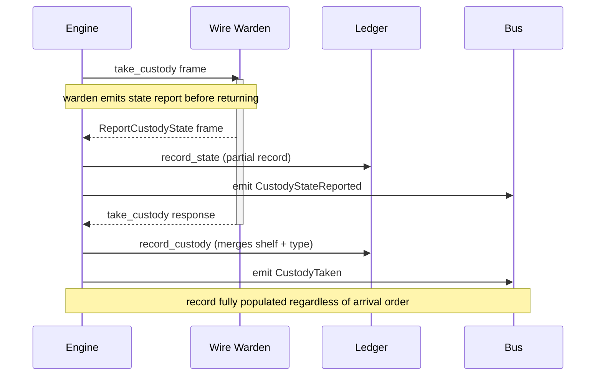

# Custody Ledger

Status: engineering-layer contract for the custody ledger subsystem.
Audience: steward maintainers, warden plugin authors, consumers of the custody surface.
Vocabulary: per `docs/CONCEPT.md`. Cross-references: `STEWARD.md`, `HAPPENINGS.md`, `PLUGIN_CONTRACT.md`.

Warden plugins take sustained custody of long-running work: an active playback session, a mounted share, a held connection, a kiosk surface. While a warden holds that work, the steward needs a stable answer to "what is currently in flight and who holds it". The custody ledger is that answer. This document defines what the ledger tracks, how entries get there, how they are observed, and why its semantics are shaped the way they are.

Variant-level semantics of the happenings the ledger emits live in `HAPPENINGS.md`. Wire-level semantics of the frames that feed the ledger live in `PLUGIN_CONTRACT.md`. Here we cover the ledger itself.

## 1. Purpose

A warden accepts work through `take_custody` and holds it until `release_custody`. While the warden holds that work, the steward needs to know:

- Which wardens are currently holding custody.
- What shelf each holding warden occupies.
- What the custody was tagged with at hand-off time (its `custody_type`).
- The most recent state snapshot the warden has reported.
- When each custody started and when it was last updated.

The ledger answers these questions. It is the fabric's read-side surface for the custody-holding portion of system state, keyed by `(plugin, handle_id)`.

Consumers split by what they need:

- "What is the box doing right now?" - read the ledger (in-process via `AdmissionEngine::custody_ledger()`, externally via the client socket's `list_active_custodies` op).
- "Tell me when something changes." - subscribe to happenings (`HAPPENINGS.md`).

The ledger is not a log. It keeps exactly one record per live custody, with the most recent snapshot overwriting older ones. A release drops the record. For transition-level observability, use the bus.

## 2. The CUSTODY Concept

The concept document (section 2) introduces the custody ledger as a companion to warden admission:

> The CUSTODY LEDGER tracks work entrusted to wardens - capabilities that take custody of long-running operations (playback, mounts, connectivity, file-sharing, kiosk surface).

Every `take_custody` the steward dispatches is a debt the ledger records. Every `release_custody` crosses that debt out. Every state report the holding warden emits is the ledger learning more about that debt. The steward's life-cycle management leans on the ledger at shutdown time, knowing which wardens are still holding custody and therefore which unloads block.

## 3. Record Model

### 3.1 Key

Records are keyed by `(plugin_name, handle_id)`:

- **plugin_name** - canonical reverse-DNS name of the warden plugin (`org.evo.example.warden`). Supplied by the admission engine when it constructs the reporter; carried implicitly on every write.
- **handle_id** - warden-chosen identifier for this custody instance. Opaque to the steward. Returned in the `CustodyHandle` from `take_custody` and carried on every subsequent `ReportCustodyState`.

The plugin-name prefix partitions the key space: two wardens that happen to pick the same internal handle-id scheme do not collide. Handle ids are warden-local; the ledger does not attempt to impose a scheme.

### 3.2 CustodyRecord

```rust
pub struct CustodyRecord {
    pub plugin: String,
    pub handle_id: String,
    pub shelf: Option<String>,
    pub custody_type: Option<String>,
    pub last_state: Option<StateSnapshot>,
    pub started_at: SystemTime,
    pub last_updated: SystemTime,
}
```

| Field | Optional? | Populated when |
|-------|-----------|----------------|
| `plugin` | No | Always - key component. |
| `handle_id` | No | Always - key component. |
| `shelf` | Yes | Set when `record_custody` runs. |
| `custody_type` | Yes | Set when `record_custody` runs. |
| `last_state` | Yes | Set on the first `record_state`; updated on subsequent ones. |
| `started_at` | No | Set at first insertion; stable across UPSERTs. |
| `last_updated` | No | Updated on every UPSERT. |

The optional fields exist because two events (`record_custody` and `record_state`) can populate a record and either can arrive first (section 4). Under normal operation a record acquires all optional fields within milliseconds of creation. A record observed with `shelf = None` is either mid-race or the ledger has seen state reports for a handle the engine never registered (a warden bug).

### 3.3 StateSnapshot

```rust
pub struct StateSnapshot {
    pub payload: Vec<u8>,
    pub health: HealthStatus,
    pub reported_at: SystemTime,
}
```

- **payload** - opaque bytes from the warden's most recent `ReportCustodyState`. Shape is warden-defined; the ledger neither parses nor validates.
- **health** - the warden's self-declared status at report time (`Healthy`, `Degraded`, `Unhealthy`). Cheap to examine by consumers that only care about transitions between coarse states.
- **reported_at** - the steward's clock at receipt, not the warden's. Avoids having to reason about clock skew on the warden side; the useful question is "when did the steward learn about this?".

The ledger keeps exactly one snapshot per record. Older payloads are overwritten. Consumers that need history use happenings: each report emits one `CustodyStateReported`.

## 4. UPSERT Semantics and the Take/Report Race

Wire wardens emit their initial `ReportCustodyState` frame from within their own `take_custody` trait method, before the response frame is written back. On the steward side the reader task processes the event frame before the response frame resolves the oneshot that the engine's `take_custody` is awaiting. Consequently, the ledger's `record_state` may run before the engine's `record_custody`.



This race is not a bug. Making it a bug would require either serialising warden-side emission (paying latency on every custody for one race that UPSERT handles for free) or plumbing synchronisation through the wire protocol (coupling the plugin contract to a steward-side implementation detail). The ledger absorbs it instead.

Both `record_custody` and `record_state` are merge operations:

- If no record exists, either call creates one with its own fields populated and the other's as `None`.
- If a record exists, either call merges its fields in, preserving the record's `started_at` and any fields the caller doesn't set.

| Call | Sets | Preserves |
|------|------|-----------|
| `record_custody(plugin, shelf, handle, custody_type)` | `shelf`, `custody_type`, `last_updated` | `last_state`, `started_at` |
| `record_state(plugin, handle_id, payload, health)` | `last_state`, `last_updated` | `shelf`, `custody_type`, `started_at` |

Either ordering ends with a fully-populated record. No explicit synchronisation is needed between the warden's first state report and the engine's registration of the handle.

## 5. `LedgerCustodyStateReporter`: the Integration Point

`LedgerCustodyStateReporter` is the single bridge between the SDK's `CustodyStateReporter` trait and the steward's ledger-plus-bus pair. One instance is constructed per admitted warden, tagged with that warden's plugin name, carrying `Arc` handles to the ledger and the bus.

```rust
pub struct LedgerCustodyStateReporter {
    ledger: Arc<CustodyLedger>,
    bus: Arc<HappeningBus>,
    plugin_name: String,
}
```

On every call to `report(handle, payload, health)` the reporter does, in order:

1. `ledger.record_state(&plugin, &handle.id, payload, health)` - UPSERTs the snapshot into the record.
2. `bus.emit(Happening::CustodyStateReported { plugin, handle_id, health, at })` - emits the happening.

The ordering is load-bearing. Subscribers that react to the happening by querying the ledger always see the new snapshot (invariant; see section 10).

### 5.1 In-process Installation

For in-process wardens, the admission engine constructs the reporter as part of the `Assignment` handed to `take_custody`. The warden receives the reporter on `assignment.custody_state_reporter` and calls it directly during custody. Ledger write and happening emission happen in the same async context as the warden's state-reporting code.

### 5.2 Wire Installation

For wire wardens, the admission engine passes the ledger and bus `Arc`s to `WireWarden::connect`. `WireWarden::load` constructs the reporter from those `Arc`s and installs it in the wire client's `EventSink`. When the remote warden's `ReportCustodyState` frame arrives, the reader task routes it through `forward_event` to the sink's `custody_state_reporter`, which is this same reporter. Ledger write and happening emission happen steward-side, regardless of where the warden's own code runs.

### 5.3 Assignment Custody Reporter Dead-ended on Wire

The admission engine constructs an `Assignment` with a steward-side `custody_state_reporter` for both in-process and wire wardens. On the wire path the plugin never sees that specific `Arc`: the SDK's `serve_warden` substitutes its own wire-backed reporter on each `take_custody` on the plugin side. The admission engine's reporter is effectively dead-ended on the wire path, present in the `Assignment` only for the in-process path. A future SDK change could unify the two; today, every state report (in-process or wire) reaches the same ledger and bus through a single reporter implementation, and that's the property that matters.

## 6. Ordering Guarantees

The ledger's writes and the bus's emissions follow a strict order relative to the admission engine's custody verbs:

| Engine verb | Ledger call | Happening |
|-------------|-------------|-----------|
| `take_custody` (succeeded) | `record_custody` | `CustodyTaken` after |
| `release_custody` (succeeded) | `release_custody` | `CustodyReleased` after |
| Reporter `report` | `record_state` | `CustodyStateReported` after |

The "after" in every row means: the happening is emitted after the ledger call returns. A subscriber reacting to any custody happening by querying the ledger always sees a state consistent with the happening's semantics:

- After `CustodyTaken`: the record exists, shelf and custody_type populated.
- After `CustodyReleased`: the record is gone.
- After `CustodyStateReported`: the record's `last_state` reflects the just-reported snapshot.

On failure paths (warden rejects `take_custody`, etc.) neither the ledger nor the bus is written. The canonical statement of these invariants lives in `STEWARD.md` section 13.

## 7. Access Surfaces

### 7.1 Programmatic Access (in-process)

`AdmissionEngine::custody_ledger()` returns an `Arc<CustodyLedger>`. Callers within the steward process can describe, list, or (for tests) pre-populate the ledger directly. The `Arc` is shared with the engine and every reporter; every handle sees the same state.

```rust
let ledger = engine.custody_ledger();
let record = ledger.describe("org.example.warden", "playback-1");
let all = ledger.list_active();
```

### 7.2 Client Socket (external consumers)

The steward exposes `list_active_custodies` over the client socket as an op with no arguments. The response is the full snapshot in the shape documented in `STEWARD.md` section 6.3.

This is a polling surface. A consumer that wants live updates combines it with the `subscribe_happenings` streaming op on the same socket: the ledger gives current state at subscription time, the bus gives transitions from that point forward. Together they are the complete external view of the custody surface.

### 7.3 Not Exposed

The ledger does not expose a direct "add record" or "mutate record" surface to external callers. All production writes go through the engine's `take_custody` / `release_custody` verbs or through the `LedgerCustodyStateReporter`. This preserves the invariant that ledger records correspond to real steward-dispatched custodies.

Tests reach `record_custody` / `record_state` / `release_custody` directly through an `Arc<CustodyLedger>` to pre-populate state for dispatch tests. This is intentional and supported; the public method surface is the same for both.

## 8. Concurrency Model

The ledger wraps a `HashMap<(String, String), CustodyRecord>` in a `std::sync::RwLock`. Reads (`describe`, `list_active`, `len`, `is_empty`) take the read lock; writes (`record_custody`, `record_state`, `release_custody`) take the write lock. Lock holds are brief - single map operations with owned keys.

`std::sync::RwLock` rather than `tokio::sync::RwLock` because every operation is short and every call site is synchronous. Asynchronous locking would add overhead without benefit; the ledger is a cache-like data structure, not a coordination primitive.

The ledger is shared across the steward via `Arc<CustodyLedger>`. The admission engine holds one; every reporter holds one; every wire warden holds one; the server borrows one on demand to serve `list_active_custodies`. All refer to the same underlying `RwLock`-guarded map.

## 9. Not A Log

The ledger is a current-state surface, not a history. Three deliberate properties:

- Releasing a custody drops the record. `release_custody` returns the removed record (for archival use by the caller), but the ledger does not retain it.
- State reports overwrite `last_state`. Earlier snapshots are not retained on the record.
- Re-calling `record_custody` with different metadata (a hypothetical shelf migration) overwrites `shelf` and `custody_type` while preserving `started_at`. This is supported behaviour, exercised by the unit tests; no engine code path currently calls it.

For historical observation use happenings: every ledger-writing event emits a happening, and subscribers can persist happenings however they like. For full forensic history, a future observability rack will keep an append-only trail (see `CONCEPT.md` section 3).

## 10. Invariants

1. In normal steward operation, every entry in the ledger corresponds to a steward-dispatched action: an `AdmissionEngine::take_custody` returning `Ok` (yielding `record_custody`) or a `LedgerCustodyStateReporter::report` routing a warden's `ReportCustodyState` (yielding `record_state`). The ledger's public methods are reachable directly from any `Arc<CustodyLedger>` holder, but the engine does not create such holders from external inputs.
2. Keys are `(plugin_name, handle_id)`. Plugin names are never empty; handle ids are never empty (enforced by `CustodyHandle::new`).
3. `started_at` is the timestamp of the first insertion for that key and does not change across subsequent UPSERTs.
4. `last_updated` is stable-or-increasing across successive writes to the same record (modulo the underlying `SystemTime` clock, which is wall-clock and can jump).
5. A successful `take_custody` on the engine always ends with `record_custody` having run before the engine returns.
6. A successful `release_custody` on the engine always ends with the record having been removed before the engine returns.
7. Every `LedgerCustodyStateReporter::report` ends with `record_state` having run before the `CustodyStateReported` happening is emitted.
8. The ledger's state is consistent with happenings observed on the bus: a subscriber that reacts to any custody happening by querying the ledger sees a state consistent with the happening's semantics.

## 11. Deferred

### 11.1 Persistence

The custody ledger is persisted to `/var/lib/evo/state/evo.db` alongside the subject registry and relation graph. Every `record_custody`, `record_state`, and `release_custody` writes through to the database in the same transaction that updates the in-memory map; a steward restart rehydrates the in-memory ledger from the database before admission resumes. In-flight custodies on wardens that also survive the restart keep their steward-side record. The full contract - schema, transaction semantics, crash recovery, permissions - is in `PERSISTENCE.md`.

Implementation is pending. Until that code lands, the ledger runs entirely in memory and a steward restart yields an empty ledger; in-flight custodies on wardens that survive the restart have no steward-side record in the interim.

### 11.2 Full State-report History

The ledger keeps only `last_state`. A bounded ring buffer of the last N snapshots per record would let consumers inspect recent state without subscribing to happenings. Low priority; no current consumer needs it.

### 11.3 Release Archival

`release_custody` returns the removed record, but the ledger does not retain it. A future "recently released" surface (bounded, time-windowed) would help consumers that want to see what just ended. Out of scope for v0.

### 11.4 Course-correction Bookkeeping

`course_correct` does not currently touch the ledger. A future pass could bump `last_updated` and/or carry the correction in a dedicated field. Low priority; wardens that emit a state report after a correction (as most will) bump `last_updated` naturally through the reporter.
