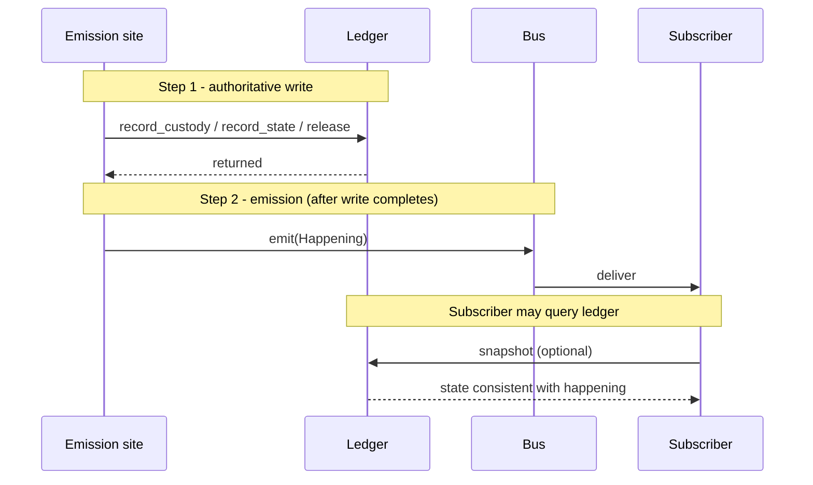

# Happenings

Status: engineering-layer contract for the happenings bus subsystem.
Audience: steward maintainers, consumers of the live event surface, future plugin authors emitting fabric-level transitions.
Vocabulary: per `docs/CONCEPT.md`. Cross-references: `STEWARD.md`, `CUSTODY.md`, `PROJECTIONS.md`.

The fabric has two notification shapes: pull and push. Consumers ask for the current state (a projection, a ledger snapshot) or they subscribe to transitions (a happening). This document describes the push side: the happenings bus, the `Happening` enum, the delivery semantics, and the boundary between "a happening was emitted" and "a subscriber saw it".

The variant set spans custody transitions, the relation graph, the subject registry, and admin (privileged) operations. The variant set is open: new transition categories (admission events, factory instance lifecycle) land as new variants under the same enum.

## 1. Purpose

Consumers that need to know "what is the box doing right now" read the ledger. Consumers that need to know "tell me when it changes" subscribe to happenings. The two surfaces are paired: every ledger-writing event emits a happening, and the happening is emitted after the ledger write. A subscriber that reacts to any happening by querying the ledger always sees a state consistent with the happening's semantics.

The bus does not replace logs, metrics, or audit trails. It is a live, in-memory, transient notification surface with one job: wake up interested parties when something changes, so they can decide what to do about it.

## 2. The HAPPENING Concept

The concept document (section 2) introduces happenings as the outbound notification channel of the fabric:

> All outbound behaviour of the system is either a projection on demand or a streamed HAPPENING on the fabric's notification surface. There is no side channel.

Projections answer questions. Happenings broadcast transitions. Together they are the full read-side surface of the fabric: one synchronous, one streaming. Any state change an external consumer needs to react to lands as a happening; any state a consumer needs to inspect lands in a projection or a typed snapshot (the ledger for custody, the subject registry for subjects, the relation graph for relations).

## 3. The `Happening` Enum

```rust
#[non_exhaustive]
pub enum Happening {
    // Custody
    CustodyTaken { plugin, handle_id, shelf, custody_type, at },
    CustodyReleased { plugin, handle_id, at },
    CustodyStateReported { plugin, handle_id, health, at },
    // Relation graph
    RelationCardinalityViolation { plugin, predicate, source_id, target_id, side, declared, observed_count, at },
    RelationForgotten { plugin, source_id, predicate, target_id, reason, at },
    RelationSuppressed { admin_plugin, source_id, predicate, target_id, reason, at },
    RelationUnsuppressed { admin_plugin, source_id, predicate, target_id, at },
    // Subject registry
    SubjectForgotten { plugin, canonical_id, subject_type, at },
    // Admin (privileged) operations
    SubjectAddressingForcedRetract { admin_plugin, target_plugin, canonical_id, scheme, value, reason, at },
    RelationClaimForcedRetract { admin_plugin, target_plugin, source_id, predicate, target_id, reason, at },
    SubjectMerged { admin_plugin, source_ids, new_id, reason, at },
    SubjectSplit { admin_plugin, source_id, new_ids, strategy, reason, at },
    RelationSplitAmbiguous { admin_plugin, source_subject, predicate, other_endpoint_id, candidate_new_ids, at },
    // ... further variants may be added under #[non_exhaustive]
}
```

`#[non_exhaustive]` is load-bearing: the steward and its consumers must tolerate new variants being added without breaking source compatibility. Every `match` on `Happening` outside this crate must include a catch-all arm.

### 3.1 Current Variants

Twelve variants ship today across four categories. All variants carry an `at: SystemTime` field (the steward's clock when the happening was emitted) - omitted from the per-variant tables below to keep them readable. JSON shapes are in `SCHEMAS.md` section 5.1.

**Custody transitions**

| Variant | Emitted from | Carries (besides `at`) |
|---------|--------------|------------------------|
| `CustodyTaken` | `AdmissionEngine::take_custody` (after ledger write) | `plugin`, `handle_id`, `shelf`, `custody_type` |
| `CustodyReleased` | `AdmissionEngine::release_custody` (after ledger drop) | `plugin`, `handle_id` |
| `CustodyStateReported` | `LedgerCustodyStateReporter::report` (after ledger write) | `plugin`, `handle_id`, `health` |

**Relation graph**

| Variant | Trigger | Carries (besides `at`) |
|---------|---------|------------------------|
| `RelationCardinalityViolation` | An assertion stored in the graph causes the source-side or target-side count for the predicate to exceed its declared bound. The assertion is not refused; the violation is surfaced for consumer policy (`RELATIONS.md` 7.1). | `plugin`, `predicate`, `source_id`, `target_id`, `side`, `declared`, `observed_count` |
| `RelationForgotten` | The last claimant retracts (`reason.kind = "claims_retracted"`), or a touched subject is forgotten and the cascade removes the edge (`reason.kind = "subject_cascade"`). Both paths emit the same variant; consumers branch on `reason.kind`. | `plugin`, `source_id`, `predicate`, `target_id`, `reason` |
| `RelationSuppressed` | First-time successful suppression of a relation by an admin. Re-suppressing an already-suppressed relation is a silent no-op. | `admin_plugin`, `source_id`, `predicate`, `target_id`, `reason` |
| `RelationUnsuppressed` | Successful transition from suppressed to visible. Unsuppressing a non-suppressed or unknown relation is a silent no-op. | `admin_plugin`, `source_id`, `predicate`, `target_id` |

**Subject registry**

| Variant | Trigger | Carries (besides `at`) |
|---------|---------|------------------------|
| `SubjectForgotten` | A subject's last addressing was retracted and the registry record was removed. Emitted BEFORE any cascade `RelationForgotten` events for the same forget. | `plugin`, `canonical_id`, `subject_type` |

**Admin (privileged) operations**

| Variant | Trigger | Carries (besides `at`) |
|---------|---------|------------------------|
| `SubjectAddressingForcedRetract` | An admin plugin force-retracted another plugin's addressing claim. Fires BEFORE any cascade `SubjectForgotten` / `RelationForgotten` events. | `admin_plugin`, `target_plugin`, `canonical_id`, `scheme`, `value`, `reason` |
| `RelationClaimForcedRetract` | An admin plugin force-retracted another plugin's relation claim. Fires BEFORE any cascade `RelationForgotten` event. | `admin_plugin`, `target_plugin`, `source_id`, `predicate`, `target_id`, `reason` |
| `SubjectMerged` | Two canonical subjects were merged into one new canonical ID. Fires BEFORE the relation-graph rewrite; any `RelationCardinalityViolation` events the rewrite triggers fire afterwards with the new canonical ID. | `admin_plugin`, `source_ids`, `new_id`, `reason` |
| `SubjectSplit` | One canonical subject was split into N new canonical IDs (length at least 2). Fires BEFORE per-edge structural rewrites. | `admin_plugin`, `source_id`, `new_ids`, `strategy`, `reason` |
| `RelationSplitAmbiguous` | A `SplitRelationStrategy::Explicit` split encountered a relation with no matching `ExplicitRelationAssignment`; the steward fell through to `ToBoth` for that relation and surfaces the gap. One emission per gap. Fires AFTER the parent `SubjectSplit`. | `admin_plugin`, `source_subject`, `predicate`, `other_endpoint_id`, `candidate_new_ids` |

Every variant carries identifying fields so subscribers can correlate happenings with ledger records (custody) or with the registry / graph (subject and relation). `admin_plugin` distinguishes the privileged actor from the `target_plugin` whose claim was modified.

### 3.2 Ordering Across Cascade Sequences

Several admin and retract paths produce a sequence of related happenings. The ordering is observable and load-bearing:

- A retract that removes a subject's last addressing fires `SubjectForgotten` BEFORE the per-edge `RelationForgotten` events the cascade triggers (`reason.kind = "subject_cascade"`).
- `SubjectAddressingForcedRetract` fires BEFORE any cascade `SubjectForgotten` and `RelationForgotten` events the same forced retract triggers.
- `RelationClaimForcedRetract` fires BEFORE the cascade `RelationForgotten` (with `reason.kind = "claims_retracted"` and `retracting_plugin` set to the ADMIN, not the target).
- `SubjectMerged` fires BEFORE the relation-graph rewrite; any `RelationCardinalityViolation` events from the rewrite fire afterwards.
- `SubjectSplit` fires BEFORE per-edge rewrites; one `RelationSplitAmbiguous` is emitted per gap relation under `Explicit` strategy AFTER the `SubjectSplit`.

Subscribers that maintain auxiliary state can rely on these orderings to clean up parent records before their children land.

### 3.3 Future Variants

The variant set is open. Categories identified but not yet modelled (aligned with `STEWARD.md` section 12.2):

- Subject announcement (`SubjectAnnounced`) on first registry insertion (today subscribers infer "new subject" by observing the first projection).
- Admission events (`PluginAdmitted`, `PluginUnloaded`, `PluginFailed`).
- Factory instance lifecycle (when factories land; see `STEWARD.md` 12.7).
- Projection invalidations (when push-style projections land).
- Fast-path transitions (when the fast path lands; see `STEWARD.md` 12.6 and `FAST_PATH.md`).

Adding a variant requires updating the enum and the relevant emission site; no other source change is required of consumers (thanks to `#[non_exhaustive]`).

## 4. The `HappeningBus`

```rust
pub struct HappeningBus { /* wraps broadcast::Sender<Happening> */ }
```

The bus wraps a `tokio::sync::broadcast` channel. `tokio::sync::broadcast` was chosen because the fabric's usage pattern is exactly what it solves: one producer (logically - the steward), many consumers (each subscriber independently paced), bounded buffer, slow consumers don't block the producer.

### 4.1 API

| Method | Purpose |
|--------|---------|
| `HappeningBus::new()` | Construct with `DEFAULT_CAPACITY` (1024). |
| `HappeningBus::with_capacity(n)` | Construct with custom capacity. `n > 0` required. |
| `bus.emit(happening)` | Fire-and-forget send. Never blocks. |
| `bus.subscribe()` | Returns a `broadcast::Receiver<Happening>`. |
| `bus.receiver_count()` | Diagnostic; count of currently-subscribed receivers. |

The bus is `Send + Sync` and cheap to share via `Arc<HappeningBus>`. Cloning the bus directly is not supported; callers share it via `Arc` instead.

### 4.2 Default Capacity

`DEFAULT_CAPACITY = 1024` is deliberately generous for an appliance-scale event rate. A warden holding a playback custody emits on the order of a state report per second; with dozens of wardens active, the channel sees hundreds of happenings per minute, well within the buffer headroom before any consumer lags.

Callers that need a different trade-off (higher buffer for aggressive consumers, lower buffer for strict back-pressure visibility) use `with_capacity`.

## 5. Delivery Semantics

### 5.1 Late Subscribers Miss Earlier Happenings

A subscriber that calls `subscribe()` at time T sees only happenings emitted after T. Earlier happenings are not replayed. This is intentional:

- The bus is not a durable log.
- Replay would require either unbounded retention (unacceptable) or bounded with lossy replay (confusing).
- Consumers that need "current state" query the ledger on subscription, then consume the bus for transitions from that point forward.

The canonical pattern for a consumer wanting a complete picture:

1. Subscribe to the bus.
2. Query the ledger (or other authoritative store) for current state.
3. Consume the bus, reconciling each happening against the queried state.

The ordering of steps 1 and 2 matters. Subscribing first and querying second means the consumer's query reflects all happenings up to some point T', and the bus will deliver every happening emitted after subscription. There is at most one moment where a happening is both in the query and on the bus; consumers handle this by idempotent reconciliation (the ledger is the source of truth either way).

### 5.2 Slow Subscribers Get Lagged

If a subscriber falls behind by more than the bus's capacity, its next `recv()` returns `Err(RecvError::Lagged(n))` where `n` is the number of happenings dropped. The subscriber is still subscribed and can continue consuming; the channel has dropped the oldest happenings to make room for newer ones.

Subscribers must handle `Lagged` gracefully. The recommended recovery:

1. Log the lag (for diagnostics).
2. Re-query the authoritative store for any state the happening stream is being used to track.
3. Continue consuming.

Loss is allowed by design. The ledger is the source of truth for current state; happenings are a live notification surface and may be lossy under pathological consumer slowness. A subscriber that cannot tolerate loss should not use happenings for that purpose.

### 5.3 Fire-and-forget `emit`

`bus.emit(h)` does not return a result. If no receivers are currently subscribed, the happening is silently dropped. If every receiver's buffer is full, the broadcast channel rotates old happenings out to make room (as above, this surfaces to subscribers as `Lagged`).

`emit` never blocks and never fails from the producer's perspective. This is essential for emissions from within `take_custody` / `release_custody` / state-report code paths: those cannot be delayed or gated on the presence or responsiveness of subscribers.

### 5.4 Every Subscriber Sees Every Happening

Within the bus's capacity, every subscriber independently sees every happening emitted after it subscribed. Subscribers do not compete for happenings; each has its own view of the stream. This matches `tokio::sync::broadcast`'s semantics verbatim.

## 6. Ordering Relative to Authoritative Writes

Every happening is emitted after the authoritative store write it describes completes. The authoritative store is the custody ledger for custody variants, the relation graph for relation variants, the subject registry for subject variants, and the admin ledger paired with the relevant graph or registry for admin variants:

| Happening | Preceded by |
|-----------|-------------|
| `CustodyTaken` | `CustodyLedger::record_custody` |
| `CustodyReleased` | `CustodyLedger::release_custody` |
| `CustodyStateReported` | `CustodyLedger::record_state` |
| `RelationCardinalityViolation` | `RelationGraph::assert` |
| `RelationForgotten` (claims_retracted) | `RelationGraph::retract` (last claimant gone) |
| `RelationForgotten` (subject_cascade) | `RelationGraph::forget_all_touching` (cascade) |
| `RelationSuppressed` | `RelationGraph::suppress` |
| `RelationUnsuppressed` | `RelationGraph::unsuppress` |
| `SubjectForgotten` | `SubjectRegistry::forget` |
| `SubjectAddressingForcedRetract` | `SubjectRegistry::forced_retract_addressing` + `AdminLedger::record` |
| `RelationClaimForcedRetract` | `RelationGraph::forced_retract_claim` + `AdminLedger::record` |
| `SubjectMerged` | `SubjectRegistry::merge` + `AdminLedger::record` |
| `SubjectSplit` | `SubjectRegistry::split` + `AdminLedger::record` |
| `RelationSplitAmbiguous` | per-edge rewrite during a `SubjectSplit` whose `Explicit` strategy left the edge unassigned |



This ordering is the basis for the "consistent view" property in section 1. A subscriber that reacts to any of these happenings by querying the authoritative store sees a state consistent with the happening's semantics:

- After `CustodyTaken`: the record exists, `shelf` and `custody_type` populated.
- After `CustodyReleased`: the record is gone.
- After `CustodyStateReported`: the record's `last_state` reflects the just-reported snapshot.
- After `RelationCardinalityViolation`: the violating relation has been stored; both the new and the pre-existing relation are visible to neighbour queries.
- After `RelationForgotten`: the relation is gone from the graph.
- After `RelationSuppressed`: the relation is hidden from neighbour queries and walks; `describe_relation` still surfaces it with its `SuppressionRecord`.
- After `RelationUnsuppressed`: the relation is visible again to neighbour queries and walks.
- After `SubjectForgotten`: the canonical ID no longer resolves in the registry.
- After `SubjectAddressingForcedRetract`: the addressing is gone; if it was the subject's last addressing, a `SubjectForgotten` follows.
- After `RelationClaimForcedRetract`: the claim is gone; if it was the relation's last claim, a `RelationForgotten` (claims_retracted, with `retracting_plugin = admin`) follows.
- After `SubjectMerged`: the new canonical ID resolves to the merged subject and the two source IDs survive in the registry as `Merged` aliases.
- After `SubjectSplit`: the new canonical IDs resolve and the source ID survives as a single `Split` alias carrying every new ID.
- After `RelationSplitAmbiguous`: the relation has been replicated under `ToBoth` semantics across the new IDs; the operator can audit and follow up via per-edge forced retracts.

The ordering is enforced by the emission sites, not by the bus itself. The bus will emit any `Happening` given to it in any order; it is the responsibility of the steward's emission sites (and of any future non-steward emitters) to write state before emitting.

See `STEWARD.md` section 13 for the canonical invariant statement.

## 7. Payload Policy

### 7.1 What Happenings Carry

Happenings carry the minimum fields a subscriber needs to:

- **Identify** the thing that changed (`plugin`, `handle_id`, `shelf`, etc.).
- **Classify** the change (the variant itself).
- **Coarse-summarise** the new state, where a coarse summary is cheap and useful (the `health` field on `CustodyStateReported`).
- **Timestamp** the transition (`at`).

### 7.2 What Happenings Do Not Carry

Full state payloads - the `Vec<u8>` a warden passes to `ReportCustodyState`, a full subject projection, a full relation graph slice - are deliberately not carried on happenings. Reasons:

- Payloads can be large (a state report may contain a rendered UI snapshot or a compressed buffer).
- Broadcast-channel capacity is finite; large payloads inflate the per-happening memory cost, shrinking the effective buffer.
- Consumers that want the payload can retrieve it from the ledger (current snapshot) after receiving the happening.

The pattern is "event notification; consumer fetches on demand". Analogous to a doorbell: the bell rings, the occupant decides whether to answer.

### 7.3 Health on `CustodyStateReported`

`health` is an exception to "no payload fields on happenings" because it is a small, bounded, consumer-useful summary. A subscriber that only cares about transitions between healthy / degraded / unhealthy states can decide whether to fetch the full snapshot or ignore the happening, all from the happening alone.

## 8. Not A Log

Happenings are live-only. Four properties, all deliberate:

- A subscriber that connects after a happening was emitted does not see it.
- A subscriber that falls behind loses happenings.
- No persistence across steward restart.
- No fan-in replay.

For historical queries:

- **Current state**: consult the ledger (custody), subject registry, relation graph, etc.
- **Historical trail**: future observability rack, not yet present.

A consumer that needs "did happening X fire in the last hour" cannot answer it from the bus. That is a gap the observability rack (when it lands) is intended to fill. Bridging happenings into a durable log is the consumer's responsibility today, and is one of the straightforward plugin contributions when the architecture grows.

## 9. Integration Points

### 9.1 Inside the Steward

The bus has the following production emission sites today:

- `AdmissionEngine::take_custody`: emits `CustodyTaken` after `record_custody`.
- `AdmissionEngine::release_custody`: emits `CustodyReleased` after `release_custody`.
- `LedgerCustodyStateReporter::report`: emits `CustodyStateReported` after `record_state`. Installed in every admitted warden (in-process and wire), so every state report from any warden ends with an emission.
- `RegistrySubjectAnnouncer`: emits `SubjectForgotten` when a retract removes a subject's last addressing. Cascade `RelationForgotten` events with `reason.kind = "subject_cascade"` follow per edge `RelationGraph::forget_all_touching` removed.
- `RegistryRelationAnnouncer`: emits `RelationCardinalityViolation` after the assertion has been stored, and `RelationForgotten` with `reason.kind = "claims_retracted"` when the last claimant retracts.
- `RegistrySubjectAdmin`: emits `SubjectAddressingForcedRetract`, `SubjectMerged`, and `SubjectSplit` after the registry primitive succeeds. `SubjectMerged` and `SubjectSplit` emit BEFORE the relation-graph rewrite they trigger; cascade `RelationCardinalityViolation` and `RelationSplitAmbiguous` events fire afterwards.
- `RegistryRelationAdmin`: emits `RelationClaimForcedRetract`, `RelationSuppressed`, and `RelationUnsuppressed` after the graph primitive succeeds.

A separate site exists on the client-socket surface: when a client sends `subscribe_happenings`, the server subscribes on its behalf and forwards every happening as a frame. See section 9.2.

### 9.2 External Subscribers (client socket)

The steward exposes the bus to external consumers via the `subscribe_happenings` op on the client socket. When a client sends this op, the server:

1. Calls `bus.subscribe()` to register a receiver.
2. Writes a `{"subscribed": true}` ack frame.
3. Enters a loop writing one frame per happening until the client disconnects.

The ack ordering is load-bearing: by the time the client reads the ack, the server has already subscribed, so any happening emitted after the ack is guaranteed to reach the client. Wire-level details are in `STEWARD.md` section 6.2.

Subscriptions are the only streaming surface in the v0 client protocol; every other op is request/response.

### 9.3 Not Plugin-facing (Currently)

Plugins do not emit happenings. Plugins emit state reports (through the `CustodyStateReporter` trait), subject announcements, relation assertions, etc. These cross the boundary into the steward where they may trigger happenings. The bus is a steward-internal emission surface; what a plugin publishes is always structured, typed data through the `LoadContext`'s announcers, not free-form happenings.

A future design decision may allow plugins to contribute to a constrained set of happening variants directly. That decision is not on the table today.

## 10. Invariants

1. Happenings are emitted after the ledger (or other authoritative store) write they describe completes.
2. A subscriber that reacts to any custody happening by querying the ledger sees a state consistent with the happening's semantics.
3. `emit` never blocks and never panics, regardless of subscriber count, buffer fill level, or consumer pace.
4. Every subscriber sees every happening emitted after its `subscribe()` call, up to the buffer capacity. Beyond that, the subscriber receives `Lagged(n)` on its next `recv` and can continue.
5. Happenings are not retained across steward restart.
6. Late subscribers do not receive replayed happenings.
7. The `Happening` enum is `#[non_exhaustive]`; adding a variant is not a source-compatibility breaking change for consumers that include a catch-all match arm.

## 11. Deferred

### 11.1 Additional Variants

Categories identified for future work (see 3.3). The pattern is mechanically simple: add a variant, add an emission site, add tests. The design work is deciding what belongs on each variant; consumer needs drive that.

### 11.2 Per-rack or Per-subject Filtering

Today a subscriber receives every happening on the bus and filters client-side. If variant count grows, a server-side filtered subscription (subscribe only to `CustodyStateReported` for `plugin = X`, or only to transitions on a specific subject) becomes attractive. Adds complexity to the bus; not justified yet.

### 11.3 Aggregation / Coalescing

A warden that emits state reports at 10 Hz produces 10 happenings per second per custody. For subscribers that care only about coarse transitions, coalescing (emit at most one `CustodyStateReported` per handle per 100 ms) would reduce noise. Plausible future enhancement; not essential for current workloads.

### 11.4 Persistence / Observability Integration

Bridging happenings into the observability rack (when it lands) for durable historical replay. Design question deferred to the rack itself; the bus is happy to be a data source for such a bridge, and the bridge is a plugin like any other.

### 11.5 Plugin-authored Happenings

Whether (and how) plugins can contribute to specific happening variants directly, rather than only through the typed announcer API. Open design question; no current need.
