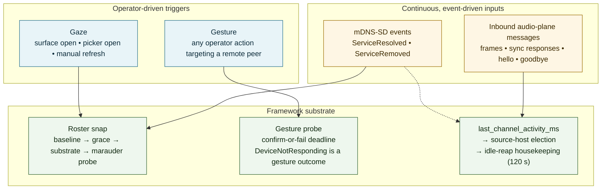
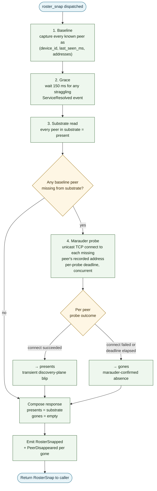
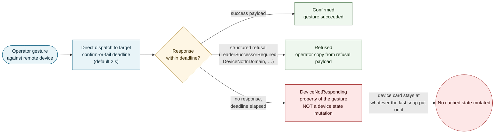
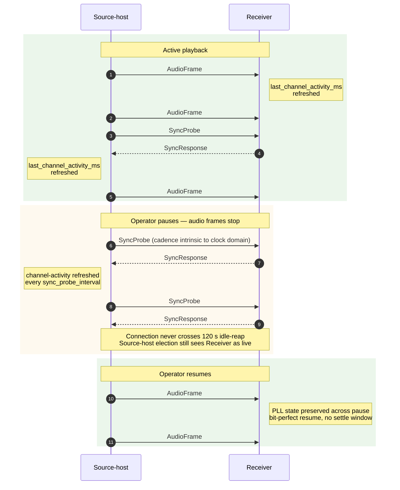

# Multi-Room Control Plane

Status: engineering-layer contract for the framework-tier multi-room
substrate (peer discovery, peer-state observation, gesture dispatch,
flow-derived liveness, audio-plane housekeeping, domain state
transcript, presence correlation, multi-carrier announce, chain-aware
relays).
Audience: steward maintainers, multi-room plugin authors, UI shell
implementers, distribution operators, fleet integrators.
Vocabulary: per `docs/CONCEPT.md`. Cross-references: `TRANSPORTS.md`,
`HAPPENINGS.md`, `SUBJECTS.md`, `STEWARD.md`, `WITNESS.md`.

The fabric's multi-room substrate observes peers, owns the audio-plane
connection lifecycle, drives source-host election, answers the
operator question "who is reachable on the LAN right now?" without
running any periodic primitive whose only job is to refresh that view,
and holds every shared fact about the domain (trust membership, group
assignments, leader selection, endpoint history) in a single
signed-transcript chain that every device replays identically. This
document defines four control-plane primitives —
**gaze-triggered roster snap**, **gesture-as-probe**, **flow-derived
health**, and **marauder query** — plus the **domain witness chain**
that carries durable shared state, the **fork-on-table presence
correlator** that reports physical truth continuously, the
**multi-carrier announce** that survives discovery silence, and the
**chain-aware relay** that crosses VLAN and tunnel boundaries. Every
primitive holds across the framework's hardware-tier range (MCU
through server).

**Substrate-canonical surfaces in this release.** The four zero-poll
primitives + the trust ledger + the per-device GroupStore + the
per-device RoleStore are the operator-canonical substrates in this
release. The domain witness chain described in §9-§12 is the
architectural reference for the cross-device-replicated chain
substrate and remains as designed; the chain-canonical path is
not the operator-canonical path in this release. Operators issue
trust + group + role gestures against the ledger and stores; chain
entries continue to record audit-bearing events. The status marker
the steward enforces is the canonical signal: when it is removed,
the chain replaces the ledger projection.

## 1. The zero-poll posture

Industry-default multi-room control planes — Sonos, Roon (RAAT),
AirPlay 2, Dante, RAVENNA — share a common shape: each device runs
periodic primitives whose job is to refresh state about other devices.
A heartbeat tick proves a peer is alive. A periodic browse refreshes
the discovered set. A polling loop asks "is X still there?" every N
seconds. Each loop pays a steady-state traffic floor and accepts a
staleness window between probes. Each loop scales linearly with peer
count.

This substrate ships none of those loops. The four primitives below
replace every periodic-liveness loop with an event-driven or
operator-driven trigger:

- **Gaze-triggered roster snap** — the framework composes a truthful
  peer roster only when the operator looks at the multi-room surface
  (or otherwise gestures against a roster-dependent affordance). No
  periodic browse cadence runs in the framework. The substrate's view
  of the peer set is kept current by the long-lived mDNS-SD event
  channel, which is event-driven (the library dispatches resolve and
  removal events as they arrive on the wire); the snap composes the
  operator-facing roster at the moment the operator asks.

- **Gesture-as-probe** — every operator action that targets a remote
  device dispatches directly to that device with a confirm-or-fail
  deadline. The dispatch is the liveness check. There is no cached
  liveness flag the framework consults as a gesture precondition. A
  did-not-confirm outcome is a property of the gesture, not a state
  mutation of the device card.

- **Flow-derived health** — the only continuous-time liveness signal
  the substrate maintains is `last_channel_activity_ms` on each
  open audio-plane peer connection. The field is updated by every
  inbound message — audio frames, sync responses, hello, goodbye, any
  legacy message. Sync probes are the always-on clock-domain primitive
  (they exist for sample-rate-skew compensation, not for liveness) and
  their `SyncResponse` traffic keeps `last_channel_activity_ms` fresh
  on healthy connections regardless of audio flow.

- **Marauder query** — when a roster snap observes a previously-known
  peer absent from the substrate at composition time, the substrate
  probes that peer's advertised audio-plane control port (`7331` by
  default) with a unicast TCP connect carrying a bounded per-probe
  deadline. A probe that succeeds reclassifies the peer as present
  (transient discovery-plane blip); a probe that fails reports the
  peer as marauder-confirmed gone. Single-packet loss on the discovery
  plane is never an absence claim.

The substrate ships these primitives end-to-end in the framework crate.
Plugin authors and UI shells consume them via the wire surface; they
do not re-implement them.



## 2. Gaze-triggered roster snap

A roster snap is the framework's answer to "who is reachable on the
LAN right now, at this stated instant." It is operator-driven: the UI
shell issues it when the operator opens the multi-room surface, when
a roster-dependent gesture's picker opens, on explicit manual refresh,
or when a new subscriber warms its initial view. The framework does
not issue snaps on a timer.

### 2.1 Wire op

```text
op = "roster_snap"

request:
  reason: SnapReason   (snake_case enum, required)
  deadline_ms: u32?    (optional, default 800, clamped at 3000)

response:
  roster_snap:        true
  result.snap_id:           string (UUIDv4)
  result.reason:            string (echo of request)
  result.snap_started_at:   SystemTime
  result.snap_completed_at: SystemTime
  result.deadline_ms:       u32 (the budget used)
  result.deadline_breached: bool
  result.presents:          [RosterEntry]
  result.gones:             [RosterDeparture]
```

`SnapReason` is one of:

- `surface_opened` — the operator opened the multi-room surface (or
  any surface that materially depends on the roster).
- `manual_refresh` — the operator hit an explicit refresh affordance.
- `gesture_precondition` — a roster-dependent gesture's picker just
  opened (move-member picker, successor picker, admit-peer chooser).
- `happening_subscription_warm` — a new subscriber is warming its
  initial roster view at connection time.

`RosterEntry` and `RosterDeparture` shapes:

```text
RosterEntry:
  device_id:     string   (canonical UUIDv4)
  display_name:  string
  addresses:     [string]
  new_to_snap:   bool     (true when peer was not in baseline)
  last_seen_ms:  u64

RosterDeparture:
  device_id:     string
  display_name:  string
  last_seen_ms:  u64      (carried from baseline for "last seen N
                           minutes ago" copy)
```

### 2.2 Composition rule

The framework composes a snap in four steps:

1. **Baseline** — capture every currently-known peer as
   `(device_id, last_seen_ms, addresses)`. The recorded addresses
   are load-bearing: the marauder query probes against the
   baseline-recorded value, so a peer that drops from the substrate
   between baseline and composition is still probeable.

2. **Grace** — wait 150 ms. The grace window lets any straggling
   `ServiceResolved` event the long-lived browse listener is
   mid-dispatching land in the substrate before composition. The
   grace is a constant, independent of the operator-supplied
   `deadline_ms` (which budgets the marauder leg).

3. **Substrate read** — read the substrate post-grace. Every peer
   in the substrate is a confirmed present. The substrate is kept
   current by the always-on browse channel; reading it is O(n)
   under a brief read lock.

4. **Marauder probe** — for each peer in baseline that is no longer
   in the substrate at composition time, probe its baseline-recorded
   address with a unicast TCP connect carrying a per-probe deadline
   (defaults to the snap's marauder window). Probes run concurrently
   so the marauder window bounds the slowest single probe, not the
   sum of all probes. A probe that succeeds reclassifies the peer as
   present in the response; a probe that fails reports the peer as
   marauder-confirmed gone.

The effective worst-case snap latency is `150 + deadline_ms`. On a
healthy LAN with all peers reachable the marauder leg has nothing to
do and the snap returns inside the grace window; the marauder cost
is paid only when a peer has dropped from the substrate and needs
confirmation.



### 2.3 Invariant

The marauder probe is the substrate's commitment that single packet
loss on the discovery plane is not an absence claim. The TCP
connect-probe goes unicast to the peer's recorded address and is
authoritative for reachability regardless of multicast packet loss
on the discovery plane. A snap that reports a peer as gone without
running the marauder probe for that peer is a contract violation.

## 3. Gesture-as-probe

Every operator action that targets a remote device dispatches
directly to that device with a confirm-or-fail deadline (default
2 s; configurable per gesture class). Three outcomes are possible:

- **Confirmed** — the target responded with a success payload before
  the deadline elapsed. The gesture succeeded.
- **Refused** — the target responded with a structured refusal
  (e.g. `LeaderSuccessorRequired`, `DeviceNotInDomain`). The gesture
  did not succeed; the structured refusal carries operator-friendly
  copy.
- **Did-not-confirm** — the deadline elapsed with no response. The
  framework returns
  `DeviceNotResponding { target_device_id, deadline_ms, attempted_paths }`.

The framework does not retry on the operator's behalf, does not
fall back silently to another peer, and does not mutate any cached
liveness state on the device card on a did-not-confirm outcome.
`DeviceNotResponding` is a property of the gesture, not a state
mutation of the device. The next gesture to the same device, or the
next gaze-triggered snap, makes its own determination.



### 3.1 Invariant

The framework MUST NOT short-circuit any subsequent gesture on the
basis of a prior did-not-confirm outcome. Every gesture stands on
its own. UI shells that mirror this discipline maintain the same
posture in their command pipeline.

## 4. Flow-derived health

The audio plane maintains a per-peer connection field
`last_channel_activity_ms` on `PeerConnectionInfo`. The field is
updated by every inbound message at the top of the message-dispatch
path before any variant-specific handling: audio frames, sync
responses, hello, goodbye, and any legacy message all reset the
silence clock.

Two concerns read this field:

- **Source-host election** treats a peer as live if its most recent
  inbound message is within the election runtime's `liveness_window`
  (60 s default). The signal stays bright through audio-frame pauses
  because the always-on sync-probe cadence (default 5 s) produces
  `SyncResponse` traffic on the same socket regardless of audio
  flow.

- **Connection housekeeping** reaps any connection whose
  `last_channel_activity_ms` is staler than `idle_reap_threshold`
  (120 s default). Only connections that have been totally silent
  for two minutes — no audio frames, no sync responses, no hello,
  no goodbye — cross the threshold. Healthy connections to paused
  peers persist indefinitely.

The substrate does not dispatch a periodic outbound Heartbeat
message on the audio-plane control channel. The legacy Heartbeat
wire-variant is retained as a no-op receiver: a peer running an
older build that still sends Heartbeats has its
`last_channel_activity_ms` updated like any other inbound message,
and its `claimed_source_host_groups` are recorded; the framework
itself does not originate Heartbeats.

### 4.1 Sync probes are clock-domain, not liveness

Sync probes (`SyncProbe` / `SyncResponse`) exist for sample-rate-skew
compensation. They feed the receiver's phase-lock loop and drive the
in-line resampling that keeps multi-room playback bit-perfect at
the receiver's DAC format. Their cadence (default 5 s, adaptive in
some deployments) is intrinsic to the clock-domain primitive and is
NOT gated on transport state — pausing them during a paused show
would cost both bit-perfect alignment on resume AND the
channel-activity freshness that keeps the connection out of the
idle-reap path.

### 4.2 Pause-resume invariant

A peer-pair whose audio is paused but whose connection answers sync
probes:

- Stays in source-host election's live set (channel activity remains
  fresh via sync responses, never crosses the 60 s liveness window).
- Stays out of the idle-reap path (never crosses the 120 s silence
  threshold).
- Resumes audio bit-perfect when playback restarts (the PLL state
  was preserved across the pause; no re-convergence settle window).

This is the framework's commitment that operator-induced pauses of
any realistic duration do not perturb the multi-room control
plane's state.



## 5. Marauder query

The marauder primitive answers a narrow question: "this peer was
known to us, but the discovery substrate no longer has it; is the
peer actually unreachable, or did the discovery plane just drop a
packet?"

When a `roster_snap` observes a baseline peer missing from the
post-grace substrate read, the framework adds that peer to the
marauder probe set with the address recorded in the baseline. The
probe is a unicast TCP connect to the peer's advertised
`control_port` (`7331` by default), with a per-probe deadline
defaulted to the snap's marauder window. Probes run concurrently
across all candidates so the marauder window bounds the slowest
single probe, not the sum.

A probe that succeeds reclassifies the peer as present in the snap
response (operator sees no observable change in card state). A
probe that fails — connect refused, timeout, network unreachable —
reports the peer as marauder-confirmed gone, emits a
`peer_disappeared` happening, and surfaces the peer in the snap's
`gones` array with its baseline `last_seen_ms` carried for the
"last seen N minutes ago" copy.

### 5.1 Mechanism rationale

Two mechanisms could implement the marauder primitive in principle:

- **Multicast known-answer query** (RFC 6762 §5.1): the framework
  issues a targeted query naming the missing instance, and a fresh
  resolve event from the wire confirms presence. This depends on
  the consuming mDNS library to refire its resolved event on the
  fresh response; libraries that deduplicate resolved events on
  identical-data responses (the conservative default for many
  implementations) emit the query but silently suppress the event,
  rendering "wait for last-seen to advance" not load-bearing.

- **Unicast TCP connect-probe** (this substrate's choice): the
  framework opens a TCP connect to the peer's advertised control
  port with a bounded deadline. Connect success or failure is
  authoritative for reachability and is independent of the mDNS
  library's event-dispatch behaviour.

The substrate ships the TCP connect-probe because it is
mechanically robust against library-level event deduplication and
because it reports reachability at the actual application-layer
endpoint the peer-pair will use for subsequent audio-plane traffic.
A peer that responds to multicast queries but is firewalled against
unicast TCP to its advertised control port would be reported as
gone — accurately, because audio-plane operation would fail against
such a peer regardless of multicast reachability.

### 5.2 Invariants

- The marauder probe MUST carry a bounded per-probe deadline. A
  probe that hangs indefinitely is a contract violation.
- The marauder probe set is composed only from baseline-missing
  peers. Probing every peer on every snap would be a periodic-
  primitive failure-mode equivalent.
- `peer_disappeared` happenings emit only on marauder-confirmed
  absence. A peer that drops from the substrate without a marauder
  probe (because the snap baseline was captured AFTER the drop) is
  not reported in `gones` — it is simply absent from `presents`.
  UI shells diff against their own prior view to render
  newly-missing peers between snaps.

## 6. Happenings

Three happenings carry the substrate's event surface for live
subscribers:

```text
peer_announced { device_id, display_name, addresses,
                 first_observation, at }
peer_disappeared { device_id, display_name, last_seen_ms,
                   snap_id, at }
roster_snapped { snap_id, reason, snap_completed_at,
                 presents_count, gones_count,
                 deadline_breached, at }
```

`peer_announced` fires on every `ServiceResolved` event from the
long-lived browse listener — both first-ever observations
(`first_observation: true`) and re-observations of known peers
(`first_observation: false`). This is the always-on event-driven
signal subscribers use for reactive roster updates between snaps.

`peer_disappeared` fires only on marauder-confirmed absence from a
roster snap. The `snap_id` joins against the `roster_snapped`
happening that triggered the probe; operator audit trails record
both for a complete trace from gaze trigger through probe outcome.

`roster_snapped` fires immediately before the snap's wire-op
response is returned to the caller. Concurrent UI shells subscribed
to the durable bus converge on the same snap truth without each
issuing their own `roster_snap` — one shell's gaze covers parallel
viewers.

## 7. UI integration contract

The substrate places three obligations on the UI shell. These are
substrate-level, not optional cosmetics; the multi-room operator
flows spec (`MULTIROOM-FLOWS.md` in the UI repository) carries the
authoritative copy templates and component-test assertions.

### 7.1 Gaze triggers

The shell issues `roster_snap` on:

1. Multi-room surface opened.
2. Surface refocused after the tab/app regained foreground after a
   backgrounded duration exceeding `freshness_budget_ms` (default
   5 s; configurable per shell).
3. Any roster-dependent gesture's precondition (move-member picker
   open, successor picker open, admit-peer chooser open).
4. Operator manual refresh gesture.

The shell does NOT issue `roster_snap` on a timer. The substrate's
zero-poll posture is reflected in the UI's gesture-driven trigger
discipline.

### 7.2 Snap-progress affordance

If `roster_snap` has not returned within 200 ms of dispatch, the
shell MUST surface a non-modal, non-blocking progress affordance
indicating the snap is in flight ("Checking who's here…" or vendor
equivalent). The affordance MUST be retired the instant the snap
returns. The affordance MAY include the elapsed-ms readout and a
manual-cancel that accepts the partial roster collected so far.
The affordance MUST NOT block other UI interaction.

### 7.3 Truthful render

The rendered roster carries `snap_completed_at` visibly available
("Freshly checked HH:MM:SS" line, or on hover for compact card
grids). Devices reported in `gones` render with their `last_seen_ms`
and the badge text "Gone since check" (or vendor equivalent). The
shell MUST NOT render an "Offline" pill that lies — the substrate
either confirms presence at a stated instant or confirms absence
with the marauder probe, and the UI mirrors that two-state model.

### 7.4 Gesture-as-probe deadline

Every gesture dispatched to a remote device carries a confirm-or-
fail deadline. The shell renders the three gesture outcomes
(confirmed / structured-refusal / did-not-confirm) per their
distinct semantics. `DeviceNotResponding` outcomes render as a
property of the gesture, not as a state mutation of the device
card. The shell MUST NOT short-circuit subsequent gestures on the
basis of prior did-not-confirm outcomes.

## 8. Operational notes

### 8.1 Idle-state traffic

On a substrate boot with no multi-room groups configured, the
framework's audio-plane TCP control port (`7331` by default)
receives zero packets in steady state. The framework dispatches no
periodic outbound primitive on the control plane; sync probes run
only when at least one audio-plane connection is open (which
requires group co-membership). The discovery channel (mDNS-SD on
UDP 5353) follows the mDNS library's own re-announcement cadence
for the local advert plus the steady-state event stream from the
wire — the framework's substrate is a passive consumer there.

### 8.2 Scale

Roster-snap latency is bounded by `150 + deadline_ms` regardless
of peer count. The marauder probe set is bounded by the number of
baseline peers that dropped from the substrate between baseline
and post-grace read — typically zero on a healthy LAN, occasionally
one or two during real peer departures. The TCP connect-probe is
O(n) in probe-set size but the probes run concurrently so wall-
clock latency is bounded by the slowest single probe.

Source-host election runs on substrate transitions (group
membership change, peer announcement, peer disappearance,
audio-plane connection change) and on the runtime's existing
membership-change tick. The election does not run on a liveness
sweep; the `last_channel_activity_ms` field is read at election
time against the existing `liveness_window` cutoff.

### 8.3 Tier portability

The four substrate primitives carry no dependency on kernel-level
features. The audio-plane control channel is application-layer TCP;
the marauder probe is a portable `connect()` call; the discovery
event channel is an mDNS-SD subscription; the snap orchestration
is async Rust on top of `tokio`. Targets that ship a different
substrate transport (an MCU port using `lwIP`, a network-isolated
deployment using a different mDNS implementation) inherit the
primitives as-is; only the underlying byte-transport changes.

## 9. Domain witness chain

The four primitives above answer "who is reachable on the LAN right
now?" Domain-shared facts — which devices are admitted, which groups
exist, who leads each group, which endpoints peers were last seen at —
have a different lifetime. They are durable. They are operator-gestured.
They must be byte-equal on every device in the domain at all times
after the gesture acknowledges. They must survive partitions, replays,
device power cycles, network outages, and discovery silence. The
control plane does not deliver these properties on its own.

The fabric introduces the **domain witness chain**: a hash-linked,
Ed25519-signed transcript log carrying every operator gesture that
mutates shared state. Each entry records the operation, the subject,
the originator's per-network endpoints at signing time, a wall-clock
timestamp, a unique nonce, the SHA-256 hash of the previous entry's
canonical encoding, and an Ed25519 signature over all of the above.
The chain head is a 32-byte hash. Every device holds the full chain
on durable storage. Two devices either share the same chain head or
they do not — there is no list-comparison ambiguity, no merge logic
at apply time, no consensus protocol.

The chain reuses the framework's witness-chain primitive (the same
crate that carries capability-dispatch audit). Domain-state entries
ride a dedicated `WitnessKind::DomainState` variant carrying a typed
domain operation. Existing capability-dispatch witnesses are
unaffected; both kinds interleave in one chain rooted at one genesis.

### 9.1 What lives in the chain

The chain is the durable source of truth for:

- **Trust**: `admit_peer`, `discard_peer`, `rename_peer_display_name`,
  `update_peer_endpoints`.
- **Group lifecycle**: `create_group`, `delete_group`, `rename_group`.
- **Group membership**: `add_member_to_group`,
  `remove_member_from_group`, `move_member` (atomic; replaces
  remove+add).
- **Leader assignment**: `set_group_leader`,
  `select_successor_on_leader_removal`, `cancel_successor_selection`.
- **Source-host pin**: `pin_source_host`, `unpin_source_host`.
- **Relay declaration**: `declare_network_relay`.
- **Endpoint history**: per-network endpoints recorded on every entry.

### 9.2 What stays outside the chain

The chain is for durable shared facts. Volatile reactive state lives
in the per-group subject substrate (active source URI, queue position,
transport state, leader_ms timing). Runtime presence
(Live / Quiet / Stalled / Absent) lives in the three-signal correlator
described in §10. The chain is durable + audit; subjects + presence
are volatile + reactive. Heartbeats and presence observations do not
inflate the chain.

### 9.3 Projection

`TrustLedger` and `GroupStore` are read-only projections over the
chain. Wire-op read paths (`list_domain_members`, `list_groups`,
`get_group`, `domain_history`) project on demand and return identical
results on every device. Wire-op write paths route through the
domain-state runtime which appends a signed entry, broadcasts it via
the multi-carrier announce described in §11, and updates the local
projection.

### 9.4 Conflict linearisation

Concurrent gestures do not block. Two operators issuing clashing
gestures at two seats simultaneously each append to their local chain
with the same `prev_hash`. The chain has forked. On reconciliation,
both entries land in every device's chain; the projection function
linearises by `(timestamp_ms ASC, originator_uuid ASC)` and computes
the same final state on every device. The framework emits a
`gesture_reconciled` happening so UI surfaces can show "your gesture
was superseded by a later one from seat X."

No leader, no quorum, no consensus protocol. Forks are first-class
and resolved mechanically.

### 9.5 Discard is operator-only and irreversible

A device going offline does NOT remove it from the trust set. The
framework runs background reconnect probes indefinitely. The Missing
state persists until the peer returns or the operator explicitly
discards it. `discard_peer` is a two-step operator gesture, signed in
the chain, irreversible. Re-admission after discard requires a fresh
`admit_peer` gesture from a seat that still trusts the peer's signing
material.

The framework never auto-appends `discard_peer` based on absence,
timeout, or any other autonomous signal. Absence is runtime presence
state (§10); revocation is chain trust state.

### 9.6 Verification at apply time

Every receiver verifies every chain entry's Ed25519 signature against
the framework's verifying key (or the seat key recorded in the chain
itself for operator-gestured entries) before applying. Tampered or
forged entries are refused; the chain does not advance past them. The
verification walks every entry; tampering with any past entry
invalidates every later signature.

### 9.7 Storage

The chain persists to `state_dir/domain/chain.log` as an append-only
file of signed entries. The cached projection head + entry count
persists to `state_dir/domain/head.json` for fast boot. The chain
itself is the durable record; the cache is reconstructed from the log
if it goes missing.

Chain size is bounded by gesture frequency, not state size. A 200-
gesture year at ~120 bytes per entry yields ~24 KB/year. A 10-year
install holds ~240 KB. Read-only follower devices may opt to hold the
projection + the last N entries (typically 50) without the full chain;
verification of new entries requires the chain back to genesis or a
trusted snapshot, both of which are supplied via the multi-carrier
announce on demand.

## 10. Fork-on-table presence

The operator's mental model is fork-on-table: a device on the network
with `evo` running is there; a device on the network with `evo`
crashed is also there but quiet; a device powered off is gone; a
device operator-discarded is in a separate category. The framework
reports physical reality continuously, refreshed sub-second. Five
states:

| State | Physical fact | Detection signal |
| --- | --- | --- |
| Live | On the network, `evo` running | Heartbeat fresh (<2 s) |
| Quiet | On the network, `evo` paused | Heartbeat 2–5 s old |
| Stalled | On the network, `evo` crashed/restarting | ICMP/ARP confirms; no heartbeat |
| Absent | Not on the network | No heartbeat, no ICMP, no ARP |
| Discarded | Operator gesture | Signed chain entry exists |

The Stalled state is first-class. A crashed `evo` on otherwise-
pingable hardware is observably different from a powered-off device.
Operators act differently on the two ("restart the service" vs.
"power it back on / reconnect").

### 10.1 Three-signal correlator

A presence correlator runtime maintains the live map. It consumes
three signals at 1 Hz per chain-admitted peer:

1. **Heartbeat receive** — UDP/5354 subnet-broadcast announces carry
   `{ device_id, chain_head_hash, endpoints, evo_state, signature }`.
   Every device emits one per second.
2. **ICMP / TCP-connect probe** — for any peer whose heartbeat has
   lapsed >2 s, one probe per second until heartbeat resumes.
3. **ARP-table read** — when ICMP also fails, the kernel ARP table
   (or platform equivalent) is the L2 last-ditch check. A small UDP
   packet to the peer's stored endpoint forces an ARP probe.

Transitions Live ↔ Quiet ↔ Stalled ↔ Absent are time-based + signal-
correlated, automatic, sub-2 s detection latency. Anything ↔ Discarded
is chain-gesture-only.

### 10.2 Mass-event batching

Coordinated outages (a wing's power failure, a switch reboot) produce
many simultaneous Absent transitions. A mass-event detector watches
for `≥3` transitions within 5 s and emits a single
`presence_mass_event_detected` happening with the affected device
list and a coarse root-cause hint inferred from timing tightness and
endpoint clustering. UI surfaces show one batched alarm with an
`[Expand list] [Reconnect all] [Wait]` affordance rather than N
separate alarms.

## 11. Multi-carrier announce

Discovery silence MUST NOT orphan an admitted peer. The fabric runs
every available carrier in parallel; any single carrier's failure
does not silence the device.

Carriers in priority order:

1. **mDNS-SD TXT** — chain-head hash + endpoint-set hash carried in
   the TXT record. Comparing TXT records is the freshness oracle;
   two devices either advertise the same chain head or they do not.
2. **UDP/5354 subnet-broadcast** — every device emits a signed
   announce at 1 Hz. Broadcast bypasses IGMP snooping that filters
   multicast on hostile networks.
3. **Audio-plane TCP push** — for peers with established control-
   plane connections, chain announces ride the existing channel.
4. **Subnet sweep on demand** — when a chain-admitted peer is
   unreachable on every other carrier, the fabric sweeps the local
   /24 with a TCP-SYN on the well-known port; bounded scope,
   completes in seconds, triggered on operator-gestured reconnect
   or after configurable background-probe failure thresholds.
5. **BLE advertisement** — MCU-class devices on a BLE link advertise
   an 8-byte truncated chain head; receivers detect divergence and
   fall back to TCP-pull when WiFi is reachable.
6. **Wake-on-LAN** — chain entries record peer MAC at admit time;
   operator-gestured reconnect emits a WoL magic packet.
7. **Out-of-band carrier** — chain bytes are signed and self-
   verifying. Wire ops `export_chain` and `import_chain` produce
   and consume portable artefacts (QR code, file copy, USB
   handoff) for emergency cross-site reconciliation when no
   network carrier is available.

Receivers de-duplicate by chain-entry hash. The same signed bytes
arriving via two carriers are a no-op on the receiver.

### 11.1 Sticky endpoints

Every chain entry carries the originator's per-network endpoints at
signing time. Admit and `update_peer_endpoints` entries carry the
subject's per-network endpoints. A local
`DeviceEndpointHistory` projection maintains the most recent N
endpoints observed per peer (default 4 — covers home, venue, lab,
transit). When a peer is observed at a new endpoint, the framework
emits a `peer_observed_at_new_endpoint` happening; an operator
gesture (`update_peer_endpoints`) makes the new endpoint sticky.

Sticky endpoints satisfy the non-negotiable property: a peer that is
pingable with `evo` running MUST be registered on every other device
in the domain, regardless of multicast state.

### 11.2 Operator-gestured reconnect

When a chain-admitted peer is Absent, the framework runs two
reconnect cadences:

- **Background polite probing** (always-on, automatic): one probe per
  missing peer at exponential backoff 30 s → 1 min → 5 min (floor
  5 min). Single carrier, low rate. Costs <1 packet/min/peer.
- **Operator-triggered storm** (gestured, time-bounded): on the
  `trigger_reconnect` wire op, every carrier fires in parallel for
  30 s with 2 s retry cadence — mDNS-SD probe, UDP/5354 broadcast
  hello, subnet sweep, TCP dial to every stored endpoint, BLE scan,
  Wake-on-LAN magic packet, audio-plane reconnect-attempt. Per-
  carrier progress streams to UI via the `reconnect_progress`
  happening. First responding carrier wins; others abort; transition
  to Live; storm ends. If 30 s elapse with no response: storm ends,
  peer remains Absent, UI offers `[Reconnect again] [Discard]`.

## 12. Chain-aware relays — multi-VLAN and tunnel visibility

VLAN boundaries break L2. ARP, broadcast, multicast stay inside one
broadcast domain. The fabric crosses VLAN boundaries via chain-aware
relays.

A device with route into more than one network (multi-NIC, trunk
port, or L3 reachability to peers on other VLANs or VPN-routed
sites) auto-declares itself as a relay via a `declare_network_relay`
chain entry. The entry carries the device's per-network endpoints
and the capabilities offered (chain-forward, presence-correlate,
endpoint-resolution).

Receivers maintain a topology projection derived from declared
relays. Chain entries originating on one network are forwarded by
every relay declaring reach into both that network and a peer
network. Forwarders verify signatures before re-broadcasting. Cycle
prevention is mechanical: a relay forwarding an entry whose hash is
already in the chain is a no-op.

Multiple relays per network-pair are first-class. Two devices both
bridging A↔B is desirable — eliminates single-relay failure.
Receivers handle duplicate delivery via hash de-dup.

Site-to-site VPN tunnels are covered by the same mechanism. A VPN is
a routed-L3 hop between networks; a device with VPN reach into both
sites' networks declares itself as a relay between them. Heartbeats
stay local per VLAN; cross-network presence is relay-forwarded as
out-of-chain presence observations on a dedicated audio-plane
control-channel variant.

UI surfaces present a per-row network chip on rows when the device
is on a different VLAN or site than the viewer's seat; same-network
rows carry no chip.

## 13. Cross-references

- `TRANSPORTS.md` — the multi-room wire ops are dispatched through
  the same canonical dispatcher every other op uses; capability
  scopes are declared in `crate::projection_schema`.

  Substrate-canonical wire ops in this release (chain-projection
  path; `TrustLedger` and `GroupStore` are read-only projections
  over the signed witness chain): `roster_snap`,
  `admit_peer_to_domain`,
  `discard_peer_from_domain` (two-step-confirm, irreversible,
  signed chain entry; the legacy `revoke_peer_from_domain` op
  routes through the same chain-canonical `DiscardPeer` path
  and is retained for client compatibility — new code SHOULD
  call `discard_peer_from_domain`), `list_domain_members`,
  `list_discovered_peers`, `create_group`, `list_groups`,
  `show_group`, `rename_group`, `add_group_member`,
  `remove_group_member`, `move_group_member`, `delete_group`,
  `set_group_leader_ms` (per-group multi-room latency budget; range
  10–5000 ms; framework default 200), `set_device_role` /
  `get_device_role` / `list_device_roles` / `clear_device_role`
  (per-device role substrate; values `source` / `receiver` /
  `auto`), `reconnect_peer` (operator-gestured 5-carrier reconnect
  storm against an absent peer; 30 s hard deadline; returns the
  winning carrier and elapsed-ms on success or `null` carrier on
  exhaustion), `plugin_reload` (lifecycle-coordinator routed reload
  via `lifecycle.mode`), `plugin_restore` (operator-gestured
  recovery of a degraded plugin).

  Chain-substrate wire ops (architectural reference path; not the
  operator-canonical surface in this release): `discard_peer_from_domain`,
  `set_group_leader` (chain-explicit handoff, distinct from
  `set_group_leader_ms`), `trigger_reconnect`, `get_chain_head`,
  `domain_history`, `export_chain`, `import_chain`,
  `update_peer_endpoints`, `declare_network_relay`.
- `HAPPENINGS.md` — the multi-room happenings
  (`peer_announced`, `peer_disappeared`, `roster_snapped`,
  `chain_head_changed`, `gesture_applied`,
  `gesture_confirmed_by_peer`, `gesture_reconciled`,
  `peer_presence_changed`, `peer_observed_at_new_endpoint`,
  `presence_mass_event_detected`, `reconnect_progress`,
  `relay_declared`, `relay_bridge_health_changed`) compose with the
  broader happenings bus; subscribers use the existing durable bus
  and replay-cursor surfaces.
- `SUBJECTS.md` — the roster snap's output is not a subject; it is a
  one-shot response to an operator gesture. The per-group volatile
  state (active source URI, queue position, transport state,
  leader_ms) IS a subject. The domain witness chain is a third
  substrate beside subjects and happenings — durable, audit-bearing,
  signed.
- `WITNESS.md` — the chain primitive that carries domain-state
  entries is the same hash-linked Ed25519-signed log that carries
  capability-dispatch audit. Both kinds of witness interleave in one
  chain rooted at one genesis.
- `STEWARD.md` — the steward's boot wires up the discovery runtime,
  audio-plane runtime, source-host election runtime, domain-state
  runtime, presence correlator, multi-carrier announce, brass-
  trumpet reconnect, network-relay runtime, and the roster-snap
  orchestration handle. Order matters: discovery before audio plane,
  audio plane before election, chain before presence-broadcast
  (presence carries the chain head), all before the steward accepts
  wire-op traffic.
