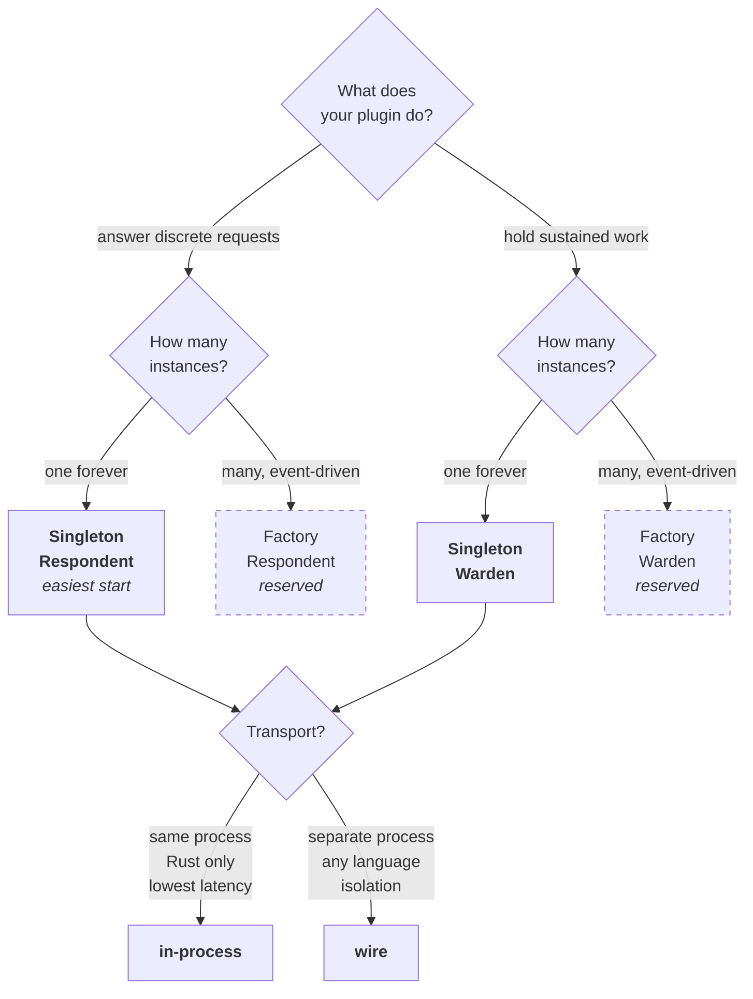

# Plugin Authoring

Status: tutorial-shaped guide for writing a plugin.
Audience: anyone writing a plugin for inclusion in an `evo-device-<vendor>` distribution, or for standalone third-party distribution.
Related (spec-shaped): `PLUGIN_CONTRACT.md` (the authoritative verbs, wire protocol, and semantics), `PLUGIN_PACKAGING.md` (manifest schema, identity, trust classes, signing), `VENDOR_CONTRACT.md` (organisational relationships).

`PLUGIN_CONTRACT.md` specifies what a plugin is. This document walks through how to write one. Read `PLUGIN_CONTRACT.md` first for the conceptual shape; come back here for the hands-on path. Both documents stay in sync with the reference example plugins in `crates/evo-example-echo/` and `crates/evo-example-warden/`.

## 1. Purpose and Scope

A plugin is a thing that stocks a slot in a catalogue. By the end of this document, you should be able to:

1. Decide which of the four plugin shapes fits your use case.
2. Set up a Rust crate implementing the appropriate SDK traits.
3. Write the manifest that declares the plugin to the steward.
4. Test the plugin in isolation and against a running steward.
5. Ship it as part of a distribution.

Rust is the primary supported language because the SDK is a Rust crate. Out-of-process plugins may be written in any language that can speak the wire protocol (`PLUGIN_CONTRACT.md` sections 6-11); this document focuses on Rust because the SDK does the heavy lifting.

## 2. Choosing a Plugin Shape

Every plugin is exactly one of four kinds. Two orthogonal axes define the kinds:

| Axis | Values | Question it answers |
|------|--------|---------------------|
| Instance shape | Singleton, Factory | Is there one instance of me forever, or many instances over time driven by the world? |
| Interaction shape | Respondent, Warden | Do I answer discrete requests, or do I hold sustained work? |

Decision tree:



In prose:

- **Singleton Respondent** (easiest). You answer discrete requests and there is exactly one of you. Examples: a metadata lookup plugin, an album-art provider, a codec identifier, a filesystem-scan respondent. Start here if you are learning the SDK.
- **Singleton Warden**. You hold sustained work and there is exactly one of you. Examples: the active playback engine, the kiosk surface, the NAS mount orchestrator.
- **Factory Respondent**. Your instances come and go driven by external events; each instance answers requests. Examples: a USB-collection reader (one instance per connected USB drive), a discovered-peer responder (one instance per peer).
- **Factory Warden**. Your instances come and go, and each holds sustained work. Rarer; a per-connected-client streaming session might fit.

Factory admission is reserved in evo-core (`STEWARD.md` section 12.7); the steward refuses `kind.instance = "factory"` at validation, and the `[capabilities.factory]` manifest block is parsed but not yet acted on. Singleton is the only supported instance shape today. This document covers Singleton Respondent and Singleton Warden; the factory shapes will follow the same tutorial once admission accepts them.

Orthogonal to the kind, you choose a transport:

| Transport | Where the plugin runs | When to pick it |
|-----------|-----------------------|------------------|
| In-process | Same process as the steward; compiled in or loaded as a Rust cdylib. | Lowest latency. Requires the plugin and the steward to share Rust versions. Appropriate for tightly trusted first-party plugins with small footprints. |
| Wire (out-of-process) | Separate process talking to the steward over a Unix socket. | Process isolation. Language independence. Trust boundary. Production plugins almost always ship as wire plugins. |

You can author the plugin code once and ship both transports from the same crate: the `Plugin` + `Respondent`/`Warden` impls are identical; the wire version adds a binary target that calls the SDK's `serve` helper. `evo-example-echo` and `evo-example-warden` both do this.

## 3. Crate Setup

A plugin is a Rust crate that depends on `evo-plugin-sdk`. Minimal `Cargo.toml`:

```toml
[package]
name = "my-plugin"
version = "0.1.0"
edition = "2021"
rust-version = "1.85"

[lib]
path = "src/lib.rs"

[dependencies]
evo-plugin-sdk = "<pinned-version>"
semver = { version = "1", features = ["serde"] }
tracing = "0.1"
tokio = { version = "1", features = ["macros", "rt-multi-thread"] }

# If you are also shipping a wire binary:
[[bin]]
name = "my-plugin-wire"
path = "src/bin/my-plugin-wire.rs"
```

Pin the SDK to a specific evo-core version (see `BOUNDARY.md` section 8). If you are in an `evo-device-<vendor>` distribution repository, the workspace typically pins one evo-core version and every plugin crate inherits the pin via `workspace.package` or a shared dependency declaration.

### 3.1 Workspace Lint Configuration

If you run `cargo clippy --workspace --all-targets -- -D warnings` on a plugin crate that depends on `evo-plugin-sdk`, clippy will reject every trait method on `Plugin`, `Respondent`, `Warden`, and `Factory` with `clippy::manual_async_fn`. The lint suggests rewriting

```rust
fn foo() -> impl Future<Output = T> + Send + '_
```

to

```rust
async fn foo() -> T
```

On stable Rust, trait-position `async fn` does not carry `Send` bounds on the returned future, which is incompatible with the steward's multi-threaded dispatch. `#[async_trait]` does preserve Send but boxes every call. The SDK's trait contract rejects both alternatives; see the "Async style" section of `evo-plugin-sdk::contract` module documentation for the full rationale.

The lint is a known false positive for this pattern. Add the following to your distribution's workspace `Cargo.toml`:

```toml
[workspace.lints.clippy]
# SDK trait methods use RPIT (impl Future + Send + '_) deliberately;
# see evo-plugin-sdk::contract module docs "Async style". The lint's
# rewrite suggestion is incompatible with the trait contract.
manual_async_fn = "allow"
```

This must live in the **workspace** root `Cargo.toml`, not in individual plugin-crate `Cargo.toml` files. Workspace lints do not propagate across workspaces, so `evo-core` configures it for its own crates and each distribution configures it for its own crates separately. Every crate in your workspace inherits the allow; no per-crate `#![allow(...)]` is needed.

## 4. The `Plugin` Trait

Every plugin - respondent or warden, in-process or wire - implements `Plugin`. It is the shared set of verbs:

```rust
use evo_plugin_sdk::contract::{
    BuildInfo, HealthReport, LoadContext, Plugin, PluginDescription,
    PluginError, PluginIdentity, RuntimeCapabilities,
};
use std::future::Future;

#[derive(Debug, Default)]
pub struct MyPlugin {
    loaded: bool,
    // your state here
}

impl Plugin for MyPlugin {
    fn describe(&self) -> impl Future<Output = PluginDescription> + Send + '_ {
        async move {
            PluginDescription {
                identity: PluginIdentity {
                    name: "org.example.my-plugin".into(),
                    version: semver::Version::new(0, 1, 0),
                    contract: 1,
                },
                runtime_capabilities: RuntimeCapabilities {
                    request_types: vec!["do_a_thing".into()],
                    accepts_custody: false,
                    flags: Default::default(),
                },
                build_info: BuildInfo {
                    plugin_build: env!("CARGO_PKG_VERSION").to_string(),
                    sdk_version: evo_plugin_sdk::VERSION.to_string(),
                    rustc_version: None,
                    built_at: None,
                },
            }
        }
    }

    fn load<'a>(
        &'a mut self,
        _ctx: &'a LoadContext,
    ) -> impl Future<Output = Result<(), PluginError>> + Send + 'a {
        async move {
            // Acquire runtime resources here.
            self.loaded = true;
            Ok(())
        }
    }

    fn unload(&mut self) -> impl Future<Output = Result<(), PluginError>> + Send + '_ {
        async move {
            // Release runtime resources here.
            self.loaded = false;
            Ok(())
        }
    }

    fn health_check(&self) -> impl Future<Output = HealthReport> + Send + '_ {
        async move {
            if self.loaded {
                HealthReport::healthy()
            } else {
                HealthReport::unhealthy("not loaded")
            }
        }
    }
}
```

Four things to note:

1. **`describe`** is called at admission time. The `identity.name` must match the plugin's manifest `plugin.name` exactly, and the `contract` field must match `plugin.contract`. The steward will reject a mismatch.
2. **`load`** receives a `LoadContext` that carries the steward's announcers and reporters. Use it to announce subjects, assert relations, or (for wardens, covered in section 6) grab the custody-state reporter. Store handles on `self` for later use.
3. **`unload`** must be idempotent. The steward calls it once on clean shutdown; a well-behaved plugin can survive a double-unload (later calls are no-ops).
4. **`health_check`** is advisory. Return `Healthy` / `Degraded` / `Unhealthy` with an optional detail string. The steward does not currently act on degraded health, but consumers may.

The futures use `impl Future + Send + '_` rather than `Pin<Box<dyn Future>>` because the SDK expects native async traits. The 1.80 MSRV was chosen for this.

## 5. Authoring a Respondent

A respondent adds one verb, `handle_request`.

### 5.1 Minimal In-Process Respondent

```rust
use evo_plugin_sdk::contract::{PluginError, Request, Respondent, Response};

impl Respondent for MyPlugin {
    fn handle_request<'a>(
        &'a mut self,
        req: &'a Request,
    ) -> impl Future<Output = Result<Response, PluginError>> + Send + 'a {
        async move {
            if !self.loaded {
                return Err(PluginError::Permanent("not loaded".into()));
            }
            match req.request_type.as_str() {
                "do_a_thing" => {
                    // ... compute a response payload ...
                    let out = b"done".to_vec();
                    Ok(Response::for_request(req, out))
                }
                other => Err(PluginError::Permanent(format!(
                    "unknown request type: {other}"
                ))),
            }
        }
    }
}
```

`PluginError` has three variants that classify failure severity:

| Variant | Semantics | When to use |
|---------|-----------|-------------|
| `Permanent(msg)` | This request will never succeed. | Unknown request type, invalid payload, nothing to look up. |
| `Transient(msg)` | Try again later. | Temporary unavailability, rate-limited, waiting on external resource. |
| `Fatal(msg)` | Plugin is unrecoverable. | Internal invariant violated, unrecoverable state. The steward will unload and may not re-admit without intervention. |

Plus `Timeout`, `ResourceExhausted`, `Unauthorized` as more specific classifications. Pick the closest match; the steward uses the classification to decide retry and escalation behaviour.

### 5.2 Manifest

Every plugin ships with a `manifest.toml`. For a minimal in-process respondent:

```toml
[plugin]
name = "org.example.my-plugin"
version = "0.1.0"
contract = 1

[target]
shelf = "example.mine"
shape = 1

[kind]
instance = "singleton"
interaction = "respondent"

[transport]
type = "in-process"
exec = "<compiled-in>"

[trust]
class = "standard"

[prerequisites]
evo_min_version = "0.1.0"
os_family = "any"
outbound_network = false
filesystem_scopes = []

[resources]
max_memory_mb = 16
max_cpu_percent = 1

[lifecycle]
hot_reload = "restart"
autostart = true
restart_on_crash = true
restart_budget = 5

[capabilities.respondent]
request_types = ["do_a_thing"]
response_budget_ms = 1000
```

Full manifest schema in `PLUGIN_PACKAGING.md`. Two fields that often confuse first-time authors:

- **`target.shelf`** must be a shelf declared in the distribution's catalogue. If your shelf does not exist, admission fails with `StewardError::Admission("…: target shelf not in catalogue: …")`. For development, use a scratch catalogue (see `DEVELOPING.md` section 5.1).
- **`capabilities.respondent.request_types`** must list exactly the strings your `handle_request` accepts. The steward uses this for routing and rejects requests for types you did not declare.

The manifest ships as a file but is typically also embedded in the plugin binary via `include_str!("../manifest.toml")` so the steward can admit the plugin without disk I/O at load time. See the `manifest()` helper in `evo-example-echo/src/lib.rs`.

### 5.3 Testing

The SDK's types are designed for isolation testing. A minimal respondent test:

```rust
#[tokio::test]
async fn handles_request() {
    let mut p = MyPlugin::default();
    p.loaded = true;

    let req = Request {
        request_type: "do_a_thing".into(),
        payload: b"input".to_vec(),
        correlation_id: 1,
        deadline: None,
    };
    let resp = p.handle_request(&req).await.unwrap();
    assert_eq!(resp.payload, b"done");
    assert_eq!(resp.correlation_id, 1);
}
```

For integration testing against a running steward, see section 8.

### 5.4 Turning It Into a Wire Plugin

The `Plugin` + `Respondent` code is transport-agnostic. Shipping the wire transport is one additional binary:

```rust
// src/bin/my-plugin-wire.rs
use anyhow::{anyhow, Context, Result};
use evo_plugin_sdk::host::{serve, HostConfig};
use my_plugin::MyPlugin;
use std::path::PathBuf;
use tokio::net::UnixListener;

const PLUGIN_NAME: &str = "org.example.my-plugin";

#[tokio::main(flavor = "multi_thread", worker_threads = 2)]
async fn main() -> Result<()> {
    let socket_path: PathBuf = std::env::args()
        .nth(1)
        .ok_or_else(|| anyhow!("usage: my-plugin-wire <socket-path>"))?
        .into();

    if socket_path.exists() {
        std::fs::remove_file(&socket_path)?;
    }
    let listener = UnixListener::bind(&socket_path)
        .with_context(|| format!("binding {}", socket_path.display()))?;

    let (stream, _) = listener.accept().await.context("accepting connection")?;
    let (reader, writer) = stream.into_split();

    let plugin = MyPlugin::default();
    let config = HostConfig::new(PLUGIN_NAME);
    serve(plugin, config, reader, writer).await.map_err(|e| anyhow!("serve failed: {e}"))
}
```

Three things worth noting:

1. **`.into_split()`** rather than `tokio::io::split()`. The former returns genuinely independent owned halves; the latter uses a BiLock that can deadlock under multi-threaded runtimes. This is the most frequently rediscovered pitfall.
2. **Accept-once is fine for v0**. A production wire plugin typically accepts one connection (the steward's), serves it, and exits on disconnect. The steward re-spawns the child on restart per the admission lifecycle.
3. **`serve` returns when the steward disconnects.** Your `main` should clean up the socket file and exit. The reference implementation in `evo-example-echo/src/bin/echo-wire.rs` does this.

For the wire transport, adjust the manifest:

```toml
[transport]
type = "wire-socket"
exec = "my-plugin-wire"
```

`exec` is the binary name (or absolute path) the steward invokes. The steward spawns it with the socket path as its sole argument.

## 6. Authoring a Warden

A warden holds sustained work. Its shape is more involved than a respondent's because it has to track state, emit state reports, and handle course corrections.

### 6.1 Minimal In-Process Warden

```rust
use evo_plugin_sdk::contract::{
    Assignment, CourseCorrection, CustodyHandle, HealthStatus,
    PluginError, Warden,
};
use std::collections::HashMap;

#[derive(Debug, Default)]
pub struct MyWarden {
    loaded: bool,
    custodies: HashMap<String, TrackedCustody>,
}

#[derive(Debug)]
struct TrackedCustody {
    custody_type: String,
    // keep whatever per-custody state you need here
}

impl Warden for MyWarden {
    fn take_custody<'a>(
        &'a mut self,
        assignment: Assignment,
    ) -> impl Future<Output = Result<CustodyHandle, PluginError>> + Send + 'a {
        async move {
            if !self.loaded {
                return Err(PluginError::Permanent("not loaded".into()));
            }

            let handle = CustodyHandle::new(format!(
                "custody-{}",
                assignment.correlation_id
            ));

            // Emit an initial state report synchronously, before
            // returning the handle. This is called from within the
            // same task as the SDK's host dispatch loop; it is the
            // safe shape. See pitfalls in section 10.
            assignment
                .custody_state_reporter
                .report(&handle, b"state=accepted".to_vec(), HealthStatus::Healthy)
                .await
                .ok(); // non-fatal

            self.custodies.insert(
                handle.id.clone(),
                TrackedCustody {
                    custody_type: assignment.custody_type.clone(),
                },
            );

            Ok(handle)
        }
    }

    fn course_correct<'a>(
        &'a mut self,
        handle: &'a CustodyHandle,
        _correction: CourseCorrection,
    ) -> impl Future<Output = Result<(), PluginError>> + Send + 'a {
        async move {
            if !self.custodies.contains_key(&handle.id) {
                return Err(PluginError::Permanent(format!(
                    "unknown handle: {}",
                    handle.id
                )));
            }
            // apply the correction
            Ok(())
        }
    }

    fn release_custody<'a>(
        &'a mut self,
        handle: CustodyHandle,
    ) -> impl Future<Output = Result<(), PluginError>> + Send + 'a {
        async move {
            self.custodies.remove(&handle.id).ok_or_else(|| {
                PluginError::Permanent(format!(
                    "unknown handle: {}",
                    handle.id
                ))
            })?;
            Ok(())
        }
    }
}
```

### 6.2 The Assignment and the CustodyStateReporter

When the steward calls `take_custody`, it passes an `Assignment`:

```rust
pub struct Assignment {
    pub custody_type: String,
    pub payload: Vec<u8>,
    pub correlation_id: u64,
    pub deadline: Option<SystemTime>,
    pub custody_state_reporter: Arc<dyn CustodyStateReporter>,
}
```

The `custody_state_reporter` is your channel back to the steward. Call `.report(&handle, payload, health).await` whenever the custody's state changes. The steward updates its ledger and emits a `CustodyStateReported` happening.

Two patterns:

- **Report-in-take-custody**: emit one initial report synchronously before returning the handle. Good for wardens that hand off to external subsystems and do not need ongoing reporting. The example warden does this.
- **Report-over-time**: keep the reporter `Arc` alive on `self` (usually in `TrackedCustody`) and emit reports from background tasks or course-correction handlers. Good for wardens whose state changes continuously (active playback position, mount health, connection state).

If you choose the second pattern, clone the `Arc` into your tracked state:

```rust
struct TrackedCustody {
    custody_type: String,
    reporter: Arc<dyn CustodyStateReporter>,
}

// In take_custody:
self.custodies.insert(handle.id.clone(), TrackedCustody {
    custody_type: assignment.custody_type.clone(),
    reporter: Arc::clone(&assignment.custody_state_reporter),
});
```

Then whatever background task updates the state calls `tracked.reporter.report(...).await`.

### 6.3 Manifest

Warden manifests declare `interaction = "warden"` and include a `[capabilities.warden]` block:

```toml
[kind]
instance = "singleton"
interaction = "warden"

[capabilities.warden]
custody_domain = "playback"
custody_exclusive = false
course_correction_budget_ms = 1000
custody_failure_mode = "abort"
```

`custody_domain` is a distribution-chosen tag that helps operators and consumers categorise the custody. `custody_exclusive = true` means only one custody may be held at a time; `false` allows multiple. `custody_failure_mode` is `abort` (plugin crashes end the custody) or `retain` (custody survives plugin restart). The router enforces `custody_failure_mode` today by logging the chosen mode at every custody-error site; `retain` semantics across a plugin restart additionally require the custody-ledger durability slice from `PERSISTENCE.md` section 20, which is on the roadmap.

### 6.4 Testing

Testing a warden without a real steward requires a `CustodyStateReporter` implementation. The example warden ships a `CapturingReporter` test fixture that records every report call - see `crates/evo-example-warden/src/lib.rs` `#[cfg(test)] mod tests`. Copy it when you need to unit-test custody behaviour.

### 6.5 Turning It Into a Wire Warden

Identical to the wire respondent shape in section 5.4. The `serve` helper handles both transports; you pass a `Warden` implementation and it routes warden verbs as well as the core `Plugin` verbs. The binary wrapper is the same.

## 6a. Writing an Administration Plugin

An administration plugin is a regular plugin that declares `[capabilities] admin = true` in its manifest. The flag is orthogonal to the four kinds in section 2: any kind may be an admin plugin. `LoadContext` gains two non-`None` callback handles for an admitted admin plugin, `subject_admin: Arc<dyn SubjectAdmin>` and `relation_admin: Arc<dyn RelationAdmin>`, which reach into the subject registry and relation graph to force-retract entries claimed by OTHER plugins. Use this pattern when the distribution needs correction tooling that operates across plugin boundaries (see `BOUNDARY.md` §6.1).

Admission refuses admin plugins whose effective trust class is weaker than `evo_trust::ADMIN_MINIMUM_TRUST` (currently `Privileged`). Declare `[trust] class = "privileged"` (or `"platform"` for first-party, highest-trust admin tooling). Declaring a weaker class together with `capabilities.admin = true` surfaces as `StewardError::AdminTrustTooLow` at admission with the manifest name, the effective class, and the minimum; operators see a specific refusal reason rather than a silent no-op.

Inside the plugin, unwrap both admin callbacks at `load` and store them on `self`. If either is `None`, something in the admission pipeline is misconfigured (typically: the plugin was constructed by a test harness that bypassed admission); surface the misconfiguration as `PluginError::Permanent` so the operator sees the problem immediately rather than at first admin request:

```rust
fn load<'a>(
    &'a mut self,
    ctx: &'a LoadContext,
) -> impl Future<Output = Result<(), PluginError>> + Send + 'a {
    async move {
        let subject_admin = ctx.subject_admin.clone().ok_or_else(|| {
            PluginError::Permanent(
                "SubjectAdmin not provided; check manifest capabilities.admin \
                 and trust class"
                    .into(),
            )
        })?;
        let relation_admin = ctx.relation_admin.clone().ok_or_else(|| {
            PluginError::Permanent(
                "RelationAdmin not provided; check manifest capabilities.admin \
                 and trust class"
                    .into(),
            )
        })?;
        self.subject_admin = Some(subject_admin);
        self.relation_admin = Some(relation_admin);
        Ok(())
    }
}
```

Two discipline rules are enforced by the wiring layer on every admin-callback invocation and are worth internalising because they change how the admin request surface is designed. First, **self-plugin targeting is refused** with `ReportError::Invalid`: an admin plugin does not force-retract its own claims through the admin surface, it uses the regular plugin-owned retract path for that. Second, **cascade ordering is load-bearing**: when a force-retract causes a cascade (last addressing triggers `SubjectForgotten`; last claimant triggers `RelationForgotten`), the admin happening (`SubjectAddressingForcedRetract` / `RelationClaimForcedRetract`) fires on the bus BEFORE the cascade happenings. Subscribers that care about the distinction between administrative corrections and plugin-driven retracts observe the admin happening first. On an admin-caused `RelationForgotten`, the `retracting_plugin` field names the ADMIN plugin, not any prior claimant.

Every successful admin-callback invocation (including the silent `NotFound` outcome) is journalled into the steward's in-memory `AdminLedger` with admin plugin, target plugin, target subject / addressing / relation, reason, and timestamp. Admin plugins do not write to the ledger directly; it is a steward-owned audit surface exposed for later reviewing passes.

The two retract primitives (`forced_retract_addressing`, `forced_retract_claim`) are available today. Future SDK extensions will add merge, split, suppress, and unsuppress primitives; plugins written against today's surface remain source-compatible because the new methods are added to the existing traits, not to new traits.

Reference implementation: `crates/evo-example-admin`. That crate ships the manifest, the plugin struct, the request-body types (`AdminRetractAddressingRequest`, `AdminRetractClaimRequest`), and five in-process integration tests covering the full admission + dispatch flow (cross-plugin addressing removal, cross-plugin claim removal, admission refused without `capabilities.admin`, admission refused at Standard trust, admission admitted at Platform trust). Fork it for product-specific admin tooling, or use it verbatim as a starting-point proof that the callback surface is correctly wired on the target distribution.

## 6b. Authoring a Factory

A factory plugin owns a variable-cardinality set of entities ("instances") it announces and retracts at runtime. Each instance becomes an addressable subject on the factory's target shelf; consumers route requests to a specific instance via the `instance_id` field on the request.

Use a factory when the plugin is the **sole authority** on whether the entity exists — a USB DAC enumerator owning USB DACs, a Bluetooth pair manager owning paired peers, a streaming-service integration owning per-account sessions. Do not use a factory for entities multiple plugins might claim (catalogue items, metadata records); those are subjects with full provenance via `SubjectAdmin`.

### 6b.1 Trait surface

A factory plugin implements the `Factory` trait alongside `Plugin` and either `Respondent` (for request-response interaction) or `Warden` (for custody-bearing interaction):

```rust
use evo_plugin_sdk::contract::factory::{Factory, RetractionPolicy};
use evo_plugin_sdk::contract::{Plugin, Respondent, /* ... */};

pub struct MyFactory { /* per-plugin state */ }

impl Plugin for MyFactory { /* describe / load / unload / health_check */ }
impl Factory for MyFactory {
    fn retraction_policy(&self) -> RetractionPolicy {
        RetractionPolicy::Dynamic
    }
}
impl Respondent for MyFactory {
    fn handle_request<'a>(&'a mut self, req: &'a Request) -> /* ... */ {
        async move {
            // Dispatch to the right instance by req.instance_id.
            let id = req.instance_id.as_deref().ok_or_else(|| {
                PluginError::Permanent("instance_id required".into())
            })?;
            self.dispatch_per_instance(id, req).await
        }
    }
}
```

### 6b.2 Announcing instances

The plugin's `LoadContext` carries an `instance_announcer: Arc<dyn InstanceAnnouncer>`. Inside `load` (or any later async context), the plugin calls `instance_announcer.announce(InstanceAnnouncement::new(id, payload))` for each instance it owns. The `id` is the plugin's stable identifier for the entity; the steward uses it as the addressing under the synthetic `evo-factory-instance` scheme. The `payload` is opaque bytes whose schema is defined by the target shelf.

Stable instance IDs are the plugin's responsibility. A factory MUST emit the same `instance_id` for the same logical entity across restarts. Plugins whose external entity has no stable identifier (a Bluetooth device with a randomised MAC, a USB drive without a serial number) derive a stable ID locally — pair-key fingerprint, partition UUID, etc. The steward does not mint instance IDs.

### 6b.3 Retraction policies

The `RetractionPolicy` declares when the plugin will call `instance_announcer.retract(instance_id)` during its lifetime:

- **`Dynamic`** — instances come and go at any time. The plugin emits both announces and retracts. A USB hot-plug enumerator: a drive plugged in fires `announce`; a drive removed fires `retract`.
- **`StartupOnly`** — every instance is announced during the `load` callback; nothing is retracted while the plugin runs. The steward retracts every instance during shutdown's drain stage. A one-shot board enumerator that scans `/proc/cpuinfo` once at startup.
- **`ShutdownOnly`** — instances are announced over the plugin's lifetime; nothing is retracted while the plugin runs. The steward retracts every instance during shutdown's drain stage. A connection pool that announces each acquired connection as an instance and lets the steward release them all at unload.

The steward enforces the policy. Calling `retract` outside its allowed window returns a structured `ReportError::Invalid`. The steward's drain path bypasses these gates — every announced instance is retracted on plugin unload regardless of declared policy, so no instance outlives its owning plugin.

### 6b.4 Manifest

Factory plugins declare `kind.instance = "factory"` in the manifest plus the `[capabilities.factory]` block:

```toml
[plugin]
name = "org.example.usb.dacs"
version = "0.1.0"
contract = 1

[target]
shelf = "audio.outputs"
shape = 1

[kind]
instance = "factory"
interaction = "respondent"

[transport]
type = "in-process"
exec = "<compiled-in>"

[trust]
class = "standard"

[prerequisites]
evo_min_version = "0.1.10"
os_family = "linux"
outbound_network = false
filesystem_scopes = []

[resources]
max_memory_mb = 32
max_cpu_percent = 5

[lifecycle]
hot_reload = "restart"
autostart = true
restart_on_crash = true
restart_budget = 5

[capabilities.respondent]
request_types = ["play", "stop", "set_volume"]
response_budget_ms = 1000

[capabilities.factory]
max_instances = 16
instance_ttl_seconds = 0
```

### 6b.5 Multiple factories on one shelf

Many real shelves are stocked by several factories simultaneously. `audio.outputs` will host I²S, USB Audio, HDMI, Bluetooth A2DP, AirPlay, and Chromecast factories — each enumerating its own slice of the world. The framework supports this transparently: each factory's instance IDs are namespaced under `<plugin>/<instance_id>` in the synthetic addressing scheme, so collisions are structurally impossible. Each factory is a separate plugin; each binds its manifest to the same `target.shelf`.

### 6b.6 Multi-layer entities

A factory instance can announce its own subjects (via `SubjectAdmin`) keyed off its instance ID. A DTV tuner plugin announces tuner instances; while a tuner is locked to a multiplex, that tuner instance announces programme subjects scoped to itself. When the tuner switches multiplex, the programme subjects retract. The relation graph ties parent (tuner) to child (programmes) so consumers walking the graph see the hierarchy. The framework does not enforce this pattern; it composes naturally because factory instances are subjects.

### 6b.7 Routing and the `instance_id` field

A client request to a factory-stocked shelf includes `instance_id` to disambiguate which instance handles the request:

```json
{
  "op": "request",
  "shelf": "audio.outputs",
  "request_type": "play",
  "payload_b64": "...",
  "instance_id": "usb-1234:5678"
}
```

The field is optional at the wire-protocol level (older clients that omit it parse cleanly; the plugin receives `None`). Factory plugins MAY treat a missing `instance_id` as an error and refuse the request; singleton plugins always receive `None` and ignore the field.

### 6b.8 Out-of-process factories

Out-of-process factory plugins use the same `evo_plugin_sdk::host::run_oop` helper as singleton respondents:

```rust
#[tokio::main]
async fn main() -> Result<()> {
    let socket_path = parse_args()?;
    let plugin = MyFactory::new();
    let config = HostConfig::new("org.example.usb.dacs");
    run_oop(plugin, config, &socket_path).await
}
```

The SDK's wire-backed `InstanceAnnouncer` translates `announce` and `retract` calls into wire frames the steward routes through its registry-backed announcer. The plugin author writes the same code as for in-process; the transport is invisible.

OOP factories currently default to `RetractionPolicy::Dynamic` regardless of what `Factory::retraction_policy()` returns; a future enhancement carries the declared policy across the wire.

### 6b.9 Reference implementation

`crates/evo-example-factory` ships a minimal factory respondent: announces three instances (`instance-a`, `instance-b`, `instance-c`) at load time, declares `RetractionPolicy::StartupOnly`, and answers any `echo` request by mirroring the payload back. The crate produces both an in-process library and an OOP wire bin (`factory-wire`); copy its shape for new factory plugins.

## 6c. Optional Capability Callbacks

The framework offers four additional opt-in callbacks on `LoadContext`. Each is gated by a manifest capability flag and populated as `Some(...)` only when the plugin's manifest declares it. Plugins that do not declare a capability see `None` and the corresponding feature is unreachable through the SDK surface.

| Manifest flag | `LoadContext` field | Trait | Use when |
|---|---|---|---|
| `capabilities.fast_path = true` | `fast_path_dispatcher` | `FastPathDispatcher` | The plugin originates real-time mutations against another warden (hardware-input plugins: IR, Bluetooth, keyboard, touch). |
| `capabilities.appointments = true` | `appointments` | `AppointmentScheduler` | The plugin schedules time-driven instructions (recurring jobs, one-shot reminders, daily / weekly / monthly cycles). |
| `capabilities.watches = true` | `watches` | `WatchScheduler` | The plugin schedules condition-driven instructions (fire when a hardware event happens, when a subject's state matches a predicate). |
| (always populated) | `user_interaction_requester` | `UserInteractionRequester` | The plugin needs to ask the human operator a question at runtime (re-auth, ambiguous match, destructive confirmation). The trait is always populated; the round-trip refuses with `responder_not_assigned` when no consumer holds the responder capability. |

`PLUGIN_CONTRACT.md` §5.3–5.6 carries the per-trait shape; the engineering-layer `FAST_PATH.md` covers the Fast Path channel in depth.

### 6c.1 Reaching for an appointment

```rust
use evo_plugin_sdk::contract::{
    AppointmentSpec, AppointmentAction, AppointmentRecurrence,
    AppointmentTimeZone,
};

let spec = AppointmentSpec {
    appointment_id: "nightly-rescan".into(),
    time: Some("03:30".into()),
    zone: AppointmentTimeZone::Local,
    recurrence: AppointmentRecurrence::Daily,
    end_time_ms: None,
    max_fires: None,
    except: vec![],
    miss_policy: Default::default(),
    pre_fire_ms: None,
    must_wake_device: false,
    wake_pre_arm_ms: None,
};
let action = AppointmentAction {
    target_shelf: "library.scanner".into(),
    request_type: "rescan_full".into(),
    payload: serde_json::json!({}),
};
ctx.appointments
    .as_ref()
    .expect("capabilities.appointments must be true")
    .create_appointment(spec, action)
    .await?;
```

### 6c.2 Reaching for a watch

```rust
use evo_plugin_sdk::contract::{
    WatchSpec, WatchAction, WatchCondition, WatchHappeningFilter,
    WatchTrigger,
};

let spec = WatchSpec {
    watch_id: "switch-on-bt-connect".into(),
    condition: WatchCondition::HappeningMatch {
        filter: WatchHappeningFilter {
            variants: vec!["flight_mode_changed".into()],
            shelves: vec!["flight_mode.wireless.bluetooth".into()],
            ..Default::default()
        },
    },
    trigger: WatchTrigger::Edge,
};
let action = WatchAction {
    target_shelf: "audio.delivery".into(),
    request_type: "switch_output".into(),
    payload: serde_json::json!({"target": "bluetooth"}),
};
ctx.watches
    .as_ref()
    .expect("capabilities.watches must be true")
    .create_watch(spec, action)
    .await?;
```

`HappeningMatch` and `Composite` over `HappeningMatch` evaluate fully today. `SubjectState` predicates parse and persist but do not yet evaluate (the projection-engine integration is not wired through the watch path in this release); plugins authoring `SubjectState` watches today should expect non-match behaviour at fire time and plan for the evaluator landing in a subsequent release.

## 7. Packaging

A plugin ships as:

1. A compiled binary (for wire plugins) or a library (for in-process plugins compiled into the steward).
2. A `manifest.toml` describing the plugin.
3. (Optionally) signed trust material.

Filesystem layout on device, per `BOUNDARY.md` section 9:

```
/opt/evo/plugins/<plugin_name>/
    manifest.toml
    <plugin-binary>       (for wire plugins)
```

For in-process plugins compiled into the steward (first-party case), there is no separate on-disk footprint; the manifest is embedded and the code is linked. For wire plugins shipped by a distribution, the distribution's packaging installs the binary and manifest at one of these paths.

Trust class and signing are detailed in `VENDOR_CONTRACT.md`. Briefly:

- **`platform`**: first-party, shipped with the steward itself. Reserved for evo-core's own examples and any future framework-bundled plugins.
- **`privileged`**: first-party or distribution-signed, elevated privilege required (for example, wardens that write to boot partitions or manipulate network state).
- **`standard`**: default for vendor or distribution plugins.
- **`unprivileged`**: third-party; runs under tighter isolation when the steward enforces OS-level sandboxing.
- **`sandbox`**: experimental; strictest isolation.

Pick `standard` unless you have a specific reason otherwise. Higher trust classes require signed manifests and are validated at admission.

## 8. Testing Your Plugin

Three levels of test, increasing in coverage and cost.

### 8.1 Unit tests (fastest)

Test `Plugin` and `Respondent`/`Warden` methods directly, as in the example plugins' `#[cfg(test)] mod tests` blocks. No steward required.

### 8.2 Wire integration tests

Exercise the wire protocol end-to-end without a steward. The SDK's `evo_plugin_sdk::host::serve` can be driven from a test that wires an in-memory duplex stream:

```rust
#[tokio::test(flavor = "multi_thread", worker_threads = 2)]
async fn wire_lifecycle() {
    let (client_r, server_w) = tokio::io::duplex(4096);
    let (server_r, client_w) = tokio::io::duplex(4096);

    let plugin = MyPlugin::default();
    let config = HostConfig::new("org.example.my-plugin");

    let host_task = tokio::spawn(async move {
        serve(plugin, config, server_r, server_w).await
    });

    // Drive the wire protocol from the client side here.
    // See crates/evo-plugin-sdk/src/host.rs tests for patterns.

    drop(client_r);
    drop(client_w);
    host_task.await.unwrap().unwrap();
}
```

Note the two-unidirectional-duplex pattern: a single `tokio::io::duplex` with `split()` can deadlock under multi-threaded runtimes. Use two one-way pairs.

### 8.3 End-to-end against a real steward

The steward's integration test harness (`crates/evo/tests/end_to_end.rs`) shows the pattern: build an `AdmissionEngine`, admit your plugin via `admit_singleton_respondent` / `admit_singleton_warden` (for in-process) or `admit_out_of_process_from_directory` (for wire), stand up a `Server`, drive requests over a Unix socket.

For an out-of-process plugin in a distribution repo, the typical pattern is to write a test that:

1. Spawns the steward binary as a child process with a scratch config pointing at a test catalogue and a writable socket.
2. Writes the plugin's `manifest.toml` and binary to the `plugins.runtime_dir` the steward is configured to read.
3. Connects a Python or Rust client to the steward's socket, exercises the plugin through `op = "request"` or the custody ops.
4. Tears down cleanly on test exit.

This is the same shape as evo-core's own `crates/evo-example-echo/tests/out_of_process.rs`; use it as a reference.

## 9. Before You Ship

Checklist. Every item should be true before tagging a plugin release.

- [ ] Plugin name is reverse-DNS and matches exactly between `describe`, `manifest.plugin.name`, and any embedded `MANIFEST_TOML`.
- [ ] Manifest parses (test with `Manifest::from_toml(MANIFEST_TOML)` in a unit test).
- [ ] `contract` version in manifest matches the steward version you are targeting.
- [ ] `target.shelf` is a real shelf in the target distribution's catalogue.
- [ ] `capabilities.respondent.request_types` (or `capabilities.warden.*`) lists every type your implementation actually handles. No more, no less.
- [ ] `load` acquires what `unload` releases. No resource leaks on load/unload cycles.
- [ ] `unload` is idempotent.
- [ ] `health_check` returns `Unhealthy` before `load` and after `unload`.
- [ ] Unit tests pass with `cargo test`.
- [ ] Wire integration test passes (if shipping the wire transport).
- [ ] End-to-end test against a steward passes (at least one).
- [ ] For wardens: the `CustodyStateReporter` is either used synchronously in `take_custody` or stored on `self` with explicit lifetime discipline. No cross-task reporter sharing without thought.
- [ ] For wire plugins: socket cleanup on exit (remove the file; see `echo-wire.rs`).
- [ ] For wire plugins: use `into_split()`, not `tokio::io::split()`.
- [ ] Trust class in manifest matches the signing posture you actually have.
- [ ] Logging uses `tracing` macros at appropriate levels (see `LOGGING.md`).
- [ ] Plugin builds for every architecture the target distributions care about (see `BUILDING.md`).

## 10. Common Pitfalls

The mistakes we have seen, roughly in descending frequency.

### 10.1 Cross-task reporter sharing

**Symptom**: warden hangs when reporting state from a spawned task.
**Cause**: the `CustodyStateReporter` can safely be called from the same task that received it on the `Assignment`. Handing it to a separate `tokio::spawn` and reporting from there can deadlock against the SDK's dispatch loop in specific scheduling orderings.
**Fix**: report synchronously inside `take_custody` (simplest), or if you need background reporting, ensure the background task has its own `Arc<dyn CustodyStateReporter>` clone and does not share a task with `take_custody`. See `evo-example-warden` for the pattern.

### 10.2 `tokio::io::split()` in wire plugins

**Symptom**: wire plugin hangs under multi-threaded runtime, works under single-threaded.
**Cause**: `tokio::io::split()` uses a `BiLock` that can deadlock when reader and writer are on different threads.
**Fix**: use `stream.into_split()` for owned, independent halves.

### 10.3 Plugin name mismatch

**Symptom**: admission fails with `StewardError::IdentityMismatch`.
**Cause**: `describe().identity.name` and `manifest.plugin.name` disagree. Typos, wrong capitalisation, stale constant.
**Fix**: single source of truth. Either embed the manifest and read the name from it, or derive both from one constant.

### 10.4 Forgotten request type

**Symptom**: request fails with a "plugin does not handle this type" error at the steward.
**Cause**: plugin's `handle_request` dispatches on a type that the manifest's `request_types` did not list.
**Fix**: keep the list and the match in sync; ideally derive one from the other.

### 10.5 Missing `unload` cleanup

**Symptom**: plugin restart during development leaks resources (file handles, background tasks, external connections).
**Cause**: `unload` returns `Ok(())` without actually releasing anything.
**Fix**: every resource `load` acquires, `unload` must release. Include a test that loads and unloads many times in a loop without exhausting whatever resource is most constrained.

### 10.6 Stale socket file in wire plugin

**Symptom**: second launch of the wire plugin fails with "address already in use".
**Cause**: the binary did not remove the socket file on exit (or a previous run crashed).
**Fix**: remove the file at startup if it exists and at exit on clean paths. See `cleanup_socket` in `echo-wire.rs`.

### 10.7 Build-time manifest drift

**Symptom**: `describe` reports a version that no longer matches the manifest.
**Cause**: hardcoded version string in code that was not updated alongside the manifest.
**Fix**: use `env!("CARGO_PKG_VERSION")` for `build_info.plugin_build`, and parse the embedded manifest for `identity.version` where possible. The example plugins do this.

## 11. Further Reading

- `PLUGIN_CONTRACT.md` - the authoritative spec for the verbs, wire protocol, and semantics.
- `PLUGIN_PACKAGING.md` - the complete manifest schema, identity, and signing.
- `VENDOR_CONTRACT.md` - organisational relationships, trust classes, signing hierarchy.
- `STEWARD.md` section 5 (Admission) - what the steward does with your plugin at admission time.
- `STEWARD.md` section 7 (Plugin-Facing Protocol) - how the steward sees your plugin.
- `LOGGING.md` - structured logging conventions.
- `crates/evo-example-echo/` - minimal reference respondent (in-process and wire).
- `crates/evo-example-warden/` - minimal reference warden (in-process).
- `DEVELOPING.md` - running a steward locally to test your plugin against.
- `BUILDING.md` - cross-architecture builds.
- `BOUNDARY.md` - where your plugin fits in the framework / distribution split.
