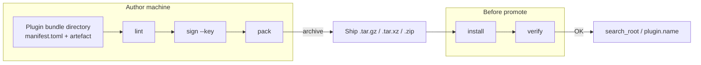
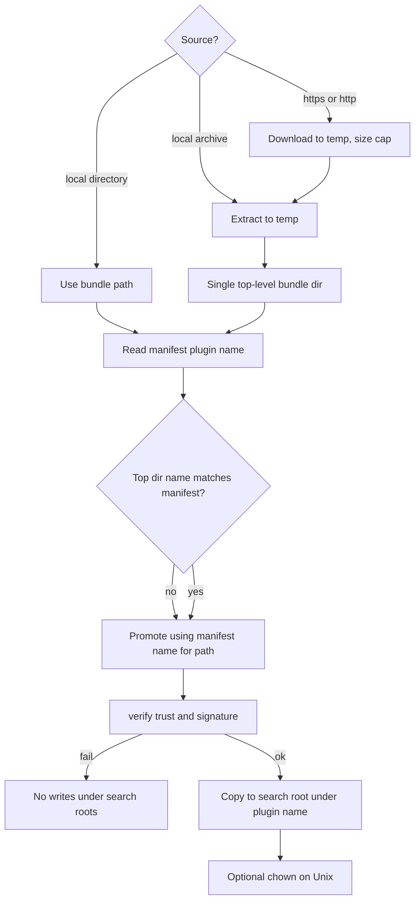
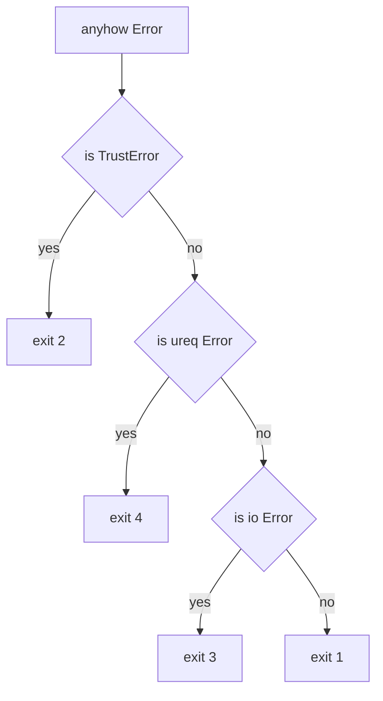

# evo-plugin-tool (implementation contract)

Status: **normative** for `crates/evo-plugin-tool` (`lint` / `sign` / `verify` / `pack` / `install` implemented in v1; this document is the long-term build contract, and a future crate `README` may still defer here).
Audience: evo-core implementers, packagers, CI and UI integrators. Packaging narrative remains in `PLUGIN_PACKAGING.md` sections 7 and 9.

The steward binary is `evo` (`/opt/evo/bin/evo`). The SDK CLI is **`evo-plugin-tool`** in the same directory, built from the workspace crate of the same name. It **must** call **`evo_trust`’s** signing and verification **APIs** (not reimplemented message formats).

---

## 1. Subcommand set

The CLI implements the full author workflow plus operator-side admin sugar that wraps the steward's wire ops:

**Author workflow:** `lint`, `sign`, `verify`, `pack`, `install`. The `install` path covers ownership / mode promotion via `--chown`. `uninstall` and `purge` are reachable through the operator-side `admin uninstall_plugin` / `admin purge_plugin_state` wire ops rather than as separate top-level CLI verbs.

**Catalogue tooling:** `catalogue lint <path>` validates a catalogue document (rack / shelf / subject grammar). `catalogue validate-shelf-schema [--schemas-path <dir>]` walks a per-shelf schemas tree and validates every `<rack>/<shelf>.v<N>.toml` file. The schemas-path resolution cascade is `--schemas-path` flag, `$EVO_SCHEMAS_DIR`, then `/usr/share/evo-catalogue-schemas/` (distribution-installed). Non-zero exit on any file failure.

**Admin wire-op sugar.** Each subcommand opens a Unix-socket connection to the running steward, negotiates the relevant operator capability, and dispatches the matching wire op. The `--socket` flag overrides the default path.

| Subcommand | Capability | Wire op(s) |
|---|---|---|
| `admin enable / disable / uninstall / purge_state <plugin>` | `plugins_admin` | `enable_plugin` / `disable_plugin` / `uninstall_plugin` / `purge_plugin_state` |
| `admin reload catalogue --inline=<toml> \| --path=<file> [--dry-run]` | `plugins_admin` | `reload_catalogue` |
| `admin reload manifest <plugin> --inline=<toml> \| --path=<file> [--dry-run]` | `plugins_admin` | `reload_manifest` |
| `admin reconcile {list,project,now}` | `reconciliation_admin` (for `now`) | `list_reconciliation_pairs` / `project_reconciliation_pair` / `reconcile_pair_now` |
| `admin flight {list,set <class> <on\|off>,all <on\|off>}` | (none — uses `request` op against `flight_mode` rack shelves) | `project_rack` + per-shelf `request flight_mode.{query,set}` |
| `admin grammar {list,plan,migrate,accept}` | `grammar_admin` | `list_grammar_orphans` / `migrate_grammar_orphans` (dry_run for `plan`) / `accept_grammar_orphans` |
| `admin diagnose <plugin>` | (read-only) | `list_plugins` + on-disk manifest |

The `admin grammar plan --from-type=X --to-type=Y` form wraps `migrate_grammar_orphans` with `dry_run = true` and pretty-prints the planned migration count, target-type breakdown, and first / last sample IDs. The `admin grammar migrate` form wraps the same op with `dry_run = false` and accepts `--reason`, `--batch-size`, `--max-subjects` for chunked execution. See `CATALOGUE.md` §5.3 for the operator surface and `CLIENT_API.md` §4.17 for the wire shape.

---

## 2. Bundle directory name vs `plugin.name`

- **`manifest.plugin.name` is the source of truth** (reverse-DNS per `PLUGIN_PACKAGING.md` §4).
- After reading `manifest.toml`, the **install** path (and the effective bundle on disk) **must** use the name **`plugin.name`**. If the archive or stage directory’s **top-level** folder name **differs** from `plugin.name`, the tool **renames** (or rewrites the path to) **`plugin.name`** as part of promotion, then places under the target search root, e.g. `.../plugins/<plugin.name>/`. Do **not** leave a final tree whose directory name disagrees with the manifest.

---

## 3. `install` sources (versatile)

**v1 supports** all of:

- A **local path** to an unpacked bundle directory, or a path under **`plugin-stage/`** (see `PLUGIN_PACKAGING` §7).
- A **local file** in one of the **pack** formats (this document section 7 and `PLUGIN_PACKAGING` §9).
- A **http(s) URL** to a bundle: full client (TLS, **redirects** within reason, **timeouts**, **size limit** to be chosen in code and documented in `--help`; **no** silent unbounded download).

Failing operations **must not** leave a **partial** or half-valid tree inside any configured **`search_roots`**.

---

## 4. Ownership and mode (`--chown`)

- **`chown` / owner metadata** on the final plugin directory: **optional in non-root invocations, required when running as root**. Expose a flag such as `--chown user:group` (exact spelling in clap) when the operator runs the tool with sufficient privilege; if omitted under a non-privileged invocation, the tool does **not** change ownership (unpack/promote runs with the process’s effective user).
- **Root-invocation guard.** When the tool's effective UID is `0` (the typical `sudo evo-plugin-tool install ...` shape) and `--chown` is **not** supplied, `install` refuses with a structured error before any filesystem mutation. Without the guard, the bundle ends up `root:root 0600` and a steward running as a non-root service user cannot read its own plugin manifest. Operators pass `--chown <user>:<group>` to set the runtime account that will own the bundle, or `--chown root:root` if the steward really runs as root. `install` from a non-root account proceeds without the guard (it cannot write outside the operator's own permissions anyway).

---

## 5. `sign` — key material (match `evo_trust`)

- **Same algorithm and message** as the steward: **`signing_message`**, ed25519, 64-byte **`manifest.sig`**, as implemented in `evo_trust` (and exercised by `crates/evo-trust/tests/verify.rs`).
- **Private key:** PEM on disk, passed with **`--key`**, in the form **`evo_trust` and the test harness already use** (see `load_trust_root` / signing helpers). **Encrypted PEM** is out of v1 **unless** already supported by a shared helper in `evo_trust` at implementation time; otherwise document "clear PEM only for v1".

---

## 6. `verify` — trust root behaviour (follow the steward)

- **Default** trust behaviour **matches the shipped steward**: same default directories as `StewardConfig` / `PLUGIN_PACKAGING` §5 — **`/opt/evo/trust`**, **`/etc/evo/trust.d`**, revocations path, **`degrade_trust`**, **union** of keys, **`*.meta.toml`** per key.
- **Override flags** in the CLI (paths for opt + etc trust dirs, revocations, strict/degrade) so **CI and laptops** can pass temp dirs **without** a full FHS layout.

---

## 7. `pack` — archive formats

- **Only** the formats in `PLUGIN_PACKAGING` §9: **`.tar.gz` / `.tgz`**, **`.tar.xz` / `.txz`**, **`.zip`**; default format **`.tar.gz`** when the implementation must choose.
- **Sniffing** and extension rules: as in that section (magic bytes, extension, `file(1)`-class behaviour where practical).

---

## 8. Exit codes (CI and UI)

Stable across releases for the same class of error (numeric values fixed in the first public release; document in `--help` and this table).

| Code | Meaning |
|------|--------|
| `0` | Success. |
| `1` | Usage / flags / bad CLI input (incl. manifest parse where not trust-related). |
| `2` | **Trust / signature / key authorisation** (`evo_trust` / verification failure, wrong manifest.sig length, etc.). |
| `3` | **I/O and filesystem** (unreadable path, full disk, failed rename, atomic promote failure). |
| `4` | **Network** (URL fetch: DNS, TLS, timeout, size exceeded, non-2xx) when `install` fetches. |

(If a subcommand has no network path, `4` is unused in that run.)

---

## 9. `pack` default file name and version in the name

- **`--out` always wins** when the operator passes it.
- If **`--out` is omitted** and the implementation invents a default filename: **accept both** conventions: prefer **`<plugin.name>-<version>.<ext>`** when the manifest exposes a suitable **version** field for the archive name; else **`<plugin.name>.<ext>`** (version segment omitted). The implementation documents which manifest field supplies `<version>` (e.g. plugin or package version per schema).

---

## 10. Binary and packaging location

- Built as **`evo-plugin-tool`**; installed next to the steward, **`/opt/evo/bin/evo-plugin-tool`**, as in the filesystem tree in `PLUGIN_PACKAGING` §3.

---

## 11. Diagrams

The following figures mirror this document; they are not additional normative rules.

### 11.1. v1 author workflow (subcommands)

`install` runs the same trust checks as `verify` (and implied lint via manifest/artefact load). Operators may run `verify` alone in CI on an unpacked tree.

### 11.2. install resolution (source → promote)

### 11.3. Exit code routing (rough map)

Labels avoid `::` in raw node text. The code still checks the real Rust types (`TrustError`, `ureq::Error`, `io::Error`).

---

## 12. Related

- `evo_trust` — `signing_message`, `verify_out_of_process_bundle`, `load_trust_root`, `RevocationSet`, key meta.
- `StewardConfig` / `docs/engineering/CONFIG.md` / `SCHEMAS.md` §3.3 — default paths for `verify` parity.
- `PLUGIN_PACKAGING` §7 (Strategy A/B), §9 (subcommands, archive rules).
