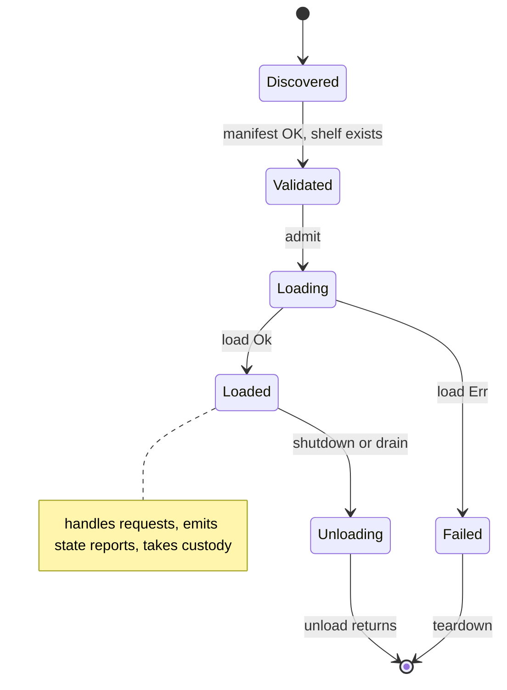

# Steward

Status: engineering-layer description of the steward process.
Audience: steward maintainers, plugin authors, consumer authors.
Vocabulary: per `docs/CONCEPT.md`. Cross-references: `SUBJECTS.md`, `RELATIONS.md`, `PROJECTIONS.md`, `PLUGIN_CONTRACT.md`, `PLUGIN_PACKAGING.md`, `VENDOR_CONTRACT.md`, `LOGGING.md`, `FAST_PATH.md`.

This document describes the steward as it exists today: what it is, how it is structured, how it runs, and which of its responsibilities are fully implemented versus reserved for later work.

Other engineering docs describe individual contracts (subjects, relations, projections, the plugin contract). This one ties them together. If a reader wants to know "what happens when evo starts", "what holds the subject registry", or "where does a plugin's announcement become a consumer's projection", the answer begins here.

## 1. Purpose

The steward is the sole authority inside the fabric. Every rack's contributions pass through it; every subject's identity is reconciled by it; every projection a consumer reads is composed by it; every plugin that joins the catalogue is admitted by it. There is no side channel.

The essence statement from `CONCEPT.md` is:

> A device that plays audio from any reachable source, through a configurable audio path, to any present output, while presenting coherent information about what it is doing to any consumer that looks.

The steward is the component that enforces this statement. It owns the catalogue, the subject registry, the relation graph, the projection layer, the admission pipeline, the client-facing socket, the custody ledger, the happenings bus, and the SQLite-backed persistence store into which the subject identity slice, the durable happenings log, and the pending-conflicts table write through. The appointments engine and the watches engine from `CONCEPT.md` section 2 are not part of the current build.

Everything else in evo is a plugin, a consumer, a document, or a build artefact. The steward is what runs on the device, and the steward is the thing that knows what the device is doing.

## 2. Responsibilities

The steward's charter, in order of foundational-to-operational:

1. Read the catalogue. Validate its shape. Refuse to start if the catalogue is malformed.
2. Discover and admit plugins. Validate each plugin's manifest against the catalogue's slot declarations. Refuse plugins whose declarations do not match. Admit both respondent and warden plugins, in-process or out-of-process.
3. For out-of-process plugins: spawn the plugin process, connect to its socket, drive its load lifecycle.
4. Expose a client-facing socket. Dispatch plugin-request operations to admitted plugins. Compose and serve subject projections on demand. Expose the custody ledger for external inspection.
5. Maintain the subject registry. Reconcile plugin subject announcements into canonical identities.
6. Maintain the relation graph. Record and retract relations claimed by plugins.
7. Maintain the custody ledger. Record every custody the steward hands to a warden, track each warden's state reports, drop entries on release.
8. Emit happenings for custody transitions on a bus any interested party can subscribe to.
9. On shutdown: drive every admitted plugin through unload. Release resources. Remove the socket.

These nine are fully implemented. The subject identity slice (subjects, addressings, aliases, the claim log), the durable happenings log, the pending-conflicts table, the relation graph, the custody ledger, the admin ledger, the installed-plugins enable bit, the per-pair reconciliation last-known-good, and the pending-grammar-orphans operator state are all persisted to SQLite at `/var/lib/evo/state/evo.db` via write-through on every state-changing operation. Boot-time rehydration reconstructs the in-memory registries (subjects + addressings + aliases, relations, custodies, admin log, reconciliation pairs) from the persisted rows so a steward restart preserves every active claim, custody session, and operator state without depending on plugin re-announcement. The two condition / time-driven instruction primitives — appointments (`AppointmentRuntime`) and watches (`WatchRuntime`) — both ship in this build, alongside plugin-initiated user-interaction routing (`PromptLedger`) and the operator-issued subject-grammar migration verbs.

## 3. Process Model

The steward is a single long-running process.

| Property | Value |
|----------|-------|
| Binary | `evo` |
| Entry point | `crates/evo/src/main.rs` |
| Runtime | `tokio` multi-threaded, default worker thread count |
| Panic strategy | `abort` in release; `unwind` in debug test runs |
| Signal handling | `SIGTERM`, `SIGINT` trigger graceful shutdown |
| File descriptors | one Unix listening socket; one connected socket per accepted client; one connected socket per out-of-process plugin; plus whatever the plugins themselves hold. |
| Exit codes | `0` on clean shutdown; non-zero only on setup failure (catalogue invalid, admission failure, socket bind failure). |

The steward does not fork. The steward does not exec. The steward spawns out-of-process plugins as child processes (section 5.3); those children are separate processes but the steward remains the only sovereign.

## 4. Module Structure

The `evo` crate is the steward. Its modules, and their responsibilities:

| Module | Role |
|--------|------|
| `main.rs` | Binary entrypoint: parse CLI, load config, initialise logging, load catalogue, run plugin discovery (`plugin_discovery` module), construct projection engine, construct server, wait for shutdown, drain. Not a library module. The shipped binary does not hardcode which plugins load; it discovers out-of-process singletons from configured search roots. Tests and custom binaries may still construct `AdmissionEngine` directly. |
| `cli` | `clap`-based argument parser. Exposes `Args`. |
| `config` | TOML config loader with default fallback and required-file variant. Exposes `StewardConfig`. |
| `logging` | `tracing_subscriber` setup. Resolves log filter from CLI, config, and `RUST_LOG` in that precedence order. Emits to `journald` in production, ANSI stderr in development. |
| `catalogue` | Catalogue loader. Validates rack, shelf, predicate declarations. Exposes `Catalogue`. |
| `error` | The steward's unified error type, `StewardError`. |
| `subjects` | Subject registry. Canonical identity, addressing reconciliation, claimant tracking. Exposes `SubjectRegistry`, `SubjectRecord`, `AnnounceOutcome`. |
| `relations` | Relation graph. Typed directed edges with multi-plugin claimant sets. Exposes `RelationGraph`, `WalkDirection`, `WalkScope`, `Relation`. |
| `custody` | Custody ledger. Records active custodies keyed by `(plugin, handle_id)`. Updated on `take_custody`, every state report, and `release_custody`. Exposes `CustodyLedger`, `CustodyRecord`, `StateSnapshot`, `LedgerCustodyStateReporter`. Full treatment in `CUSTODY.md`. |
| `projections` | Projection engine. Composes subject projections on demand, including recursive relation walks with cycle guards and visit caps. Exposes `ProjectionEngine`, `ProjectionScope`, `SubjectProjection`. |
| `admission` | Admission engine. Accepts plugins (singleton respondents and wardens, in-process or out-of-process). Routes plugin requests, custody verbs, and emits custody happenings on the bus. Exposes `AdmissionEngine`. |
| `plugin_discovery` | Walks `plugins.search_roots` from config, creates per-plugin `state/` and `credentials/` under the data root, and admits out-of-process plugins (singleton and factory, respondent and warden). Skips in-process bundles with warnings. |
| `context` | The `LoadContext` handed to each plugin at load time. Carries the announcers and state reporters the plugin uses to push data back into the steward. |
| `wire_client` | Wire-level client for out-of-process plugins. Wraps a connected socket; speaks the plugin-facing protocol. Exposes `WireClient`, `WireRespondent`, `WireWarden` (the adapters that make a wire-backed plugin look like an in-process plugin to the admission engine). |
| `happenings` | Happenings bus. Streamed notifications for fabric transitions; carries custody variants in this version. Exposes `Happening` (`#[non_exhaustive]`) and `HappeningBus`. Full treatment in `HAPPENINGS.md`. |
| `server` | Client-facing Unix socket server. Accepts connections, reads length-prefixed JSON frames, dispatches plugin requests, projection queries, and custody-ledger snapshots. Exposes `Server`. |
| `shutdown` | Signal-waiting helper. Exposes `wait_for_signal`. |

Every module except `main` is public from the library crate. Tests may import any of them directly; integration tests in `tests/end_to_end.rs` do.

## 5. Admission

Admission is the process by which a plugin becomes part of the running fabric. The admission engine is the steward's sole entry point for plugins.



The lifecycle is the same for respondents and wardens, in-process and wire. The wire variant adds a child-process spawn between Discovered and Validated (section 5.3) and a child-process teardown on Unloading and Failed (section 5.4); the state shape is otherwise identical.

### 5.1 Admission Contracts

Admission supports both respondent and warden interaction shapes, in-process or out-of-process:

```rust
AdmissionEngine::admit_singleton_respondent(plugin, manifest, catalogue)
AdmissionEngine::admit_singleton_warden(plugin, manifest, catalogue)
AdmissionEngine::admit_out_of_process_respondent(manifest, catalogue, reader, writer)
AdmissionEngine::admit_out_of_process_warden(manifest, catalogue, reader, writer)
AdmissionEngine::admit_out_of_process_from_directory(plugin_dir, runtime_dir, catalogue)
```

The in-process variants take a constructed plugin instance directly. The low-level out-of-process variants take the reader and writer halves of a pre-established connection and are primarily used by tests that inject in-memory transports. Production callers go through `admit_out_of_process_from_directory`, which reads a manifest from a directory, spawns the plugin binary as a child process, waits for its Unix socket to appear, connects, and branches on `manifest.kind.interaction` to select the respondent or warden path.

Factory admission (`Instance::Factory`) is supported alongside the singleton path. The steward provides `admit_factory_respondent`, `admit_factory_warden`, and the OOP equivalents (the existing `admit_out_of_process_respondent` / `admit_out_of_process_warden` accept both singleton and factory manifests, branching on `manifest.kind.instance`). Each factory plugin's `LoadContext.instance_announcer` is wired to a registry-backed implementation that mints a subject per announced instance under the `evo-factory-instance` addressing scheme; the steward's shutdown drain stage retracts every announced instance before the per-plugin unload tasks fire. See `PLUGIN_AUTHORING.md` §6b for the plugin-author surface.

### 5.2 Validation

Every admission validates the plugin's manifest against the catalogue:

| Check | Error if it fails |
|-------|-------------------|
| Manifest parses | Dispatch error with parser diagnostics |
| Target shelf exists in catalogue | `StewardError::MissingShelf` |
| Plugin `describe` returns an identity matching the manifest | `StewardError::IdentityMismatch` |
| No plugin is already admitted on this shelf (singletons enforce this) | `StewardError::DuplicateShelf` |
| `manifest.kind.interaction` matches the admission path (respondent vs warden) | `StewardError::Admission` with a message naming the mismatch |
| `manifest.target.shape` equals the shelf's `shape` | `StewardError::Admission` (shape mismatch) |
| Shelf accepts a **list** of older shape values (`shape_supports`, migration window) | `Shelf::accepts_shape(candidate)`; see section 12.4 and `CATALOGUE.md` §4.2 |

A validation failure during out-of-process admission is handled by tearing down the child process cleanly before returning the error (section 5.4).

### 5.3 Out-of-Process Spawning

For out-of-process plugins the steward:

1. Reads `<plugin_dir>/manifest.toml`.
2. Constructs the socket path: `<runtime_dir>/<plugin_name>.sock`. Removes any stale file at that path.
3. Spawns the plugin executable (`manifest.transport.exec`) as a child process, passing the socket path as an argument.
4. Waits for the socket file to appear and accept a connection. Polls every 25ms, up to 5 seconds (`SOCKET_READY_TIMEOUT`).
5. On successful connect, constructs a `WireClient` over the stream and performs the plugin-protocol `describe` handshake.
6. Constructs a `WireRespondent` adapter around the client. Hands the adapter and the captured `Child` to the admission engine's shared plugin-list.
7. Calls `load` on the plugin through the adapter. If `load` fails, treats it as admission failure and triggers teardown.

### 5.4 Teardown on Failure and on Shutdown

On admission failure after the child was spawned, the steward tears the child down in a fixed order that avoids deadlocks:

1. `erased.unload().await` (if the failure was after load succeeded; a best-effort graceful signal).
2. `drop(erased)` - this is load-bearing: the erased plugin owns the write half of the socket. Dropping it closes the write half, which is the child's EOF signal to exit.
3. `child.wait()` with a 5-second timeout. If the child has not exited by then, `child.kill()` and wait again.

This order is the fix for a deadlock encountered during subpass 3e. Waiting on the child before dropping the plugin deadlocks because the child will not exit until it sees EOF on its read half, and EOF only arrives when the write half is dropped.

Normal shutdown drains through the same path: for every admitted plugin, call `unload`, drop the plugin, wait on the child. This runs serially today (section 9).

## 6. Client-Facing Protocol

External consumers talk to the steward over a Unix domain socket at the path declared in the config (`steward.socket_path`, default `/var/run/evo/evo.sock`).

### 6.1 Framing

Length-prefixed JSON:

```
[4-byte big-endian length] [length bytes of UTF-8 JSON]
```

Frames above 64 MiB are rejected as `Dispatch("frame too large")`. Zero-length frames are rejected as `Dispatch("zero-length frame")`. The 64 MiB cap matches the absolute hard ceiling on `prepare_for_live_reload` state blobs (`MAX_LIVE_RELOAD_BLOB_BYTES`), so any blob the framework's admission would admit can also cross the wire.

### 6.2 Request Shapes

Every request carries an `op` discriminator. v0 defines five ops:

| Op | Purpose | Shape |
|----|---------|-------|
| `request` | Dispatch a plugin request on a specific shelf. | Request / response. |
| `project_subject` | Compose and return a federated subject projection. | Request / response. |
| `describe_alias` | Look up the alias chain for a (possibly merged-away) canonical subject ID. | Request / response. |
| `list_active_custodies` | Snapshot the custody ledger. | Request / response. |
| `subscribe_happenings` | Stream every happening the bus emits. | Streaming: promotes the connection to streaming mode. |

Unknown ops return a structured error; they do not close the connection.

#### `op = "request"`

```json
{ "op": "request",
  "shelf": "<rack>.<shelf>",
  "request_type": "<string>",
  "payload_b64": "<base64>" }
```

The steward base64-decodes the payload, assigns a correlation ID, constructs an SDK `Request` value, and calls `AdmissionEngine::handle_request(shelf, request)`. The response payload is base64-encoded and returned.

#### `op = "project_subject"`

```json
{ "op": "project_subject",
  "canonical_id": "<uuid>",
  "scope": {
    "relation_predicates": ["album_of"],
    "direction": "forward",
    "max_depth": 3,
    "max_visits": 100
  } }
```

The `scope` field is optional. Omitting it or omitting its sub-fields yields a scope with no relation traversal, default depth (1), and default visit cap (1000). See `PROJECTIONS.md` section 4 for the projection shape emitted.

#### `op = "list_active_custodies"`

```json
{ "op": "list_active_custodies" }
```

No arguments in v0. Returns every currently-held custody in the ledger. The response shape is documented in section 6.3.

A future pass may add filter arguments (by plugin, by shelf); the empty-argument form is the base case and will remain valid.

#### `op = "subscribe_happenings"`

```json
{ "op": "subscribe_happenings" }
```

No arguments in v0. This is the only streaming op in the v0 protocol: once the server accepts the subscription, the connection becomes output-only for the lifetime of the subscription. Clients that need both subscription and other ops open two connections.

The server's frame sequence after accepting a subscription:

1. An immediate `{"subscribed": true}` ack, written after the server calls `bus.subscribe()` on the happenings bus. Any happening emitted after the client reads the ack is guaranteed to reach it.
2. A `{"happening": {...}}` frame for each subsequent happening. The inner object is internally-tagged by `type` (`custody_taken`, `custody_released`, `custody_state_reported`) with variant-specific fields. The happening variant reference lives in `HAPPENINGS.md` section 3.
3. A `{"lagged": n}` frame if the subscriber falls behind the bus's buffer (tokio `broadcast::error::RecvError::Lagged`), carrying the number of dropped happenings. Subscribers recover by re-querying the authoritative store (the ledger for custody) and continuing to consume.

The subscription ends when the client closes the connection or the server shuts down. There is no explicit unsubscribe frame.

### 6.3 Response Shapes

Responses are untagged; variants are disambiguated by the distinct top-level fields of each shape.

| Shape | When |
|-------|------|
| `{ "payload_b64": "..." }` | Plugin request succeeded. |
| Full `SubjectProjection` with `canonical_id`, `subject_type`, `addressings`, `related`, `composed_at_ms`, `shape_version`, `claimants`, `degraded`, `degraded_reasons`, `walk_truncated` | Projection succeeded. |
| `{ "active_custodies": [...] }` | `list_active_custodies` succeeded. Each array element has `plugin`, `handle_id`, `shelf`, `custody_type`, `last_state`, `started_at_ms`, `last_updated_ms`. `last_state` is `{ payload_b64, health, reported_at_ms }` or `null`. Optional fields (`shelf`, `custody_type`, `last_state`) serialise as `null` rather than being omitted. |
| `{ "subscribed": true }` | Ack written once at the start of a `subscribe_happenings` subscription, after the server has registered on the bus. |
| `{ "happening": {...} }` | Streamed. One frame per emitted happening. Inner object is internally-tagged by `type` (`custody_taken`, `custody_released`, `custody_state_reported`). All variants carry `plugin`, `handle_id`, and `at_ms` (milliseconds since the UNIX epoch); variant-specific fields per `HAPPENINGS.md` section 3.1. |
| `{ "lagged": n }` | Streamed. Emitted when the subscriber has fallen behind the bus's buffer; `n` is the number of dropped happenings. |
| `{ "error": "..." }` | Any failure: unknown op, unknown shelf, unknown subject, plugin error, invalid JSON, invalid base64. |

The `composed_at_ms` and `at_ms` fields are milliseconds since the UNIX epoch. Enumerated fields (`direction`, degraded `kind`, happening `type`, `health`) are snake_case or lowercase strings.

### 6.4 Connection Lifecycle

Connections persist for the lifetime of the client or until the steward's accept loop exits. Multiple frames on one connection are supported; the server reads, processes, and writes each frame sequentially.

A connection that sends a `subscribe_happenings` op transitions to streaming mode for the remainder of its lifetime: the server no longer reads from the connection, only writes. Frames the client writes after the subscribe op are ignored and sit in the socket buffer; clients should not expect further request/response semantics on a subscribed connection. Use a separate connection for non-subscription ops.

When a connection handler encounters an I/O error or a malformed frame header, the connection is closed. Structured errors (unknown op, unknown shelf, invalid JSON) do not close the connection.

### 6.5 Shutdown

When the shutdown signal fires (section 9), the accept loop exits. Open connection tasks are not explicitly joined; they are dropped when the tokio runtime winds down. The socket file is removed on a best-effort basis on exit.

## 7. Plugin-Facing Protocol

Plugins speak the wire protocol defined in `PLUGIN_CONTRACT.md` section 6, implemented by the `evo-plugin-sdk` crate. The steward sees plugins through uniform erased traits (`ErasedRespondent` and `ErasedWarden`, both in `crates/evo/src/admission/erasure.rs`), regardless of transport.

### 7.1 In-Process Plugins

An in-process plugin is a Rust value passed directly to the admission engine. Its callbacks (subject announcers, relation announcers, state reporters) run on steward tokio tasks.

### 7.2 Out-of-Process Plugins

An out-of-process plugin is a child process connected over a Unix socket. The `WireClient` handles the wire protocol: it writes length-prefixed JSON frames carrying `WireFrame` variants, reads responses, and dispatches events (state reports, subject announcements, relation assertions) to the steward-side registries.

Key behaviours of `WireClient`:

| Behaviour | Detail |
|-----------|--------|
| Liveness coordination | A shared `Arc<AtomicBool>` between the reader and writer tasks. When either task exits, it atomically sets the flag to false and drains pending responders. Request() checks the flag while holding the pending-mutex to avoid race conditions where a request is inserted after the peer has exited. |
| `describe` caching | The first `describe` call is cached. Subsequent health checks re-use the cached identity. |
| Event forwarding | Subject announcements, relation assertions, and state reports from the plugin are forwarded to the steward-side registries inline on the reader task. The plugin-side callback API sees this as a synchronous-looking operation. |
| TOML -> JSON conversion | Plugin state reports and announcements cross the wire as JSON; the plugin-side SDK may emit TOML. `WireClient` has a TOML-to-JSON converter that rejects TOML datetimes (they have no clean JSON analogue) with a specific error. |

### 7.3 LoadContext

At load time, each plugin receives a `LoadContext`:

| Field | Role |
|-------|------|
| `instance_announcer` | Announce factory instances. For factory plugins, populated with a registry-backed announcer that mints a subject per instance under the `evo-factory-instance` addressing scheme. For singleton plugins, populated with a logging placeholder; calls have no effect on the registry. |
| `subject_announcer` | Announce and retract subjects. Goes to the shared `SubjectRegistry`. |
| `relation_announcer` | Assert and retract relations. Goes to the shared `RelationGraph`. |
| `state_reporter` | Push state reports (logged today; folded into rack projections when those land). |
| `custody_state_reporter` | Warden-only. Every assignment carries a `LedgerCustodyStateReporter` tagged with the warden's name; the reporter UPSERTs state snapshots into the custody ledger on every report and then emits a `CustodyStateReported` happening on the happenings bus. Out-of-process wardens install the same reporter in their wire-client event sink so `ReportCustodyState` frames arriving over the wire land in the same ledger and emit the same happening. |
| `user_interaction_requester` | Request a user-facing prompt; logged today, routed to kiosk or remote UI when those exist. |

The announcers carry the plugin's identity (`claimant`) so the registry can track who said what. A plugin trying to retract a claim it did not make is rejected (`StewardError::ClaimantMismatch`).

## 8. Shared State

The steward owns five long-lived stores, all held as `Arc<T>` and shared between the admission engine, the wire clients, the projection engine, and the server.

| Store | Type | Purpose |
|-------|------|---------|
| Subject registry | `Arc<SubjectRegistry>` | Canonical subject identities and their addressings. See `SUBJECTS.md`. |
| Relation graph | `Arc<RelationGraph>` | Typed directed edges between subjects. See `RELATIONS.md`. |
| Custody ledger | `Arc<CustodyLedger>` | Active custodies keyed by `(plugin, handle_id)` with shelf, custody type, and most recent state snapshot. |
| Happenings bus | `Arc<HappeningBus>` | Streamed notifications of fabric transitions. Backed by a tokio broadcast channel. |
| Projection engine | `Arc<ProjectionEngine>` | Read-only composer over the subject registry and relation graph. See `PROJECTIONS.md`. |

The admission engine is wrapped in an `Arc<Mutex<AdmissionEngine>>` and shared with the server. The server holds its own `Arc<ProjectionEngine>`.

The subject identity slice (subjects, addressings, aliases, claim log), the durable happenings log, and the pending-conflicts table are persisted to SQLite at `/var/lib/evo/state/evo.db` via write-through on every state-changing operation. The persisted rows serve the boot-time orphan diagnostic, the replay-window check on `subscribe_happenings`, and forensic queries; boot-time rehydration of the in-memory subject registry from those rows is the next slice of persistence work, after which a steward restart will reconstruct the registry directly rather than relying on plugin re-announcement. The relation graph, the custody ledger, and the admin ledger run in memory today and are scheduled for SQLite-backed durability in the same store; section 12.3 names the boundary that remains.

## 9. Concurrency Model

The steward is asynchronous and single-process. Its concurrency primitives:

| Primitive | Used for |
|-----------|----------|
| `tokio::sync::Mutex` | `AdmissionEngine` (admission and shutdown are serialised). |
| `std::sync::Mutex` (inside registries) | Fine-grained internal locking of the subject registry and relation graph. Sync rather than async because these operations are short and call sites are typically sync. |
| `std::sync::RwLock` (inside custody ledger) | Fine-grained internal locking of the custody ledger. Read-heavy (`describe`, `list_active`) with occasional writes (`record_custody`, `record_state`, `release_custody`). |
| `Arc<AtomicBool>` | Liveness coordination in `WireClient`. |
| `tokio::sync::mpsc` | Writer-task channels inside `WireClient`. |
| `tokio::sync::oneshot` | Shutdown signalling. |
| `tokio::sync::broadcast` | Happenings bus. Multiple consumers, each sees every happening emitted after subscribing; slow consumers get `Lagged` errors and recover. |
| `tokio::spawn` | Accept loop task, per-connection handler tasks, per-plugin reader/writer tasks for out-of-process plugins. |

The admission engine's mutex serialises admission and shutdown. Request dispatch lives on the `PluginRouter` (`crates/evo/src/router.rs`) so per-request handling does not need to take the admission mutex; admission and shutdown serialise but request dispatch does not block on either. High-frequency warden state reports flow through the same path; the fast path (`FAST_PATH.md`) is the dedicated real-time mutation channel and runs alongside the slow-path control socket.

Out-of-process plugin shutdown is serial: one plugin at a time. For a handful of plugins this is fine; for larger plugin sets it will need parallelisation (section 12.1).

## 10. Trust Classes

Every plugin manifest declares a trust class:

| Class | Meaning |
|-------|---------|
| `Platform` | First-party signed, highest privilege. |
| `Privileged` | First-party signed, elevated privilege (e.g. for wardens that write to `/boot`). |
| `Standard` | First-party or vendor-signed, default privilege. |
| `Unprivileged` | Third-party; runs under seccomp and with no filesystem capability beyond its own plugin directory. |
| `Sandbox` | Experimental; full isolation, strictest enforcement. |

v0 records the *effective* trust class from the manifest and admission. **Optional** (default off) `[plugins.security]` in the steward config maps effective trust class to a Unix **UID and GID** for out-of-process spawns. When disabled or a class is unmapped, OOP plugins run as the same user as the steward. Seccomp, capability bounding sets, and namespace isolation are **not** set by the core steward; a distribution layers those via systemd, OCI, LSM, or product-specific integration (`CONCEPT.md` section 9).

## 11. Configuration and Catalogue

### 11.1 Configuration

The steward's configuration is a TOML file. CLI flags override the file; absent flags fall back to the file; absent file uses hardcoded defaults.

| Source | Precedence |
|--------|-----------|
| `--config <path>` | Highest. File must exist; missing file is an error. |
| Default path (`/etc/evo/evo.toml`) | Optional. Missing file silently falls back to defaults. |
| Environment (`RUST_LOG` for logging only) | Lowest. |

The effective configuration surfaces (full schema in `SCHEMAS.md` section 3.3, narrative in `CONFIG.md`):

| Key | Default | Purpose |
|-----|---------|---------|
| `catalogue.path` | `/opt/evo/catalogue/default.toml` | Where to read the catalogue. |
| `steward.socket_path` | `/var/run/evo/evo.sock` | Client-facing socket location. |
| `steward.log_level` | `warn` | Default log filter; overridden by `--log-level` and `RUST_LOG`. |
| `plugins.allow_unsigned` | `false` | If `true`, unsigned plugins admit at `sandbox` trust class only. |
| `plugins.plugin_data_root` | `/var/lib/evo/plugins` | Parent for per-plugin `state/` and `credentials/`. |
| `plugins.runtime_dir` | `/var/run/evo/plugins` | Directory for out-of-process plugin socket files. |
| `plugins.search_roots` | `["/opt/evo/plugins", "/var/lib/evo/plugins"]` | Ordered bundle search roots; later entry wins on duplicate `plugin.name`. |
| `plugins.trust_dir_opt` | `/opt/evo/trust` | Package-shipped `*.pem` public keys; each with a `*.meta.toml` sidecar. |
| `plugins.trust_dir_etc` | `/etc/evo/trust.d` | Operator-installed `*.pem` public keys (union with `trust_dir_opt`). |
| `plugins.revocations_path` | `/etc/evo/revocations.toml` | Install-digest revocation list; missing file is an empty set. |
| `plugins.degrade_trust` | `true` | If a signing key's `max_trust_class` is weaker than the declared class, admit at the key's max instead of refusing. |
| `plugins.security` | (disabled) | Optional `[plugins.security]` in `CONFIG.md` / `SCHEMAS.md`: per-class `uid`/`gid` for OOP plugin processes on Unix; `enable` defaults to `false`. |

### 11.2 Catalogue

The catalogue is a TOML document declaring racks, shelves, slots, and the relation grammar. See `PLUGIN_CONTRACT.md` section 7 for its shape.

Catalogue validation runs at steward startup. Malformed catalogues refuse startup with a specific error naming the offending declaration. The steward never writes the catalogue.

## 12. Capability Status

`CONCEPT.md` enumerates the fabric-level capabilities of the steward. This section reports their implementation status today: which are fully shipped, which are partially shipped (and what remains), and which are still on the roadmap.

Since this document was first authored the following capabilities have shipped: warden admission (in-process and wire), the custody ledger, the custody state reporter, `list_active_custodies` on the client socket, the happenings bus (with custody and subject/relation variants), the `subscribe_happenings` streaming op with replay cursors, the SQLite persistence backend covering subjects/addressings/aliases/claim-log/happenings/pending-conflicts, the unified `ErrorClass` taxonomy on the wire, claimant-token resolution gated by client ACL, and the boot-time orphan diagnostic that diffs persisted subject types against the catalogue. Subsequent waves added the time-driven and condition-driven instruction primitives (Appointments + Watches), the Fast Path real-time mutation channel, plugin-initiated user-interaction routing (prompts), factory-instance admission, and the operator-facing reload + grammar-migration verbs — each described below at the implementation depth it has reached.

### 12.1 Appointments and Watches

Time-originated and condition-originated producers that feed instructions into the steward as if from outside. Both ship in this build:

- **Appointments.** `AppointmentRuntime` runs a per-steward scheduler loop that holds a `notify` / bus / `sleep_until` `tokio::select!` across pending entries, dispatches matched fires through `PluginRouter::handle_request`, and re-arms the OS RTC wake hook (when a distribution provides one) on every transition. Recurrence covers `OneShot` / `Daily` / `Weekdays` / `Weekends` / `Weekly` / `Monthly` / `Yearly` with DST-aware Local timezone arithmetic; `Untrusted` clock state defers dispatch under the per-appointment miss policy. Plugins schedule via `LoadContext::appointments` under `capabilities.appointments`; operators reach the runtime over the wire under `appointments_admin` (see `CLIENT_API.md` §4.15).
- **Watches.** `WatchRuntime` subscribes to the framework happenings bus once and walks every active watch's condition tree against each event. `HappeningMatch` and `Composite` over `HappeningMatch` evaluate fully; `SubjectState` predicates parse and persist but do not yet evaluate (the projection-engine integration is not wired through the watch path in this release). Edge / Level triggers (level requires `cooldown_ms >= 1000`); per-watch evaluation throttle (1000/s default) prevents action storm under runaway sensors. Plugins schedule via `LoadContext::watches` under `capabilities.watches`; operators reach the runtime over the wire under `watches_admin` (see `CLIENT_API.md` §4.16).

Both runtimes are constructed before admission walks the catalogue, so plugins admitted at boot with the relevant capability flags see populated trait handles on their `LoadContext` at load time.

### 12.2 Happenings Subscription Enrichment

The `subscribe_happenings` op streams every happening from the bus to external consumers (section 6.2). It accepts an optional `since` cursor and emits a `current_seq` ack plus a per-Happening `seq` so consumers can resume after a disconnect; the `[happenings]` config block sizes the retention buffer (`retention_capacity`, default 1024) and the retention window (`retention_window_secs`, default 1800). The following enrichments remain on the roadmap:

- **Server-side filtering**: today a subscriber receives every happening and filters client-side. A filtered subscription (by variant, by plugin, by shelf) becomes attractive as the variant set grows.
- **Aggregation and coalescing**: high-frequency state reports could be coalesced (at most one `CustodyStateReported` per handle per N ms) to reduce noise for subscribers that only care about coarse transitions.
- **Additional variants**: the variant set already covers custody transitions, subject and relation transitions, conflict detection, and degraded-projection causes; further additions land as the consumer needs surface, with the `#[non_exhaustive]` enum and forward-compatible wire shape ready to absorb them.
- **Durable replay extension**: durable replay is in place via `PersistenceStore::load_happenings_since`; longer retention horizons or a separate observability rack remain a distribution choice.

See `HAPPENINGS.md` section 11 for the full list of enrichment items and design rationales.

### 12.3 Persistence Status

Every steward-owned authoritative store is persisted to SQLite at `/var/lib/evo/state/evo.db`. The schema reaches version 11 in this release; `PERSISTENCE.md` §7.5 carries the per-migration table. Migrations 001–011 add: subject identity slice, durable happenings log, steward meta (instance_id), pending conflicts, ordered live-subject covering index, admin log, custody ledger, relation graph, installed-plugins enable bit, per-pair reconciliation last-known-good, and pending grammar orphans (operator-visible record of orphan types and any migration / acceptance decisions). Boot rehydration reconstructs every in-memory store from the persisted rows. The chosen boundary is steward-owned SQLite, not plugin-owned state — plugins continue to keep their own state under `/var/lib/evo/plugins/<name>/state/` for their own purposes.

### 12.4 Shape Version Enforcement

Plugin manifests declare `target.shape` as a `u32`. The catalogue shelf declares a single `shape` `u32` for that slot. At admission, the steward enforces **equality**: the manifest's `target.shape` must match the shelf's `shape` or admission fails. There is no supported-range field on the shelf in the current schema, so "outside the supported range" and "mismatch" are the same case today: not equal, refused.

The **range** model (a shelf that admits plugins declaring shape 1 or 2 during a migration, tolerance windows, SemVer-like rules) and the **catalogue schema** to express it are not implemented; that work is the remainder of shape versioning, tracked in the open decision in `CONCEPT.md` section 10.

### 12.5 Rack-Keyed Projections

Structural queries (`get_projection(rack = "audio")`) are documented in `PROJECTIONS.md` section 3.1 but are not part of the current build. They require plugins to push shaped contributions to a state-report channel that the projection engine composes over. The steward-side groundwork (projection engine, subject registry, relation graph) exists; the plugin-facing state-report shape and the composition rules are what remain.

### 12.6 Fast Path

The real-time mutation channel for parameter changes, transport commands, and volume — see `FAST_PATH.md`. Both halves ship in this build.

**Plugin-wire half (steward → warden):** `PluginRouter::course_correct_fast(handle, verb, payload, deadline_ms)` dispatches a budget-bounded course-correction to the warden holding the relevant custody. Per-warden Fast Path budget defaults to 50 ms (manifest-declared up to 200 ms via `[capabilities.warden] fast_path_budget_ms`). Verb eligibility is gated by `[capabilities.warden] fast_path_verbs` on the target warden's manifest; verbs not on that list refuse with `not_fast_path_eligible`. Custody-failure-mode honoured (`abort` vs `partial_ok`) with differential ledger transitions and `Happening::CustodyAborted` / `CustodyDegraded` audit.

**Client-wire half (consumer → steward):** a second Unix-domain socket at `/run/evo/fast.sock` accepts Fast Path frames alongside the slow-path control socket. Distributions opt in via `[server] enable_fast_path = true`. Connections must negotiate the `fast_path_admin` capability before dispatching frames; refusals carry stable subclass tokens (`fast_path_admin_not_granted`, `not_fast_path_eligible`, `fast_path_budget_exceeded`, `shelf_not_admitted`, `shelf_unloaded`, `shelf_not_warden`).

**SDK-side helper:** plugins originating Fast Path frames against another warden declare `[capabilities] fast_path = true`; their `LoadContext::fast_path_dispatcher` is populated with a router-backed `FastPathDispatcher`. See `PLUGIN_CONTRACT.md` §5.4.

### 12.7 Factory Plugins

Factory plugins produce variable instances over time (USB drives appearing, peers being discovered, accounts authenticating). The plugin contract defines `announce_instance` and `retract_instance` verbs through `LoadContext.instance_announcer`. The admission engine accepts `kind.instance = "factory"` manifests on the in-process and out-of-process paths; each announced instance becomes a subject under the `evo-factory-instance` addressing scheme keyed by `<plugin>/<instance_id>`. The shutdown drain stage walks every registered factory and retracts its instances before per-plugin unload. See `PLUGIN_AUTHORING.md` §6b for plugin-author surface and `PLUGIN_PACKAGING.md` for the manifest schema.

### 12.8 User Interaction Routing

Plugins request user-facing prompts through `LoadContext::user_interaction_requester`. The steward parks the request on the `PromptLedger` and routes it to the consumer connection holding the negotiated `user_interaction_responder` capability (single-claimer; first-claimer-wins; an RAII guard releases the claim when the connection closes). The responder consumer sees `Open` prompts via `subscribe_user_interactions` (live updates ride the existing `subscribe_subject` infrastructure since each prompt is a subject under the synthetic `evo-prompt` scheme) and answers via `answer_user_interaction` or `cancel_user_interaction`. The plugin's awaiting future resolves when the consumer responds (or with `PromptOutcome::Cancelled` on cancel / disconnect / timeout).

Ten typed `PromptType` variants cover credentials, single / multi select, multi-field forms, external redirects, date / time pickers, and a freeform escape hatch. Per-prompt timeout defaults to 60 seconds (max 24 hours). A future kiosk-plugin path (route to a designated consumer plugin rather than to the operator's terminal) reuses the same surface — the responder capability is one negotiable axis, not a hard binding to a specific consumer.

### 12.9 Plugin Discovery

The shipped binary runs a discovery pass after the catalogue loads and before the server is constructed. It walks each path in `plugins.search_roots` (default: `/opt/evo/plugins` then `/var/lib/evo/plugins`; a plugin name in a later root overrides the same name in an earlier root). Staged directory layout under `evo` / `distribution` / `vendor` (per `PLUGIN_PACKAGING.md`) and flat “each child directory is a bundle” layout are both supported. Each bundle must contain a `manifest.toml`. Out-of-process plugins of every interaction shape (respondent or warden) and instance shape (singleton or factory) are admitted; in-process transport is skipped with a warning (in-process plugins are admitted programmatically by the distribution's main, not by discovery).

Per-plugin `state/` and `credentials/` directories are created under `plugins.plugin_data_root` (default `/var/lib/evo/plugins`) before each admission. Sockets for out-of-process plugins live in `plugins.runtime_dir` (default: same as the data root).

An empty `AdmissionEngine` after discovery is still a valid state (for example, empty catalogue, or catalogue with no matching shelves, or only skipped bundles). The steward logs this at `info` so the situation is not silent. Distributions and tests may still build a custom binary that constructs an `AdmissionEngine` directly and call `admit_*` (see `tests/end_to_end.rs` and the example plugin crates' tests).

## 13. Invariants

These hold in every build of the steward and are enforced by the code paths described above:

1. The steward is the only party that addresses plugins. Plugins never address each other.
2. Every subject has exactly one canonical ID. Addressing conflicts are rejected at announcement time (`AnnounceOutcome::Conflict`).
3. Every relation has a source, a predicate, and a target, all non-empty. Empty fields are rejected at assertion time.
4. A plugin can only retract claims it made. Claimant mismatches are errors.
5. A projection is either fully composed or an error. Partial-composition failures during recursion emit degraded projections or references, never half-built structures.
6. A cyclic relation graph terminates projection composition in finite time. The visited-set cycle guard in `ProjectionEngine::project_recursive` is a safety property, not an optimisation.
7. A walk that would exceed `max_visits` emits further subjects as references and sets `walk_truncated` on every projection built at or after the truncation point.
8. Shutdown drives every admitted plugin through `unload` before the steward exits. The socket file is removed on exit when possible.
9. The steward process exits with status 0 only after a clean shutdown.
10. Every successful `take_custody` UPSERTs the custody into the ledger and emits a `CustodyTaken` happening before returning.
11. Every successful `release_custody` removes the ledger record and emits a `CustodyReleased` happening before returning.
12. Happenings are emitted after the ledger write they describe. A subscriber that reacts to a happening by querying the ledger always sees the new state.

## 14. Observability

The steward uses `tracing` for structured events. See `LOGGING.md` for the full schema.

Every admission success, admission failure, incoming request, outgoing response, shutdown phase, and plugin state transition emits a tracing event. Events include the plugin claimant, shelf, correlation ID, and relevant IDs so a log stream can be correlated with any plugin action.

Log output goes to `journald` in production and to ANSI stderr in development. The log filter is resolved in the order: `--log-level` CLI flag, `RUST_LOG` environment, `steward.log_level` config, hardcoded `warn` default.

## 15. Testing

The steward is tested at three levels:

| Level | Location | Scope |
|-------|----------|-------|
| Unit | `crates/evo/src/*.rs` `#[cfg(test)] mod tests` | Per-module behaviour. Fast, no I/O. |
| In-process integration | `crates/evo/src/wire_client.rs` tests using in-memory duplex streams | Wire protocol round-trips without spawning processes. |
| End-to-end | `crates/evo/tests/end_to_end.rs` | Boots a real steward in-process, connects a real Unix socket client, exercises the full admission-through-projection chain. |

The `evo-example-echo` crate provides a minimal plugin used across all three levels. `tests/out_of_process.rs` and `tests/from_directory.rs` in that crate exercise out-of-process admission end-to-end.

Test-specific concurrency caveats worth knowing:

- Tests using `tokio::io::duplex` with separately-spawned reader and writer tasks must use two unidirectional duplex pairs, not one duplex with `tokio::io::split`. The latter deadlocks.
- Integration tests touching 5+ async tasks chained through I/O use `#[tokio::test(flavor = "multi_thread", worker_threads = 2)]` to avoid starvation on single-threaded runtimes.

Both invariants are documented in the relevant test files; the wire protocol reference itself lives inline in `PLUGIN_CONTRACT.md` section 6 and `SCHEMAS.md` section 8 rather than a separate document.

## 16. Open Decisions

`CONCEPT.md` section 9 and each engineering doc's closing section name decisions reserved for later layers. Those relevant to the steward specifically:

| Decision | Where it belongs |
|----------|------------------|
| Projection subscription protocol | Pending; `PROJECTIONS.md` section 8 sketches it. The `subscribe_happenings` op (section 6.2) is the design precedent: streaming response from a single input, connection promoted to output-only for the subscription's lifetime, ack frame before the first event. Projection subscriptions will likely follow the same shape. |
| Fast-path mechanism | `FAST_PATH.md`. |
| Trust-class-to-OS-primitive mapping | Pending; orthogonal to existing engineering docs. |
| Catalogue-declared projection shapes | Pending; extends `PROJECTIONS.md` sections 3 and 4. |

Each is open because the current implementation does not constrain the answer and each is large enough to deserve its own document when picked up.

Essence enforcement at startup is **not** open: a running steward with an empty catalogue or zero admitted plugins is a valid state; section 12.9 describes the `warn`-level signal when the catalogue declares shelves but discovery admits none. A stricter operational gate is a distribution concern, not a framework one.
